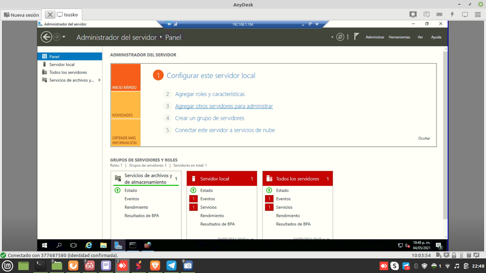
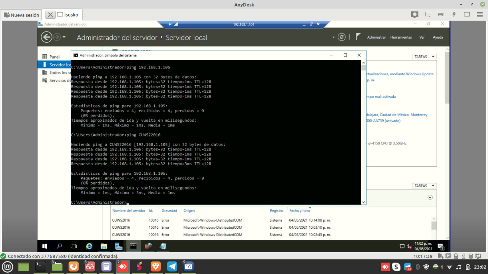
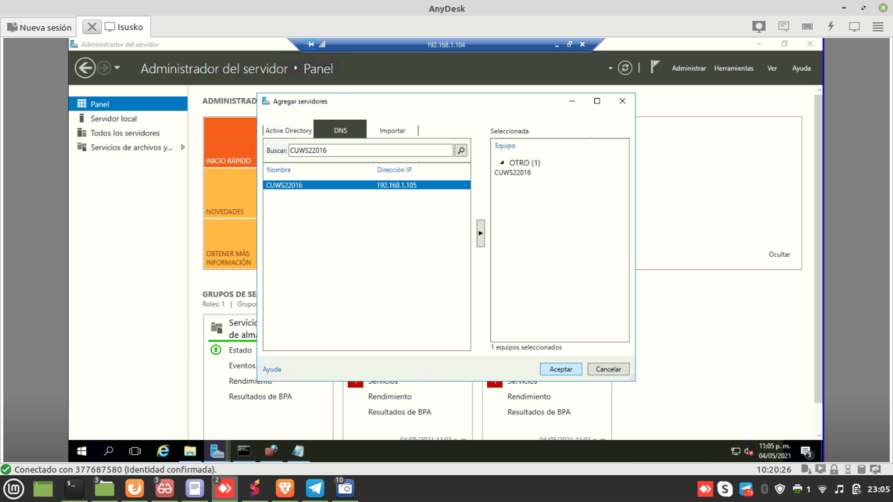
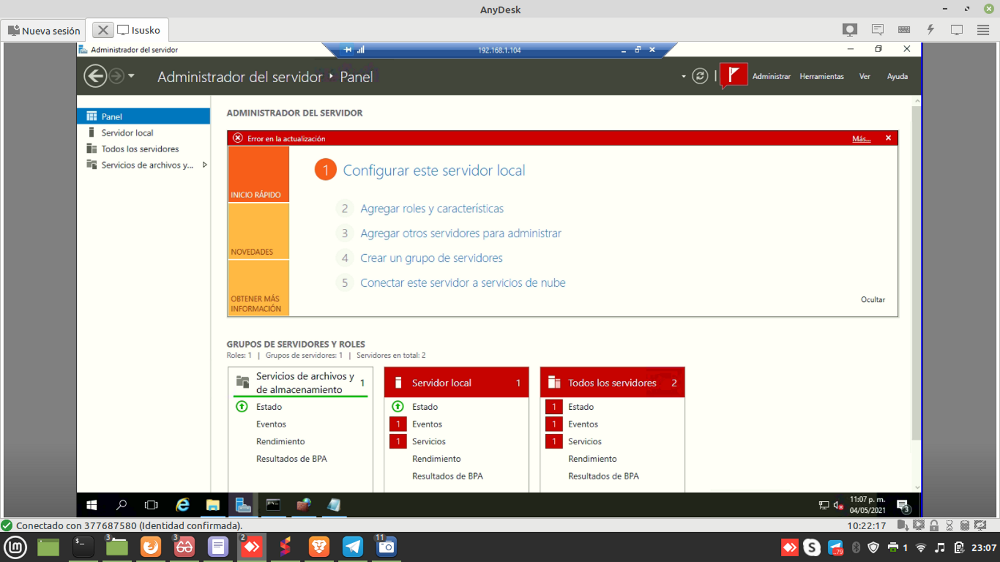
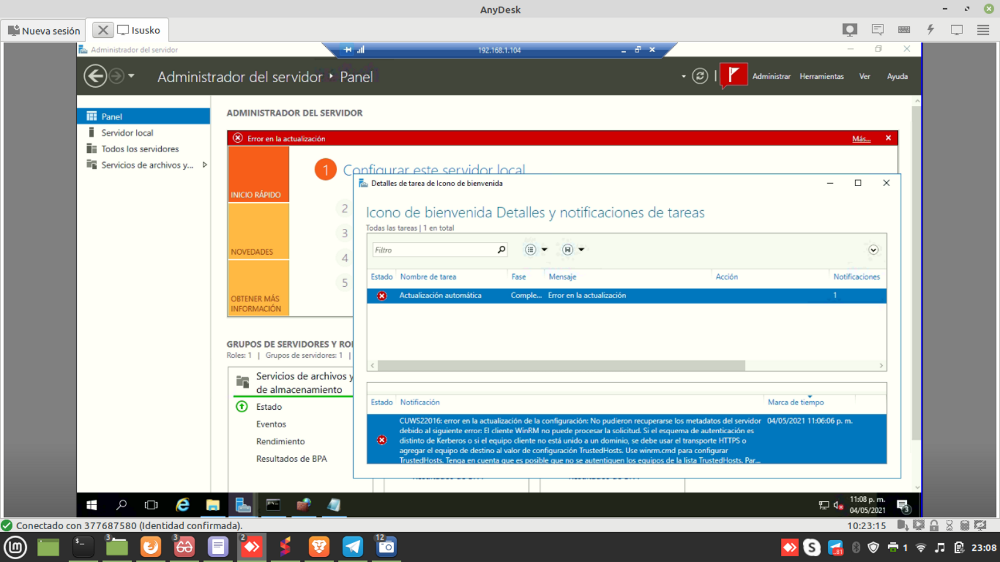
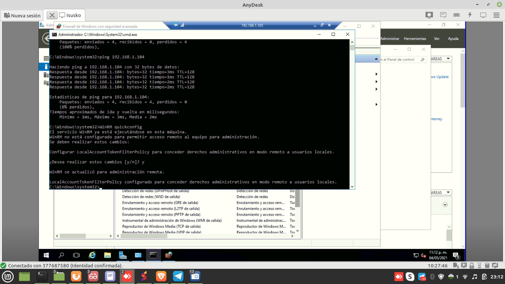
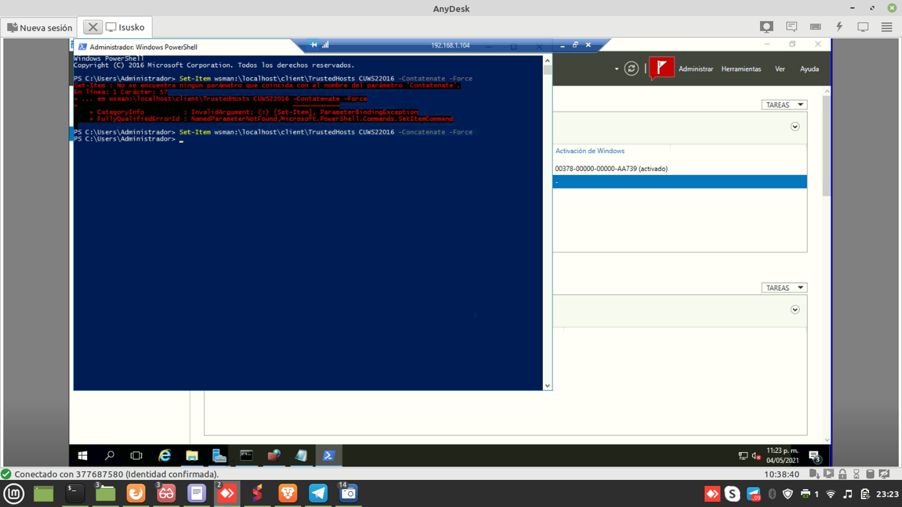
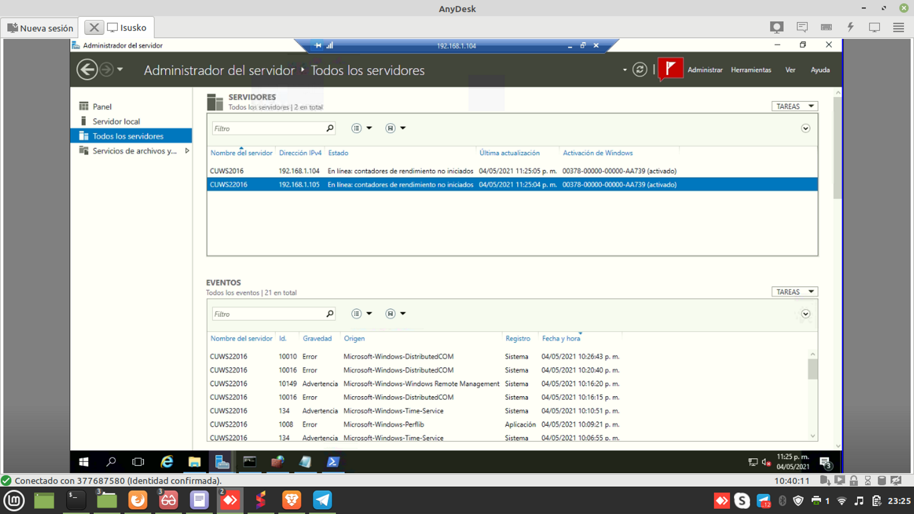
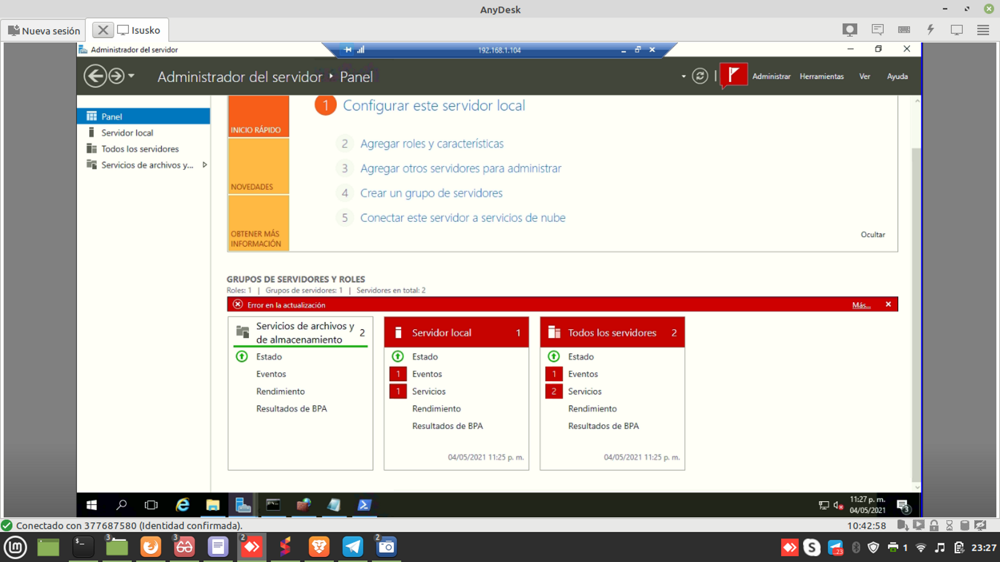
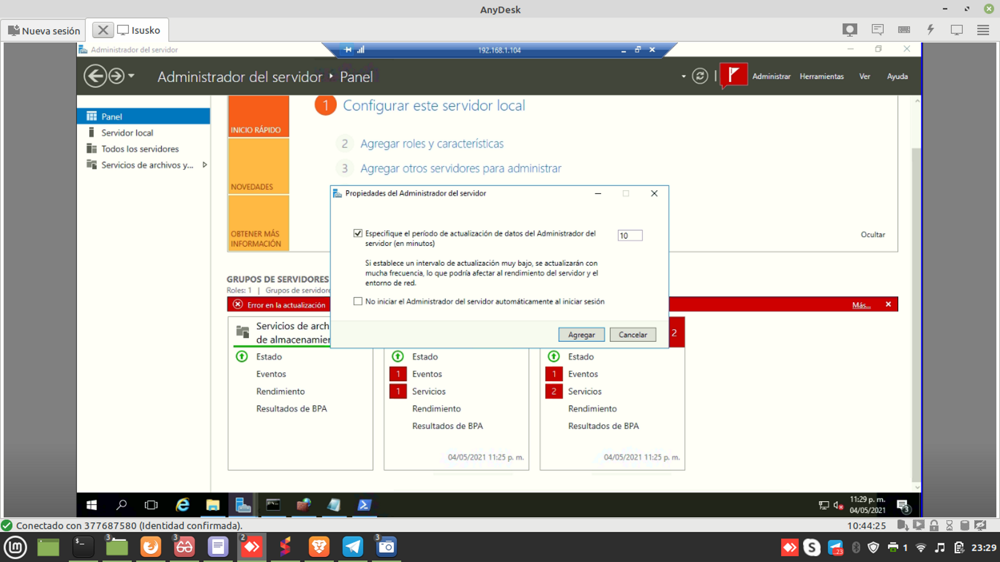

Para eso nos vamos al server manager y en Panel>Configurar este servidor local > agregar otros servidores

Vamos a realizarlo a tráves de DNS y haremos uso de un archivo que simulará ser un servidor DNS, vemos como:

En el equipo maestro que serà con la ip 104 nos vamos a C:\windows\system32\drivers\etc y vamos a buscar el archivo host lo abrimos con editor de text y agregamos:

La ip del equipo secundario y agregamos también el nombre
192.168.1.105 CUWS22016 y guardamos cambios

Y ahora como comprobamos abrimos poweshell y escribimos ping CUWS22016 y nos debe arrojarnos prueba correcta

Ahora si podemos agregar a través del dns, colocamos el nombre CUWS22016 después buscar, doble click sobre el nombre del equipo y aceptar

Después en las notificaciones nos arroajará un error le damos doble click para mostrar el error

Para solucionar este error debemos abrir el cmd en el equipo secundario 105 y escribir system>WinRM quickconfig luego nos va a pregunar si queremos realizar los cambios y le presionamos que y

Luego nos regresamos al equipo maestro y le damos refrescar y nos vamos al server manager y en todos los servidor nos va a mostrar ahora otro error llamado error de negociación y este error es normal ya que al no trabajar a través de un servidor de dominio y hacerlo a través del simulador de DNS el servidor secundario se protege 

Para resolver el error ahora vamos abrir powershell en el servidor maestro
Y escribimos el siguiente comando:
powershell>Set-Item wsman:\localhost\client\TrustedHosts CUWS22016 -Concatenate –Force

Regresamos a todos los servidores presionamos refrescar y ya no nos debe mostrar ningún error y ambos servidores deben de estar en línea

Y ya podremos administrar el servidor secundario como eventos,servicios etc

En la parte de administrar>Propiedades de administrador del servidor, podremos cambiar el tiempo de actualizacion de los servidores en este caso por default son 10 min lo cambiaremos a 1 min

Teniendo el servicio centralizado podremos apagar o inciiar servicios como la licencias aspel o contpaqi hasta reiniciar los servidores secundarios
