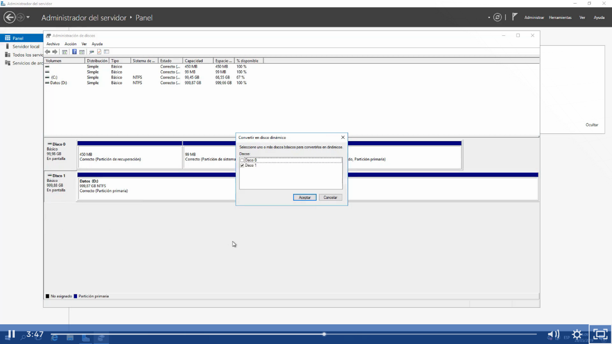
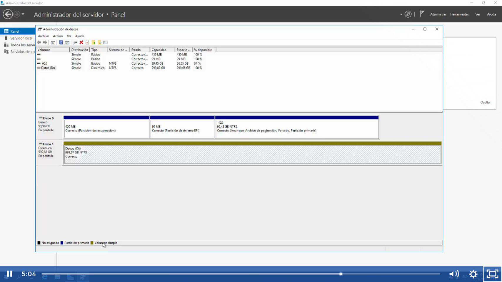

Jamás se debe de convertir un disco básico que contiene un sistema operativo a dinamico

discos duros extras si podemos convertirlos a dinamicos sin el temor de perder información solo click con el botón derecho del mouse y convertir a disco duro dinámico

Nos daremos cuenta que es un disco duro dinamico por le color azul disco duro básico y disco duro dinamico o simple en color dorado o verde (por qué no tiene ningún arreglo como lo tendría un disco duro con so)

Los discos duros dinaáicos no se pueden convertir a disco duro básico, se tiene que eliminar el volumen y volver a crearla como básica

Los discos duros dinamicos estan enfocado a tolerancia a fallos