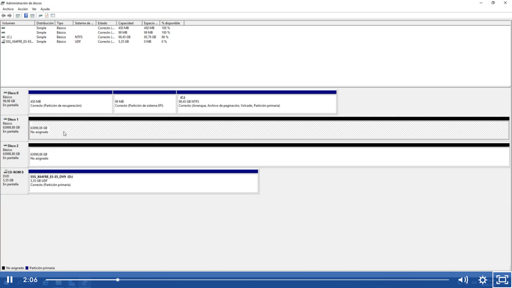
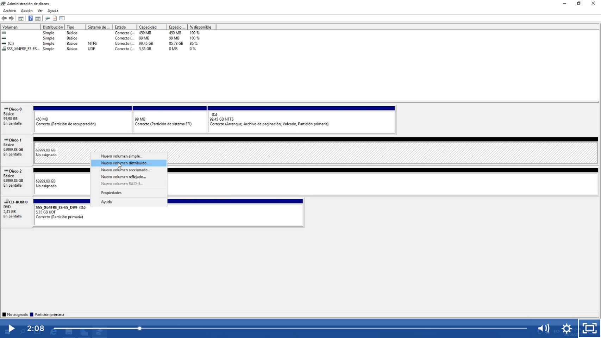
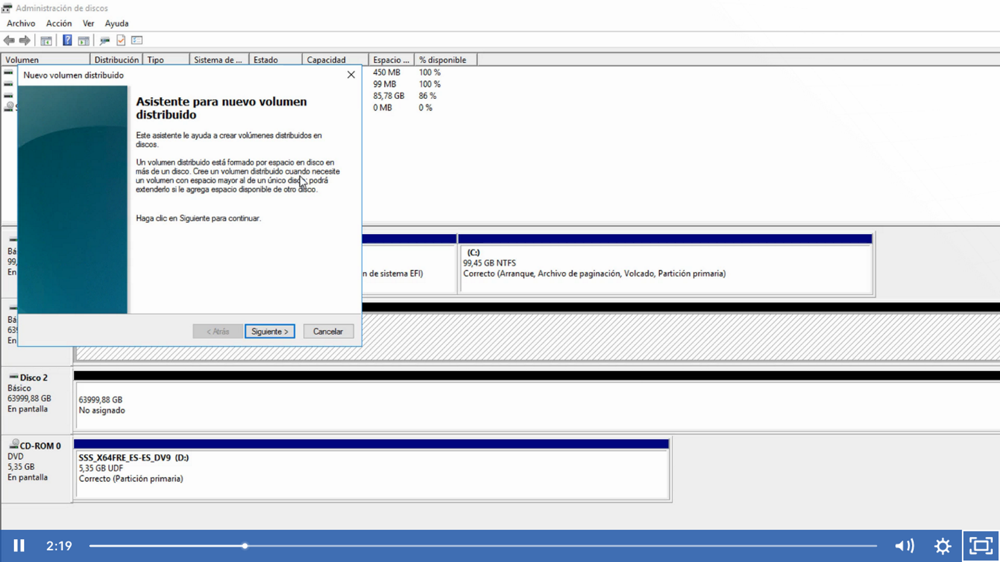
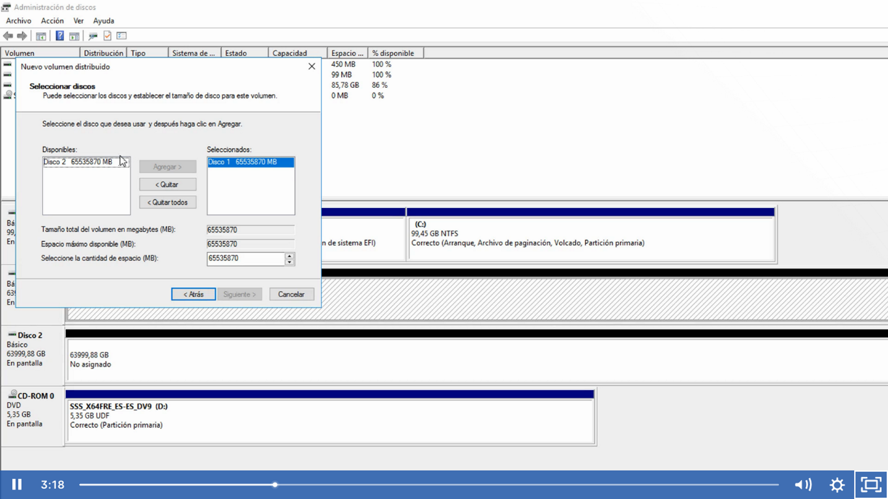
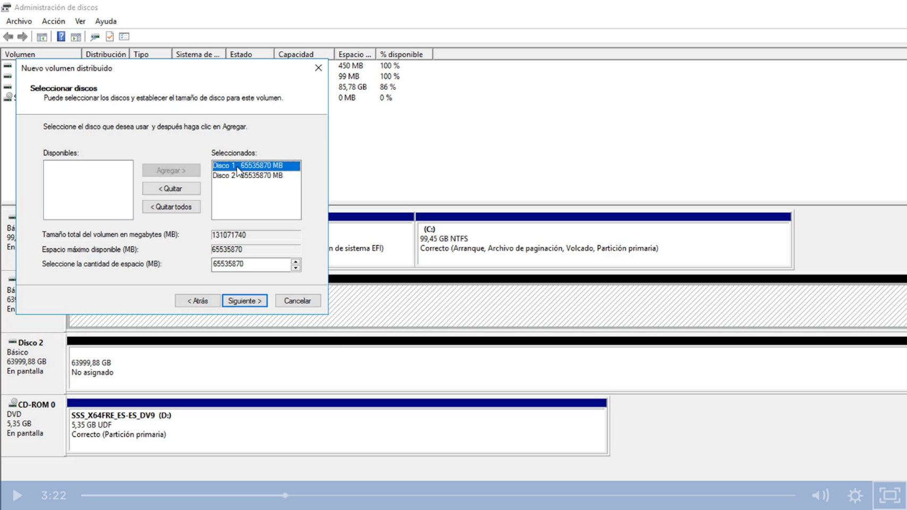
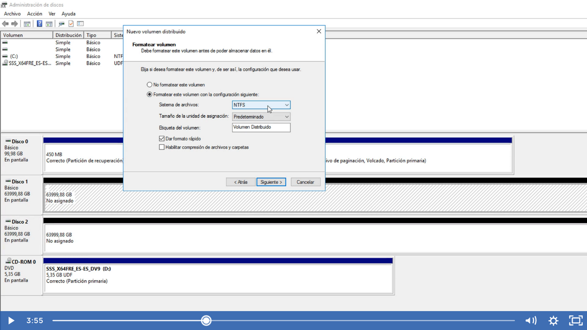
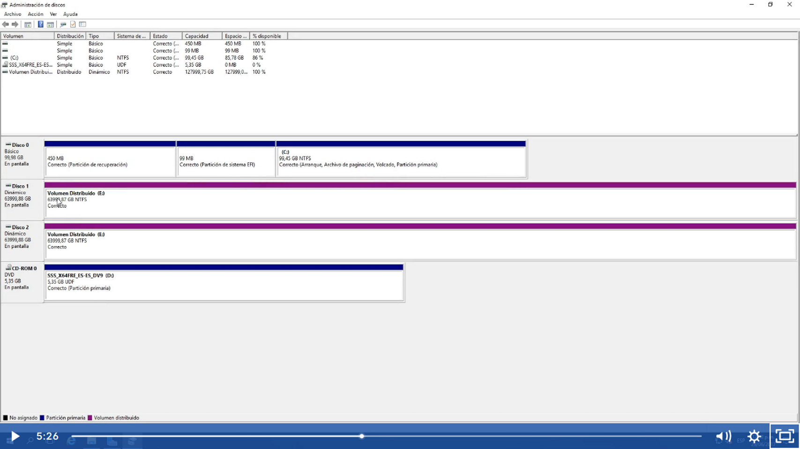
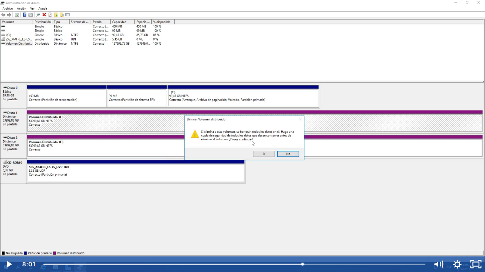
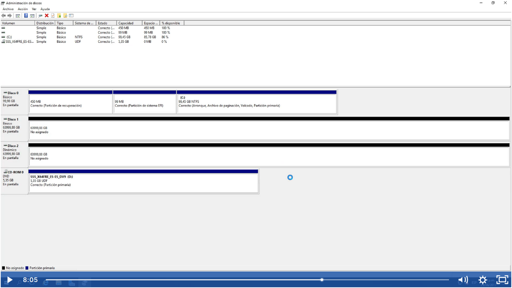

Un volumen distribuido es un volumen dinámico que consta espacios en disco en más de un disco físico

En formato GPT podemos extender el espacio en disco pero no en el mismo disco sino más bien en otro disco duro físico, sería crear una especie de puente o jumper para unir dos discos duros fiscos diferentes y aparente ser uno solo, por ejemplo tengo 2 discos duro de 500 Gb , al crear el volumen distribuido me lo va mostrar un solo disco duro de 1 TB.
Antes de empezar debemos recordar que los discos duro debe de estar como espacio no asigando.

Nos va a mostrar en color morado o lila que ya fueron fusionados o dinamicos y si nos fijamos en la imagen ambos discos nos lo muestra con la misma letra en este caso E

Y si nos vamos al administrador de discos nos mostrar una sola unidad

También podemos eliminar volumen

Entonces veremos que se elimina el volumen en ambos discos

Tambièn podemos crear discos distribuidos a la mitad de volumen de un disco y completo de otro como se ve en el ejemplo

Volumen distribuido el morado y volumen simple el dorado o verde

