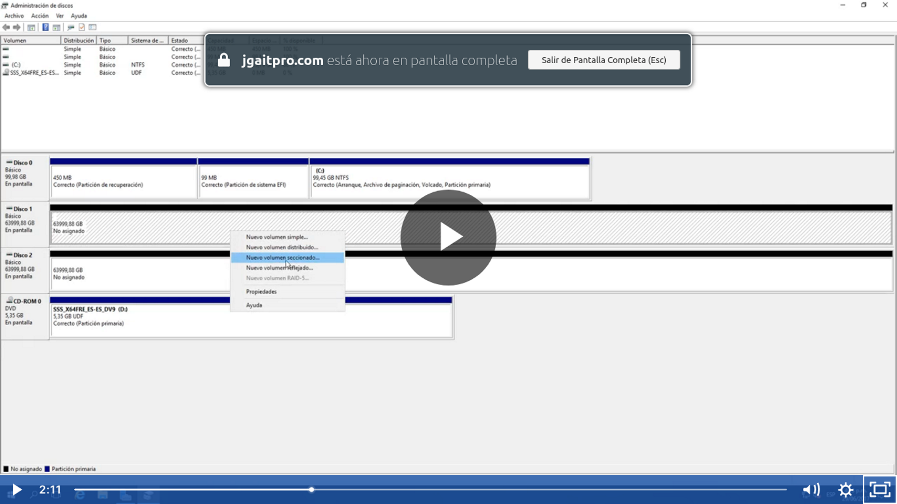
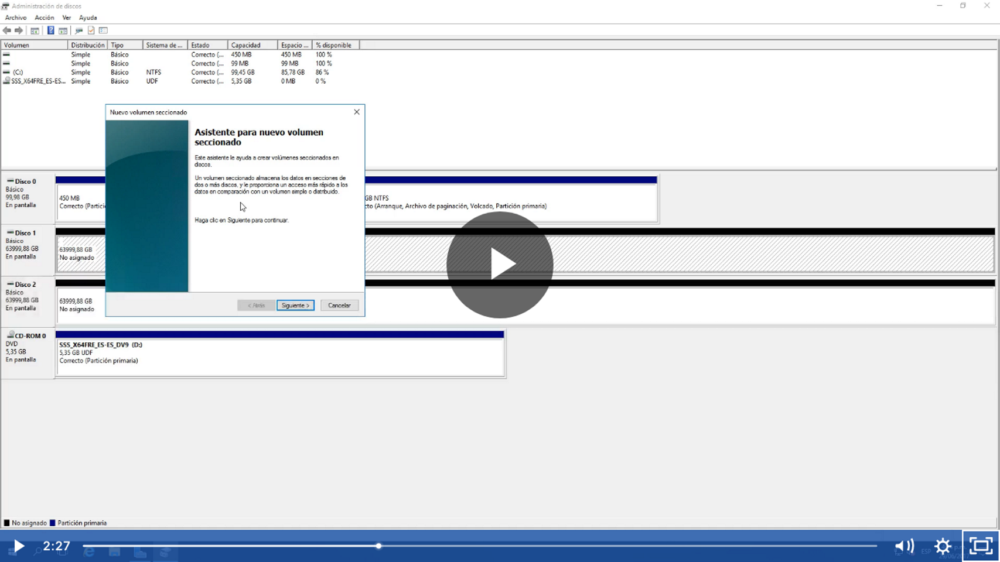
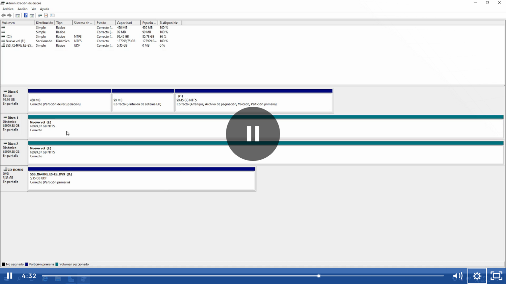

Esta opción solo se permite en discos Duros RAID, se conoce también como RAID 0 que no crea una redundancia o alta disponibilidad aunque si distribuye la información por eso no es muy utilizada, se utiliza más el raid espejo o el RAID1 o el RAID5 que lo conforman más de 3 discos duros y que si hay una alta disponibilidad

Y ahora nos muestra la misma letra para cada volumen en este caso la E y con un color verde agua

