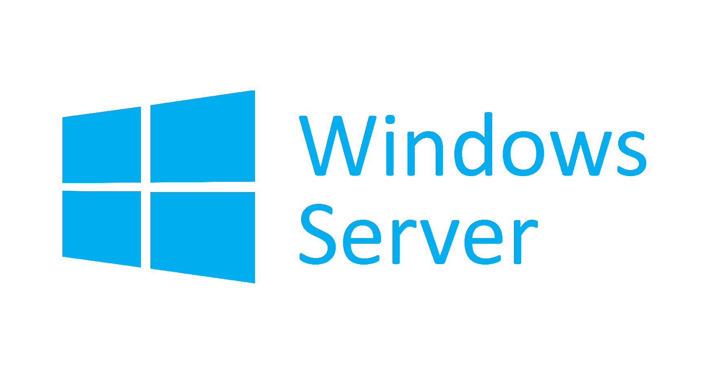

Si se compra la licencia con un proveedor hacer la instalaciòn con el disco  o link de descarga que el proveedor no proporcione 

Pero en caso de que hayamos instalado una versiòn de prueba y le hayamos hecho cambios y solo queremos hacer el update de free a licencia tenemos que realizar lo siguiente:
1.- Veremos la versión del windows server:
Inisiamos symbolo del sistema  system32> DISM /online /Get-CurrentEdition

En este caso nos indica que es una versión estandar y debo de conseguir la licencia para el tipo de versiòn

Y para poner la key hacemos lo siguiente:
system32>DISM /online /Set-Edition:ServerStandar /ProductKey:WC2BQ-FFFF-FFF-FFF /AcceptEula presionamos enter y nos indicara que ha finalizado la configuración, al final nos pedira reinicar la computadora

Tambièn se puede activar la licencia a trevés de opción grafca y para eso vamos a inicia->configuracion windows>actualización y seguridad> activaciòn y en la opción donde dice activar windows ahora en el apartado de cambiar la clave del producto.

Otra opción de activación de producto es con  la consola
System32> slmgr –ipk xxxxxx-xx-x-x-x-x—x
Y luego system32>slmgr -auto
