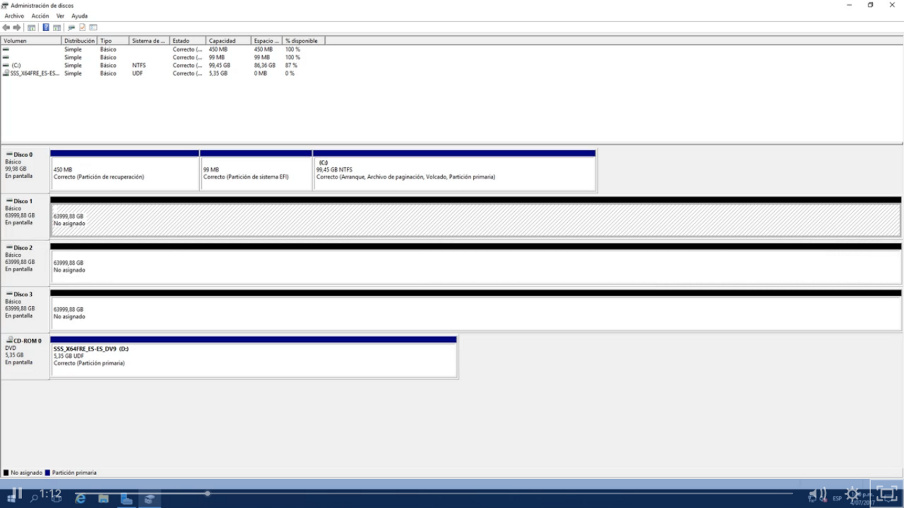
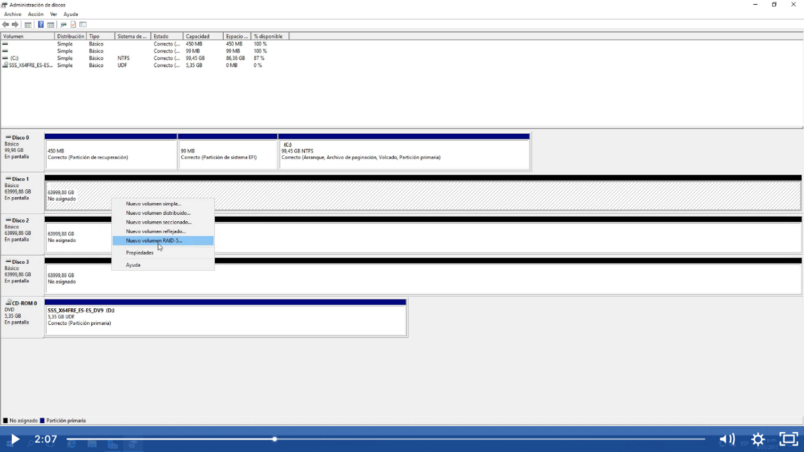
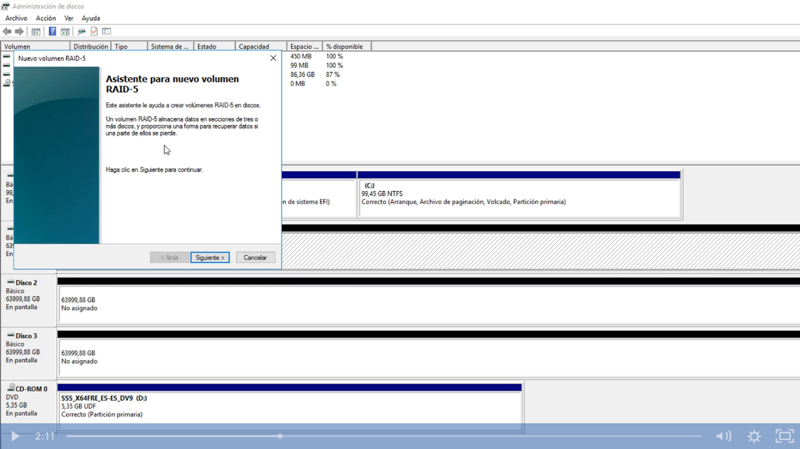
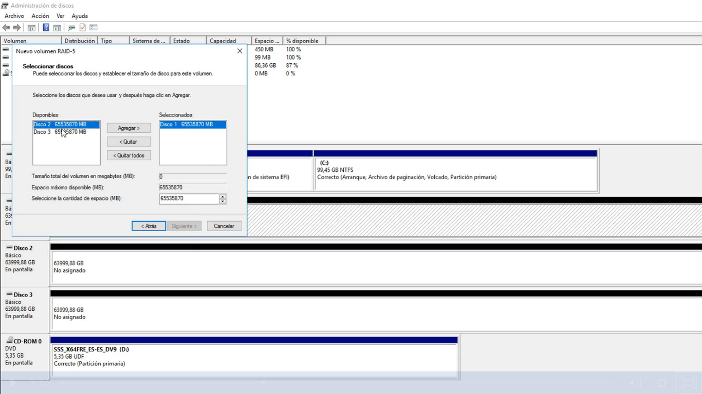
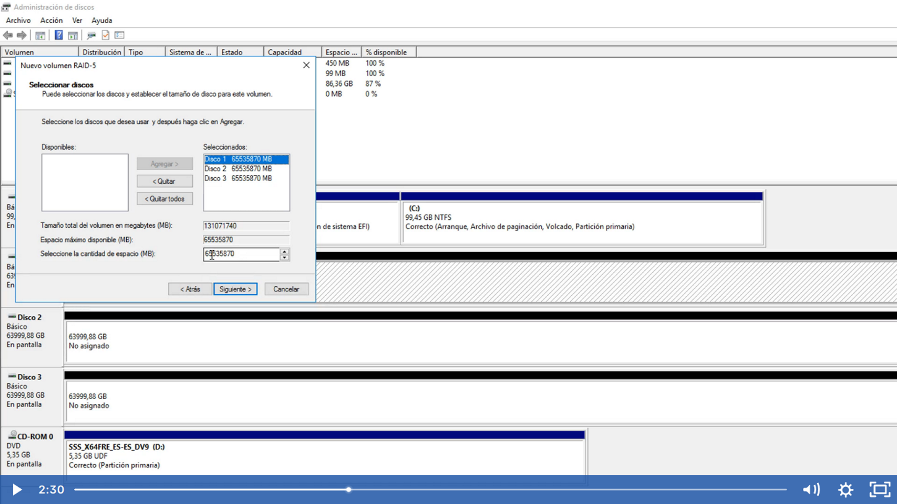
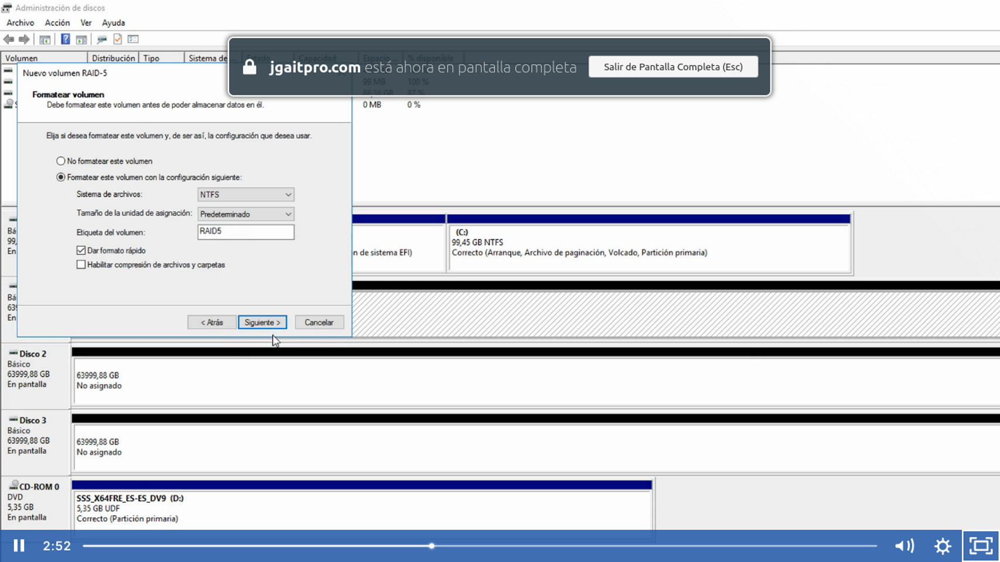
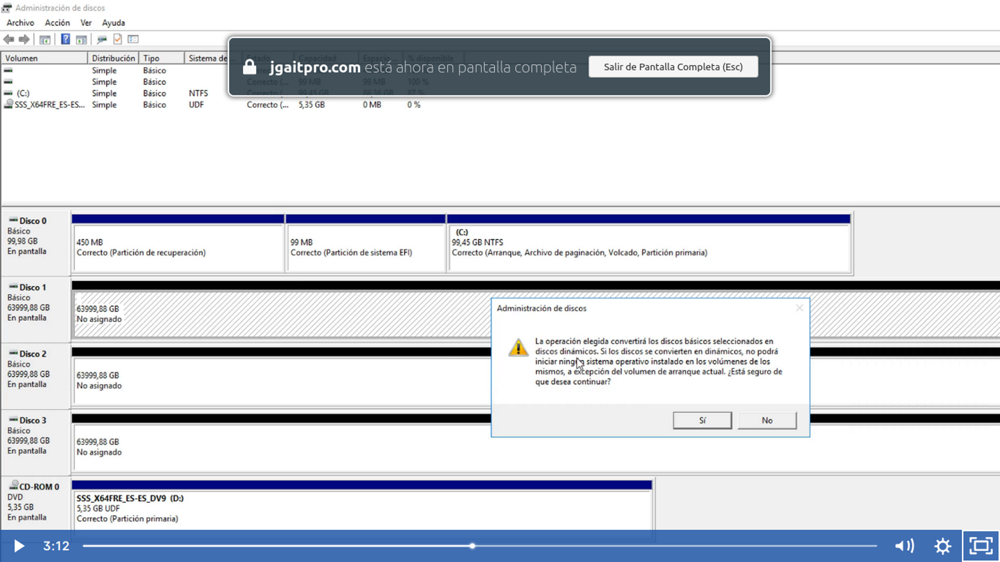
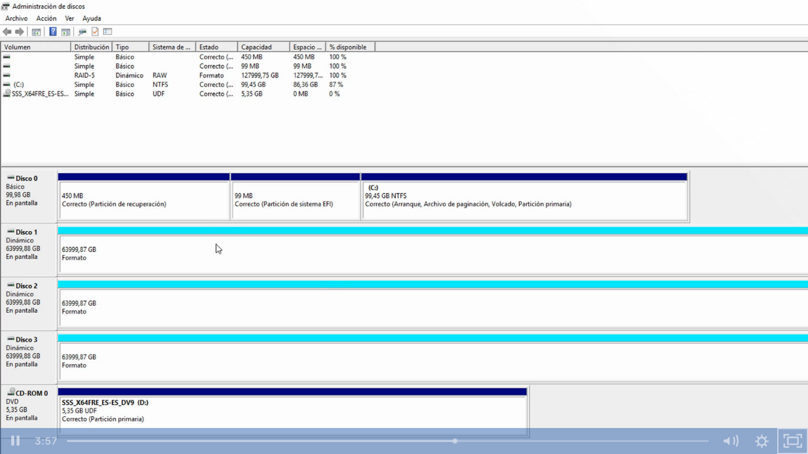
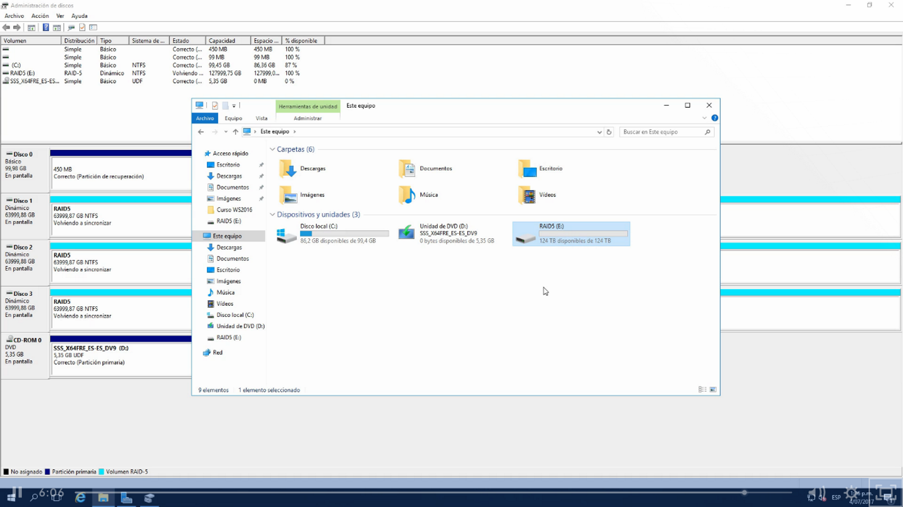

Se crea a partir de 3 o más discos duros

Seleccionamos nuevo volumen RAID5

Aquí nos muestra los discos disponibles para aplicar el RAID5

Una vez realizado el proceso RAID5 nos mostrará las unidades que son parte en color verde, lo mismo no nos mostrará una unidad en el administrador de discos

Nos daremos cuenta que se pierde un disco por el tamaño de la unidad E, pero es normal debido a que siempre se utiliza un disco para la reconstrucción de la unidad de volumen
