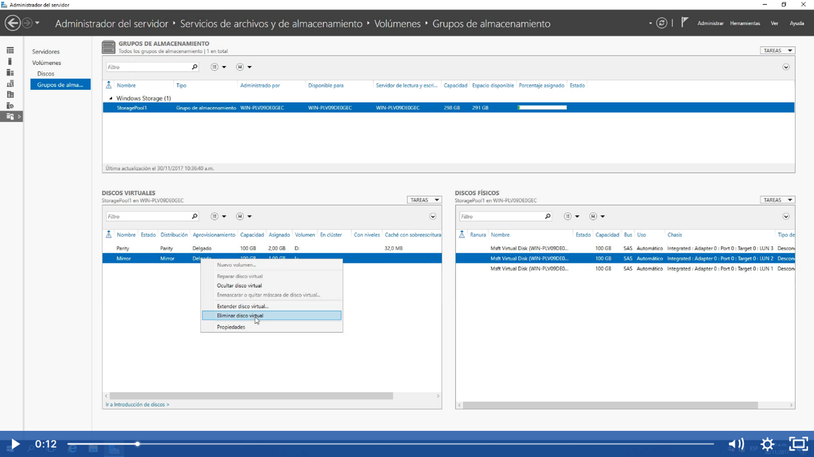
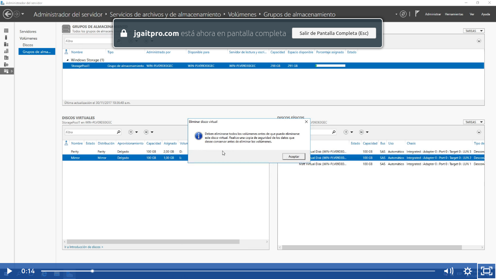
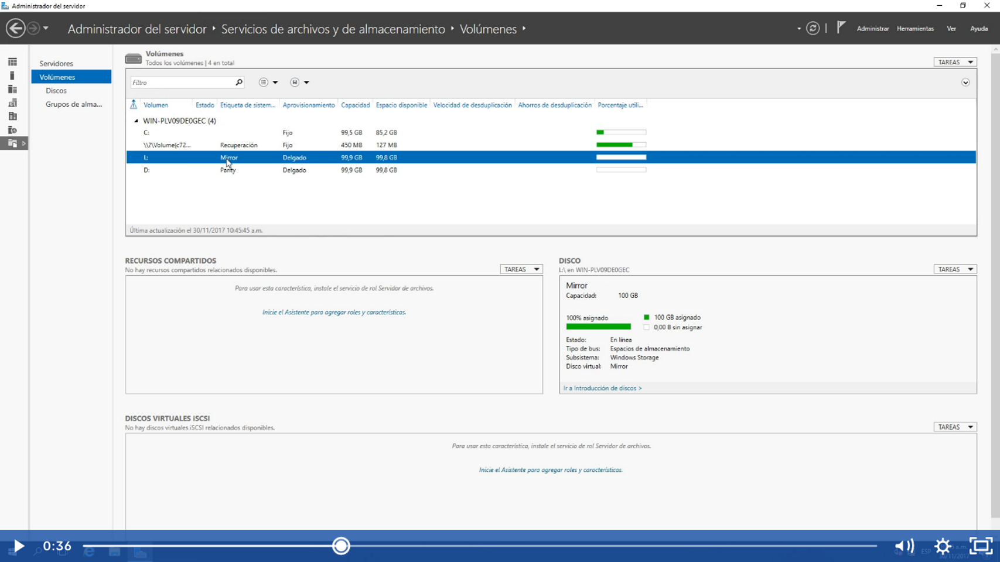
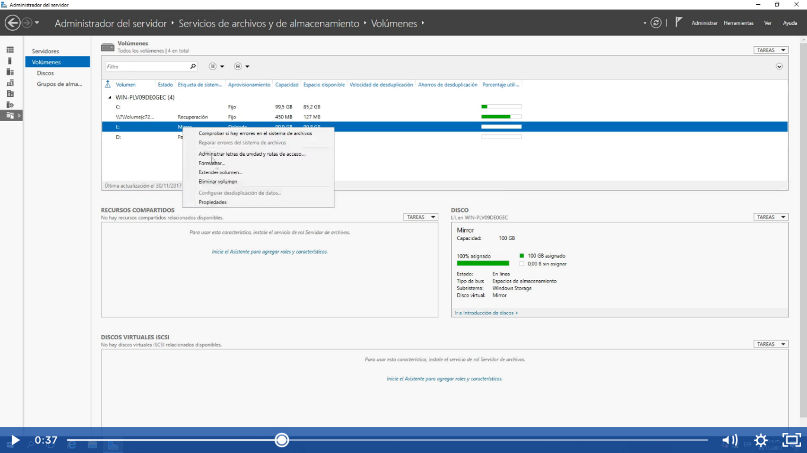
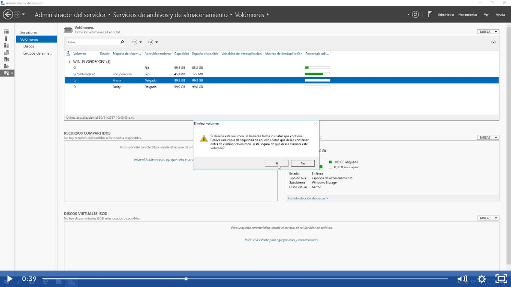
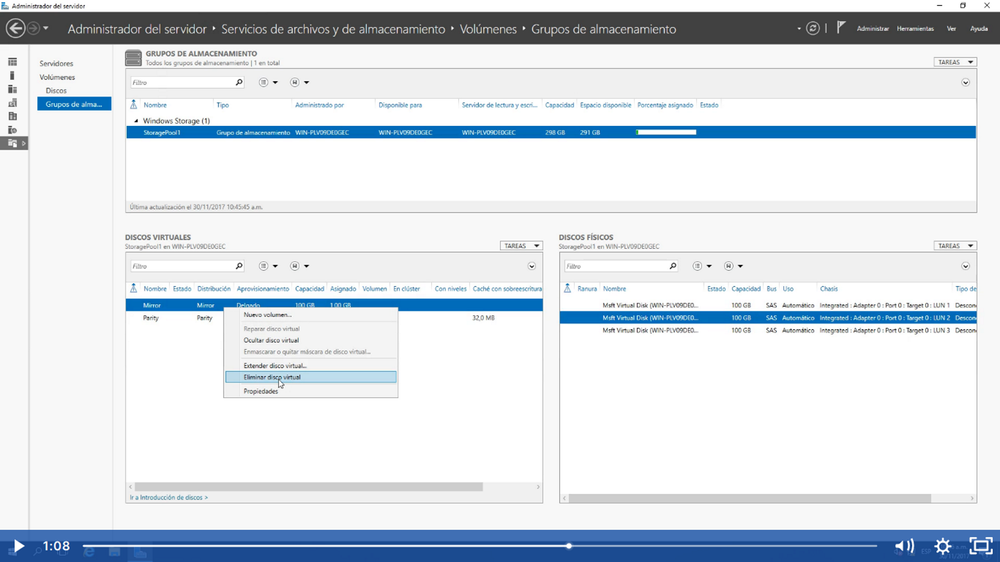

Eliminar Espacios de almacenamiento (Storage Space) 

No podremos eliminar directamente del espacio virtual un storage space:

Para eso nos vamos a la parte de volumenes y seleccionamos el que queremos eliminar:

Con botón derecho eliminar volumen:

Click en si

Ahora regresamos al espacio de almacenamiento y podremos eliminar:

