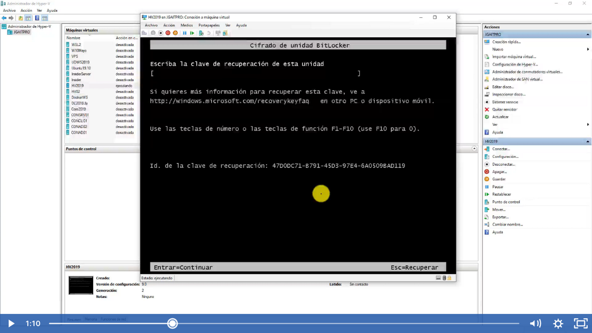
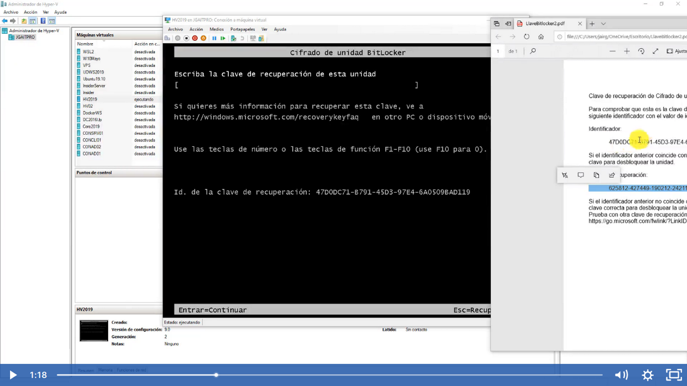
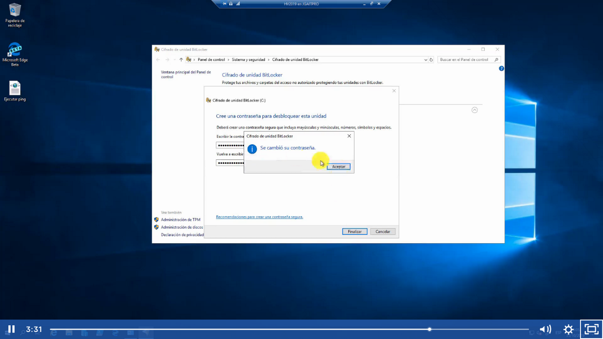

En este ejemplo vamos a presionar esc para poder realizar la recuperación de bitlocker

Entonces utilizaremos el archivo que guardamos en pdf con la clave de recuperación, para poder insertar la clave tenemos que sersiorarnos que el identificador coincida en el pdf y en pantalla.
Ambos inician en 47*** colocamos la clave e iniciara sesión

Ahora si queremos cambiar el password lo podemos hacer es presionar cambiar contraseña y en caso de que estes dentro de la sesión y quisieramos cambiar la contraseña y no nos acordemos de la anterior podemos hacer lo siguiente click en restablecer una contraseña olvidad y ponemos una contraseña nueva

