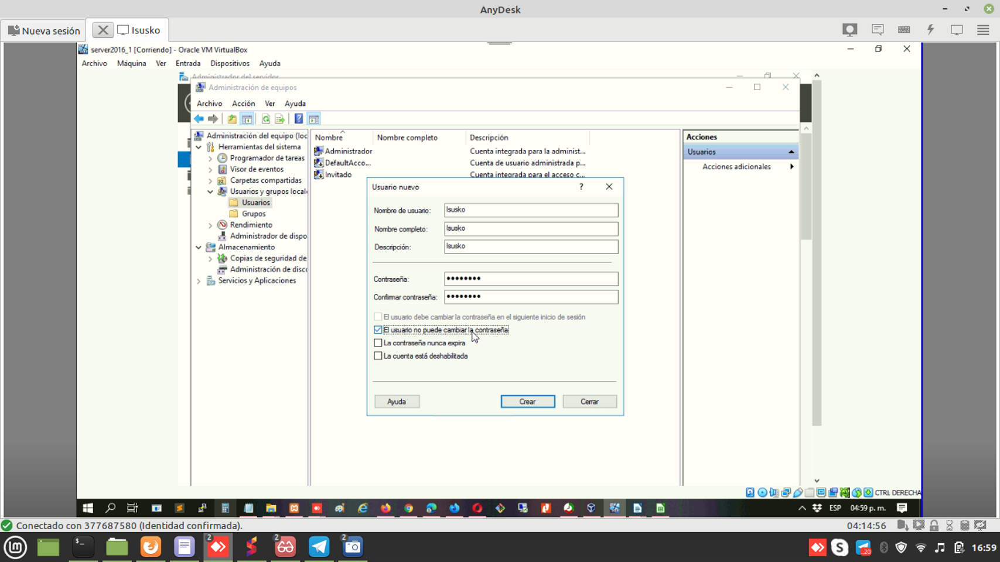
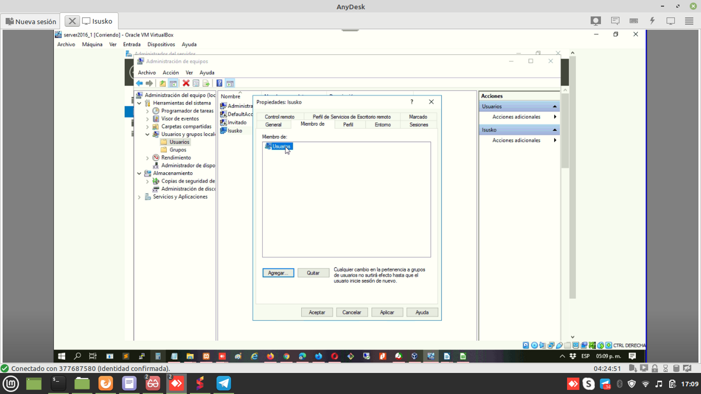
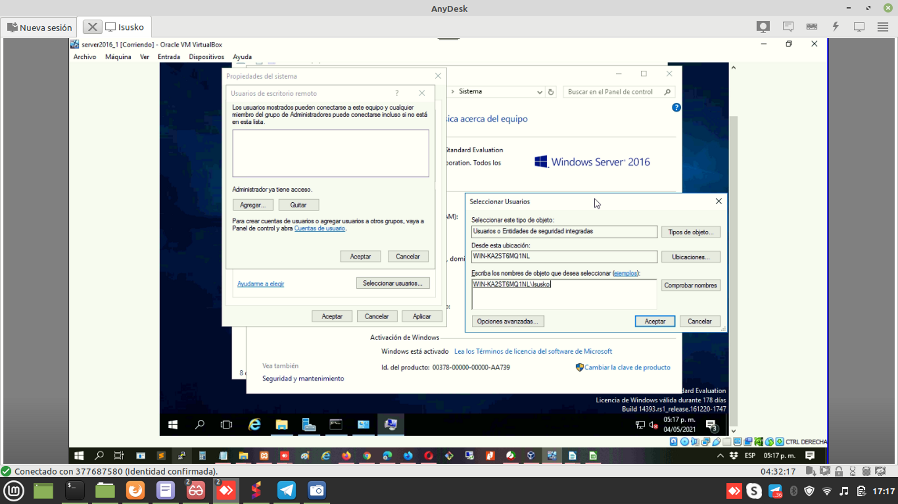

Primero vamos a crear un nuevo usario llamado User:Isusko Password:Sbrv1234

Pertenece solo a usuarios:

Luego habilitamos conexión remota y seleccionamos al usuarios Isusko

En caso de no habilitar el acceso remota, al iniciar localmente nos indicara que no se puede iniciar sesión y como no es administrador solo nos permite tener acciones que no son de administrador

Windows Server solo permite por defecto 2 conexiones simultaneas para poder conectarse más usuarios necesita las CAL