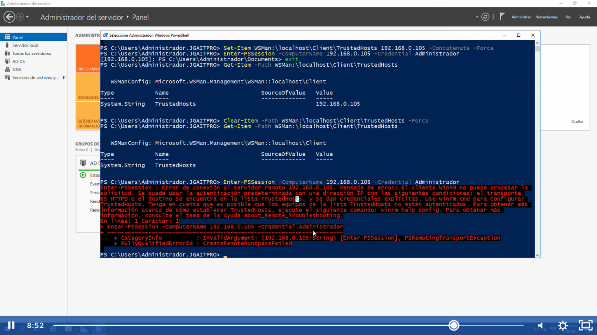

Son los hosts permitidos que nosotros podremos administrar remotamente, cuando no estamos conectado a través de una red de dominio podremos utilizar el TrustedHost que permitirá que los servidores confíen en otros servidores.

¿Los TrustedHosts no son necesarios en un entorno de Active Directory gracias a?
Kerberos

Para poder agregar lo vemos en la opción agregar otros servidores y es con el siguiente comando
Set-Item wsman:\localhost\client\TrustedHosts CUWS22016 -Concatenate –Force

Para poder conectarme a otro equipo a través de la red y  través de la consola de poweshell ocuparemos el siguiente comando:
Enter-PSSession –ComputerName 192.168.1.105 -Credential Administrador

Para poder ver la lista de TrustedHosts es con el siguiente comando:
Get-Item –Path WSMan:\localhost\client\TrustedHosts 
Y podremos ver todos los equipos conectados a    
Través de trustedhosts

Para eliminar la lista completa de equipos de Trustedhosts es con el siguiente comando:
Clear-Item –Path WSMan:\localhost\client\TrustedHosts -Force

