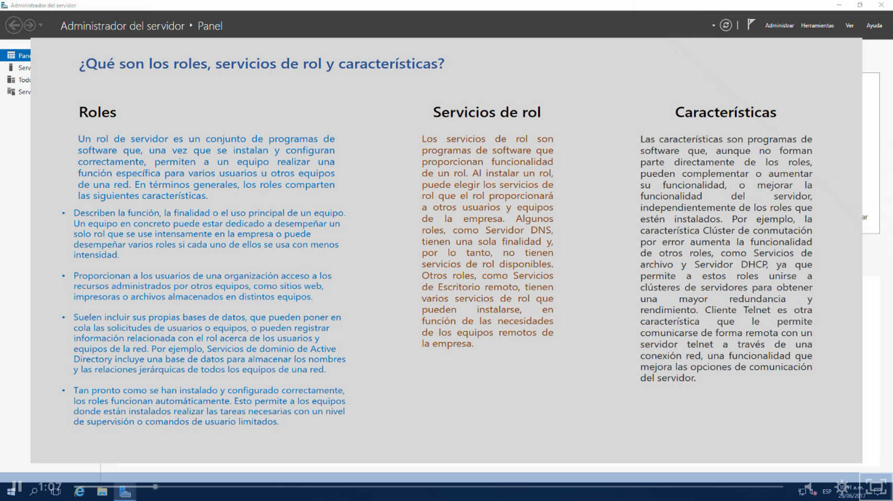

Para asignar roles nos vamos al server manager > administrar> roles y características

Los Roles son las funciones principales para ofrecer un servicio a la red por ejemplo

Los Servicio de Rol:sub roles o subfunciones y nos ayudan a los roles a ofrecer un servicio mejor

Características:  