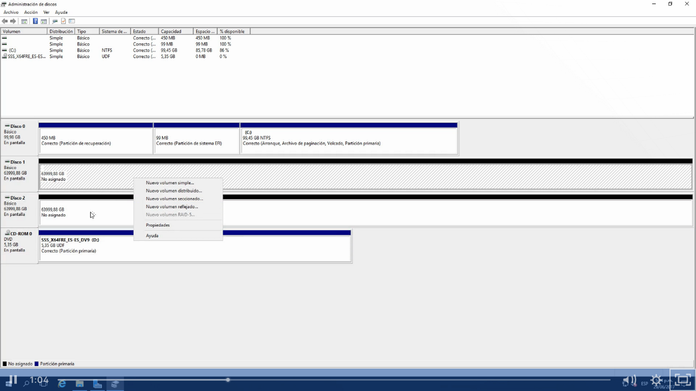
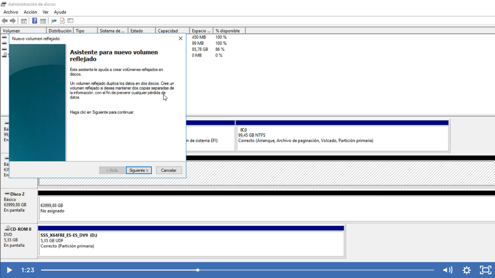
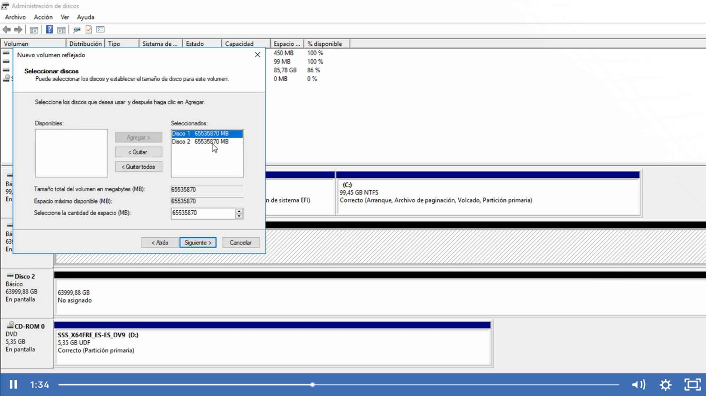
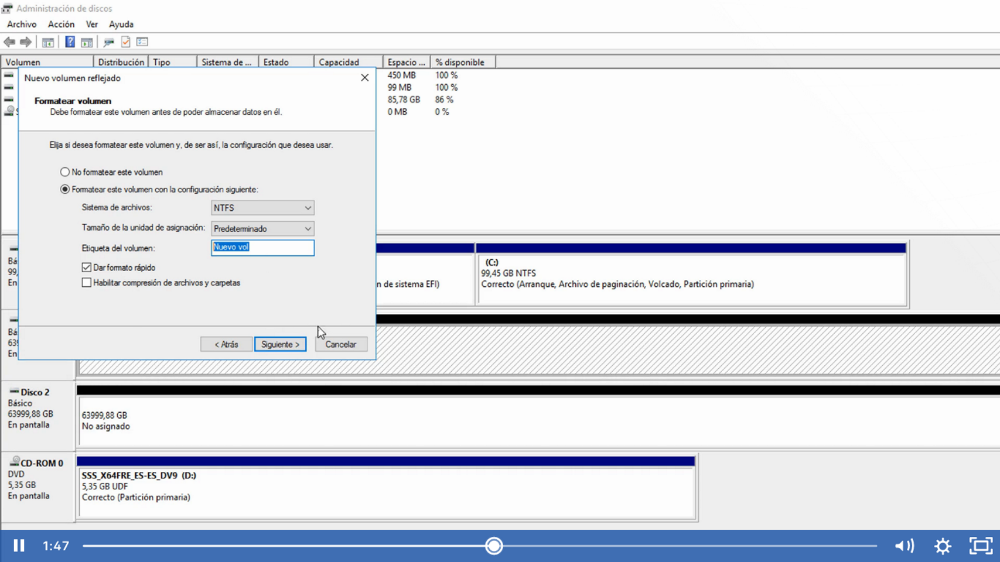
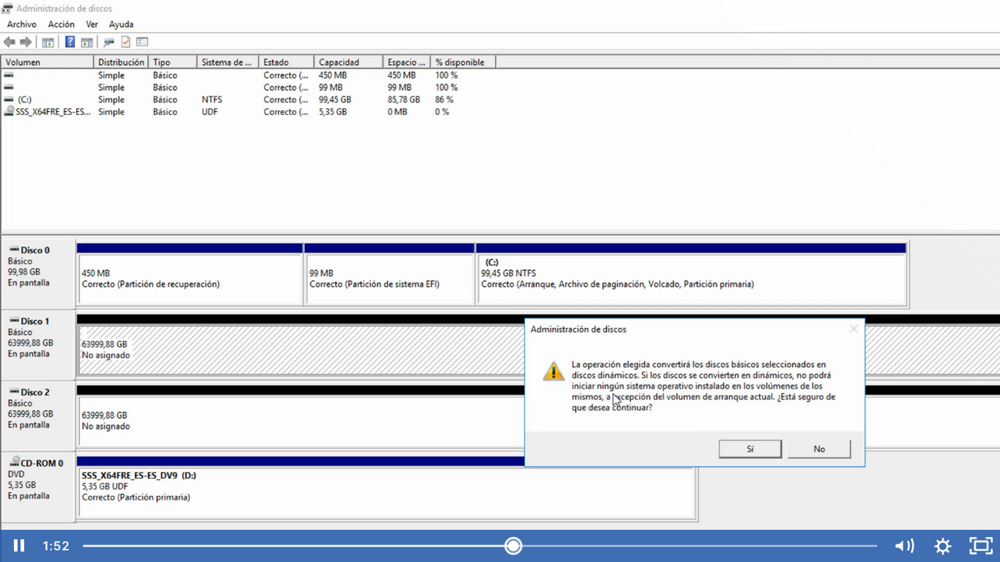
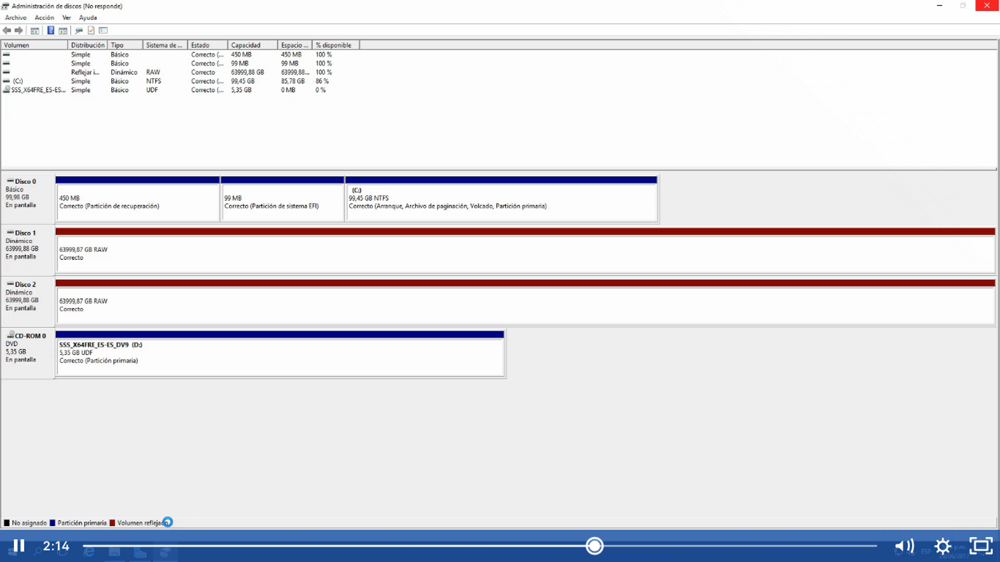

EL volumen reflejado pasa lo mismo que los volumunes seleccionas y en si un volumen reflejado es un RAID1, lo que hace es que la misma información lo va a copiar en los discos que esten  compuestos en el volumen reflejado, en este caso el RAID lo que hace es copiar la información que hace en parte del RAID1

Nos daremos cuenta que es un volumen reflejado por el color en este caso es rojo y no veremos la letra desde el administrador de disco

Pero si en explorador, veremos la letra de la unidad en este caso E:

