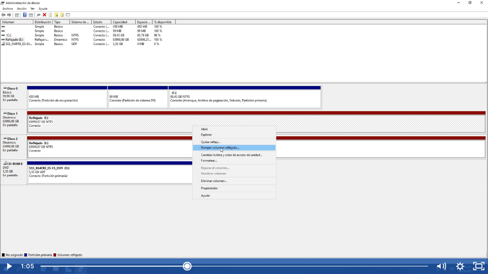
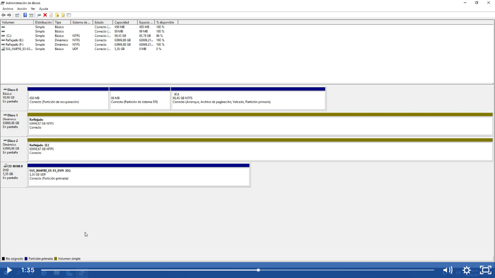

Botón derecho del mouse y seleccionar romper volumen reflejado:

Al seleccionar que si los discos se vuelven en volumen simple pero en discos dinámicos 

Y en el explorador veremos los dos discos

Y si revisamos el contenido nos daremos cuenta que ambos discos tienen la misma información reflejada.

Nota una vez roto el volumen reflejando ya no podremos volver a reconstruirlo como un volumen reflejante, para volver a construir como volumen reflejando tendremos que eliminar el volumen en ambos discos y volver a crearlo.