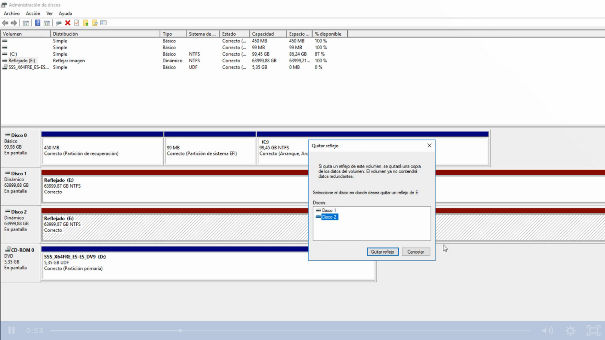
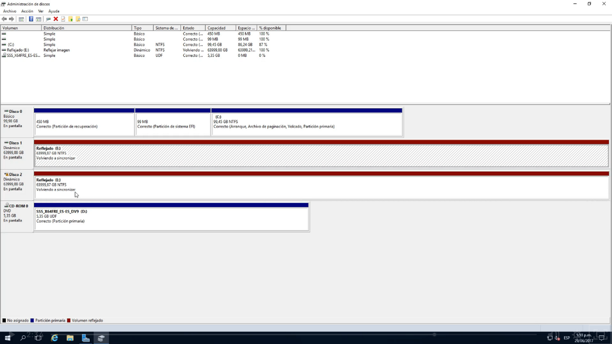

¿Qué pasa si se nos daña un disco duro que ya està como vulumen reflejante?
Y tenemos que agregar un nuevo disco duro para remplazar el anterior.

Lo que tenemos que hacer es lo siguiente (esto sin la consala de raid a través del administrador de discos)

Tenemos que seleccionar el disco que necesitamos quitar del reflejo

Seleccionamos la unidad 2:

Aquí vemos que ya se rompió el vínculo un HD(color negro) y la información sigue estando en el disco Reflejado en color verde/dorado:

Ahora vamos a reconstuir la unidad reflejada con un nuevo disco duro, le damos botón derecho y seleccionamos agregar reflejo:

Nos detecta el disco 2 y click en agregar reflejo:

Después de darle click en si seleccionamos nos arroja un msj que nos indica que va a empezar a sincronizar

