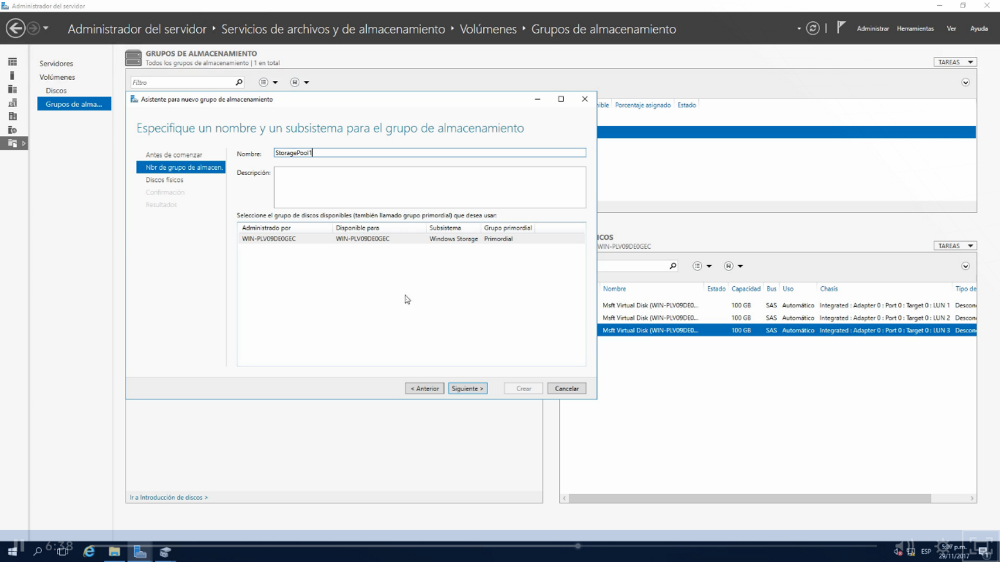

Son bloques de almacenamiento creados a partir de uno o más discos fiscos que nos permiten agregar la capacidad de un forma flexible.
Si nos llegáramos quedar sin espacio en los discos actuales podemos agregar un disco duro fisico al servidor y agregar  este al grupo de almacenamiento para aumentar su capacidad y podemos combinar discos HDD y SDD.

Uno de los requisitos es que ninguno de los discos este en línea y no asignados

Ahora vamos al server manager>Servicios de archivos y almacenamiento

Veremos que crea un por defecto un storage pool llamado "PRIMORDIAL" que es en donde se cuentra nuestro sistema operativo windows server y es la unidad C
Y del lado derecho veremos una parte que dice DISCOS FÍSICOS que tenemos disponibles para crear un grupo de almacenamiento.
Del Lado izquierdo veremos una apartado DISCOS VIRTUALES donde podremos crear los espacios de almacenamiento donde vamos a poder crear nuestros volumenes donde podremos cambiar de tamaño.

Nos vamos a Tareas> luego nuevo grupo de almacenamiento

Nos mostrara el asistente la información

Cuando creamos un grupo de almacenamiento en explorador no nostrara ninguna unidad como por ejemplo la Letra E:/ , sino que tenemos que crear los espacios de almacenamiento para poder crear volumenes.

Vamos a presionar siguiente

Seleccionamos un disco o los tres, lo ideal y como se trabaja con un Simi de RAID 5 necesita las 3 unidades como mínimo

Seleccionamos todos los discos duros de la lista y en asinación tenemos 3 opciones:
1- Automático
2.-Reserva activa (el tener seleccionado esto indica que ne caso de que falló alguno de los otros 2 discos se activa el disco duro y empieza a trabjar)
    3. Manual
Para el ejemplo vamos a dejar los 3 como automatico y click en siguiente

Veremos que se un resuemen de como se generará un grupo de almacenamiento de 300 GB y click en crear

Click en cerrar

Después nos daremos cuenta que se ha creado un starge pool y que las unidades fisicas se han retirado(porqué ya se veran en el storagepool)

Si vamos al administrador de discos veremos que tampoco estarán los 3 discos duros

