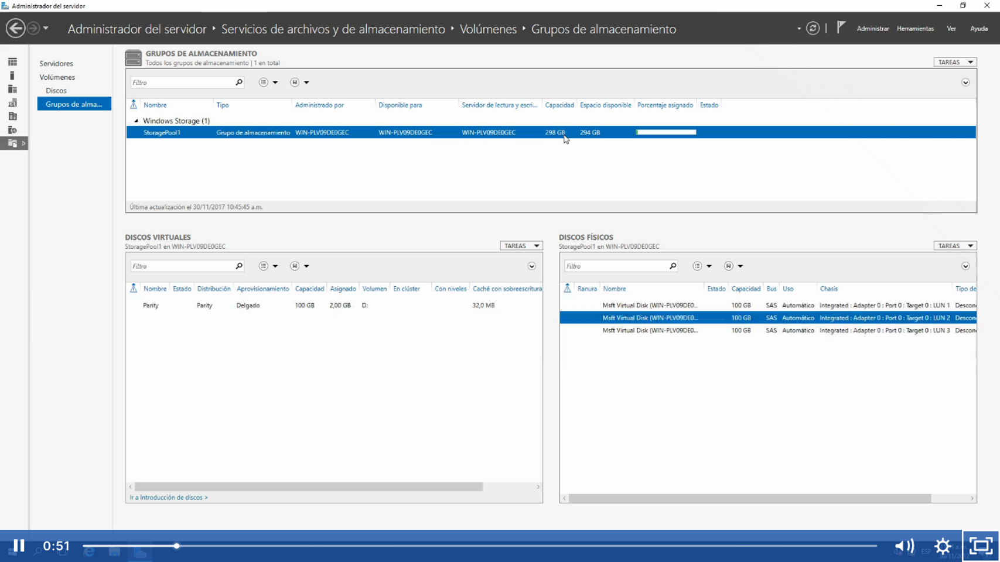
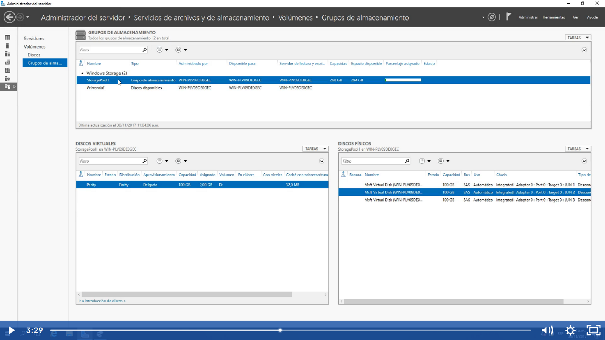
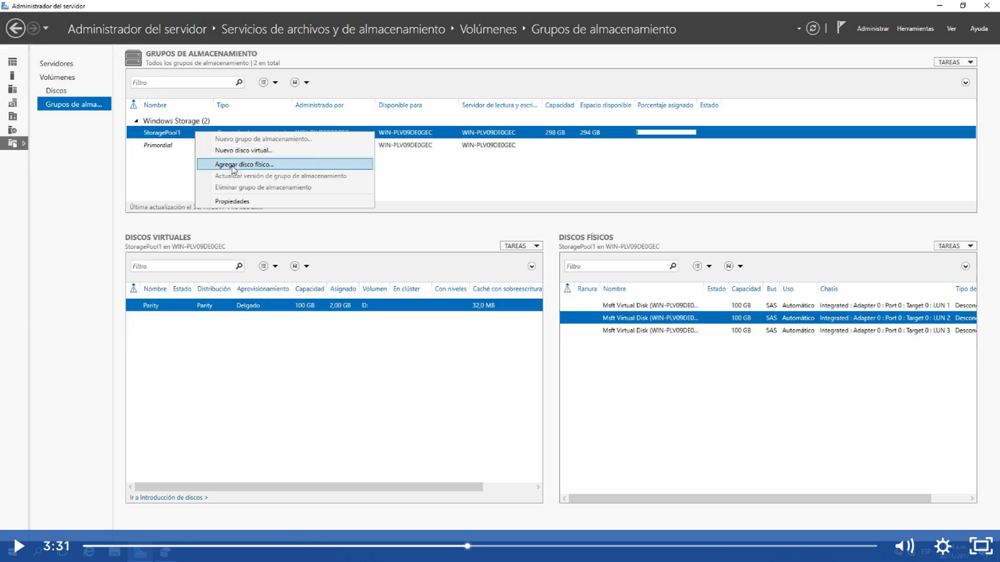
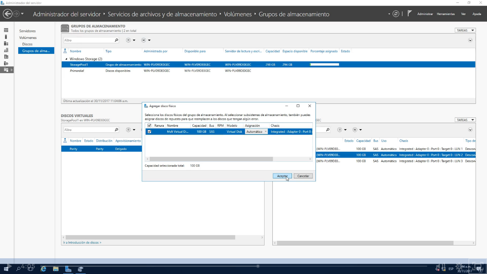
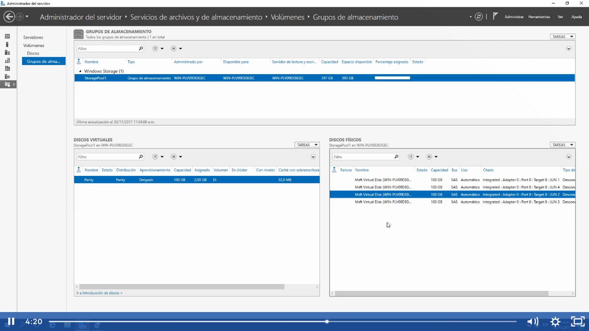

    Agregar discos fisicos a Grupos de almacenamiento (Storage Pool)

    Vamos añadir un 4 disco a la lista:

Una vez que insertamos el disco o en el laboratorio se crea una nueva unidad de disco ya nos dará la opción de agregar un disco duro en la parte de grupos de almacenamiento y nos aparecerá como discos disponibles:

Seleccionamos el Storage pool y le damos botón derecho y agregar disco

Nos va aparecer el disco o los discos duros que este disponible, marcamos la opción y aceptar

Y ya podremos ver el disco duro agregado y veremos que el pool aumento a 397GB:

