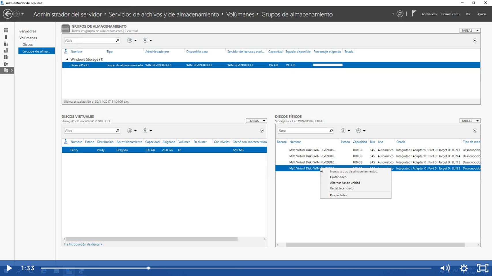
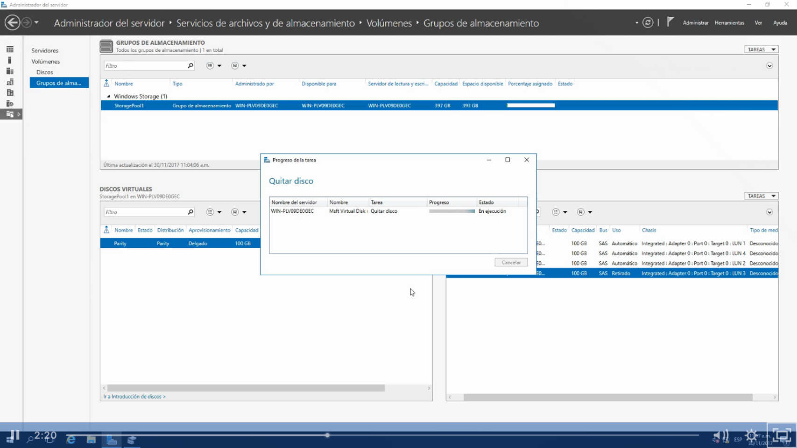
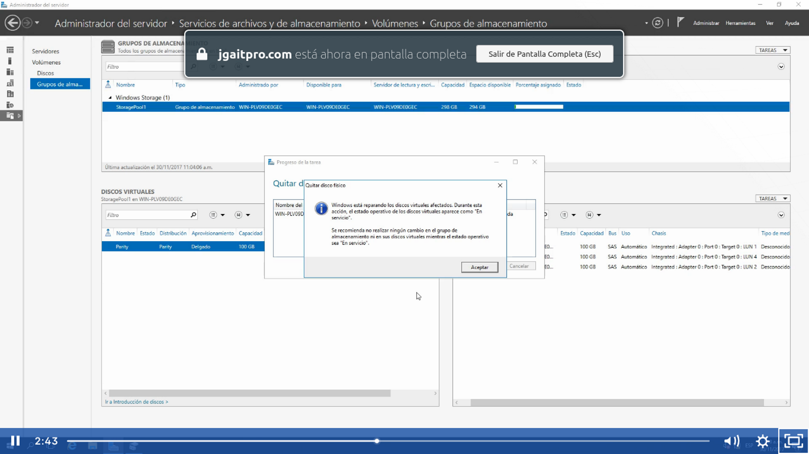
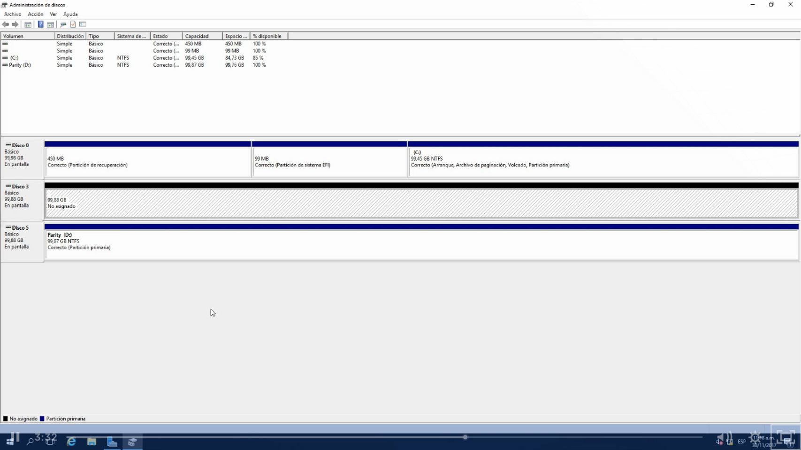
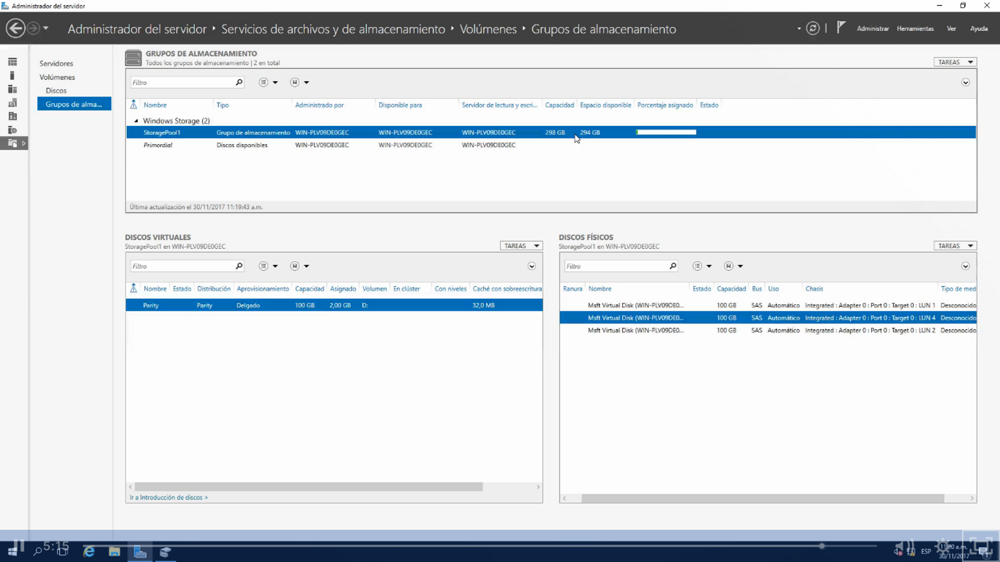

En el apartado de discos fisicos seleccionamos algun disco y le damos quitar disco. SIn embargo hay que tener en cuenta si es Mirror (Raid1) siempre debe de haber 2 discos duros entonces antes de quitar uno, primero lo añadimos 1 y retiramos un disco, en el parity debe de haber por lo menos 3 discos entonces agregamos 1 primero y ya podemos a proceder a retirar algun disco que ande fallando 

Se esta quitando el disco duro:

Listo ya se quito el disco duro fisico, ahora podremos apagar el servidor y retirar el disco duro

Y si nos vamos al administrador de discos nos mostrará el disco duro que se desmonto del pool storage;

En el storage pool podremos fijarnos que ya no tenes los 398GB solo nos quedan 298 gb

