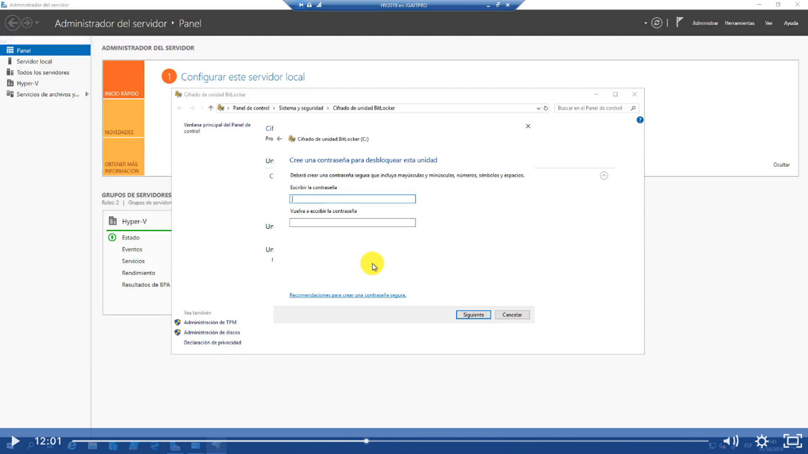

Para instalar esta caracteristica en windows server tenemos que ir a tareas> administrar roles y caracteristicas

Click en siguiente:

Lo encontramos el parte de caracteristicas llamaod cifrado de bitlocker lo seleccionamos y click en siguiente

Veremos esto Click en agregar caracteristicas:

Click en siguiente:

Click en instalar:

Antes de reiniciar vamos activar las gpos en un where group y para eso nos vamos a Gpedit debido a que está en un GRUPO DE TRABAJO Y NO EN UN DOMINIO
Y al cifrar cualquier disco duro debemos tener mucho cuidado y guardar las claves y la llave con reselo.
Una vez que ya iniciamos gpedit>Configuración de equipo>plantillas administrativas>componentes de windows y buscamos cifrado de bitlocker

En unidades de sistemas operativo vamos a habilitar los siguientes permisos

1.-Requerir autentificación al iniciar, le vamos a dar doble click 

Le damos habiliar la directiva:

De acuerdo al hardware del servidor podemos seleccionar configuración de inicio con TPM, que es una llave y cifra el disco duro con la tarjeta madre, eso quiere decir que el disco duro no puede ser utilizada en ningún otro servidor fisico, en este caso de prueba seleccionaremos PERMITIR TPM.

2.Seleccionar requerir autentificación de inicio:

Las mismas opciones que la anterior:

Después reiniciamos el equipo

Vamos a buscar en inicio Bitlocker:

Aquí se nos va abre el bitlocker y le damos activar:

Aquí nos indica el modo de cifrado a trvés de un usb o por password:

En este caso vamos utilizar la opción de contraseña:

Una vez puesto la contraseña nos indica en donde queremos guardar el password:

Si seleccionamos guardar y lo tratamos de guardar en la unidad c nos va arrojar un error, por eso siempre hay que guardarla en otra unidad externa

Click en siguiente y de preferencia cifrar toda la unidad:

Aquí nos indicara el modo de cifrado, podemos seleccionar a convenir lea las intrucciones, pero si vamos a estar moviendo el disco duro en diferentes servidores seleccionar modo compatible en caso de que los otros servidores tengan diferentes versiones de windows server, click en siguiente:

Click en continuar y tenemos que reiniciar el equipo:

Ahora al iniciar el sistema operativo nos pedirá el password:

Y si vamos a las propiedades del sistema podremos ver que ya se encuentra cifrada la unidad

En esa parte podremos hacer una copia de la  clave de seguridad, desactivar bitlocker o quitar contraseña.

Aquí veremos que contiene el archivo PFD donde se guardo la clave de recuperación:

