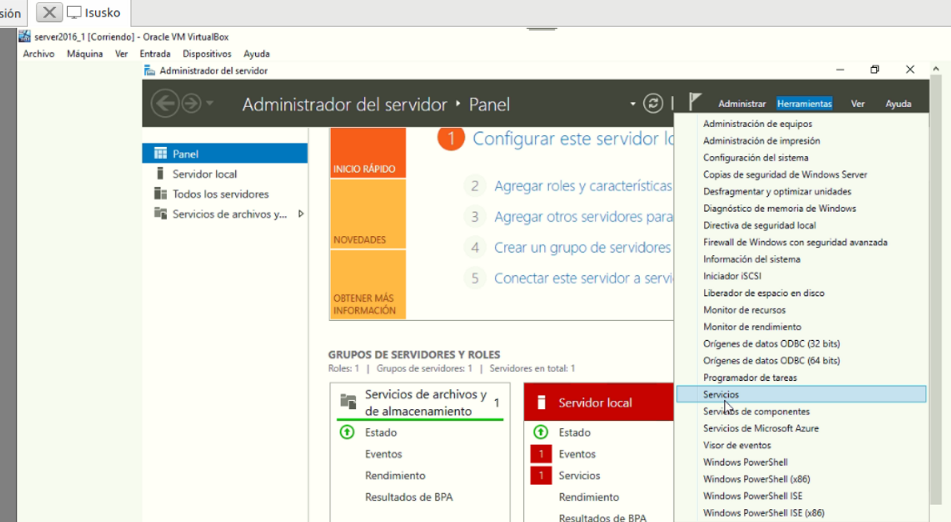
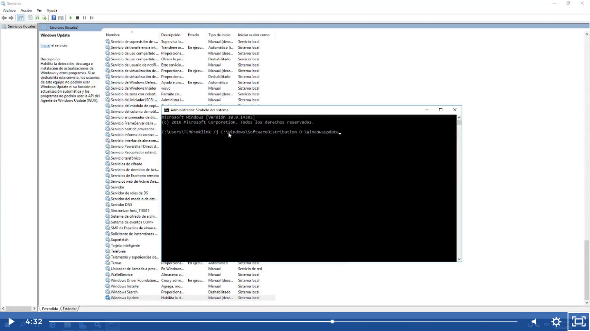
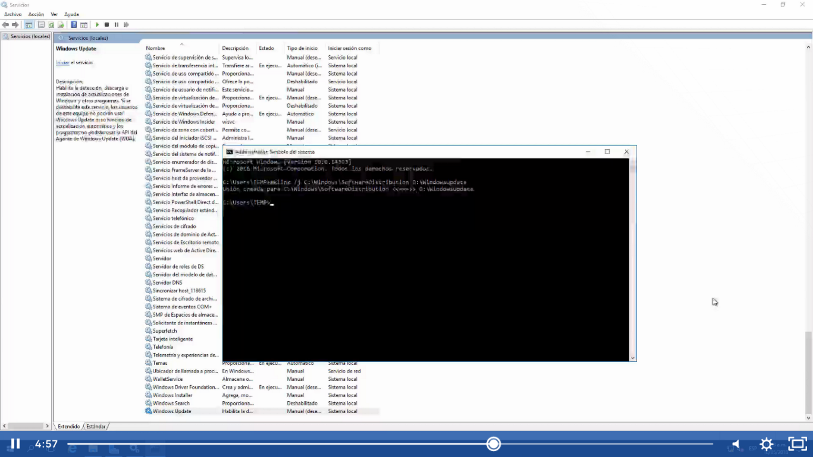

Primero stop a las actualizaciones automaticas para ello nos vamos a servicios 

En la partición D vamos a crear una carpeta llamada WindowsUpdate
En la unidad c vamos a renobrar la carpeta SoftwareDistribution a SoftwareDistribution.old
Luego con la cmd vamos a crear un enlace simbolico a la unidad D> WindowsUpdate
System32>mklink /j C:\Windows\SoftwareDistribution D:\WindowUpdate

Luego vamos a C:\windows\WindowsDistribution.old y vamos a copiar/cortar los archivos que se encuentren en esta carpeta, después nos devolvemos a c:\windows y encontraremos un acceso directo llamado WindowsDistribution  y vamos a pegar ahí los archivos, este enlaza a D:\WindowsUpdate que fue el redireccionamiento, esta se realiza así para que cuando habilitemos de nuevo las actualizaciones automaticas se descarguen en la nueva ubicación.

El paso anterior solo se realiza en caso de quedar sin espacio disponible de la unidad C: