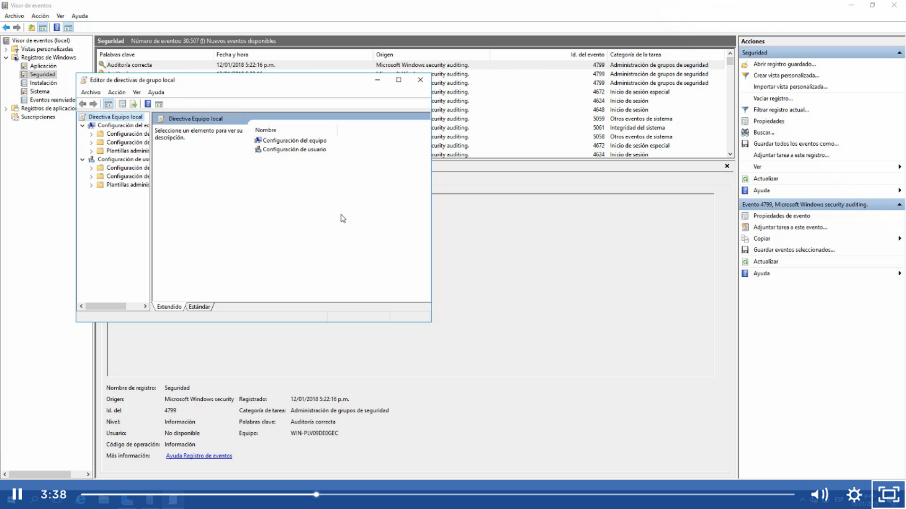
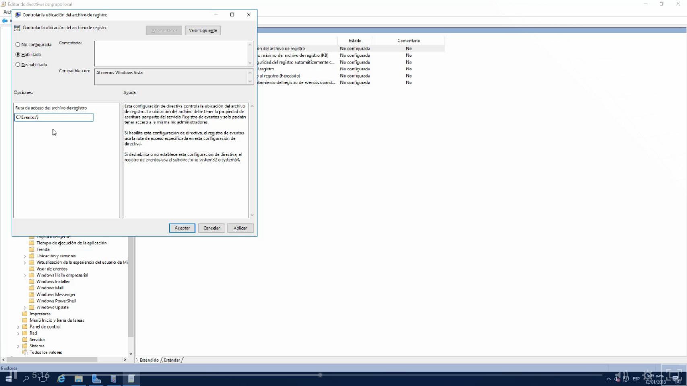
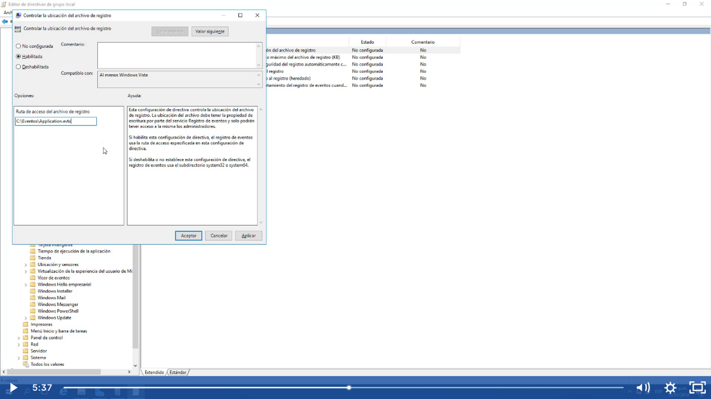

Tenemos que ir a gpedit.msc o GPO o Group Policy Editor y buscar Configuración de equipo>plantillas administrativas>componentes windows>servicios de registros de eventos que encontraremos los principales que se tiene que cambiar la ruta individualmente:
Aplicación
Programa de instalacion
Seguridad y sistema

Luego creamos en la unidad D por ejemplo una carpeta llamada eventos el cual será la nueva ubicación.

En el registro de windos copiamos \Application.evtx y así cada uno 

