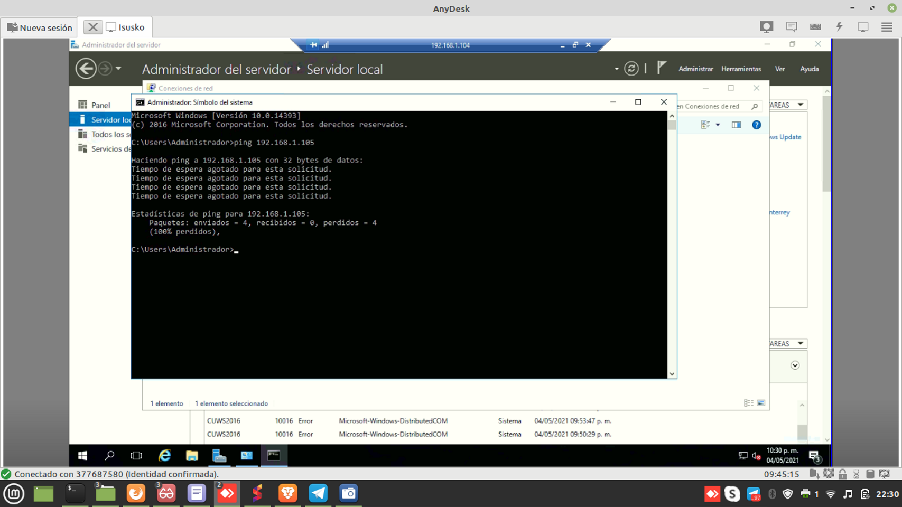
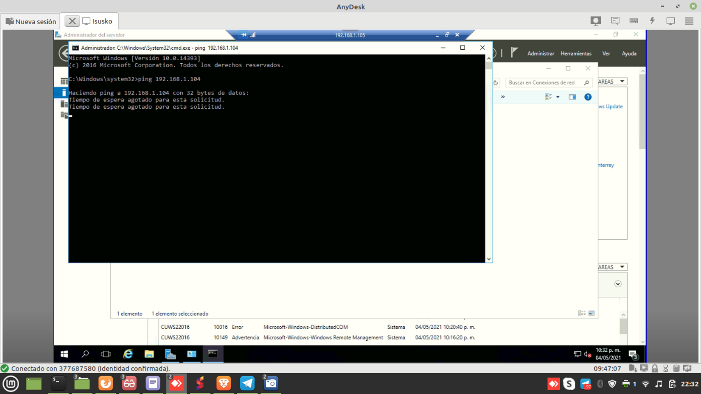
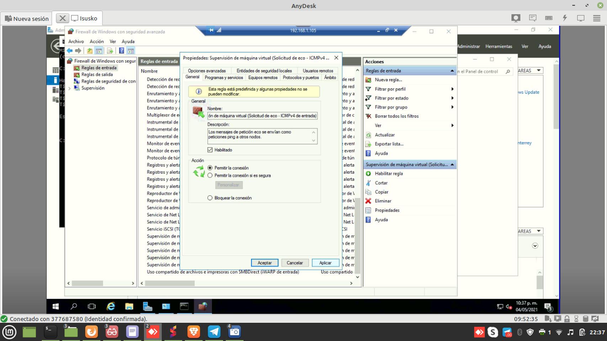
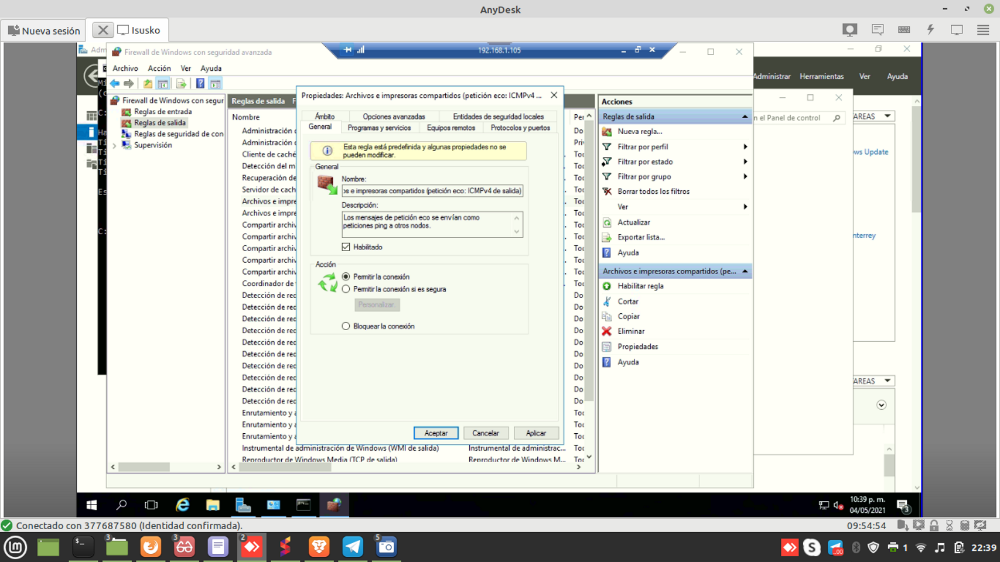
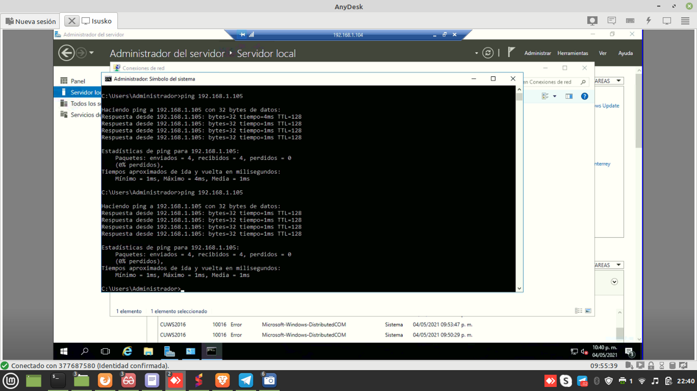
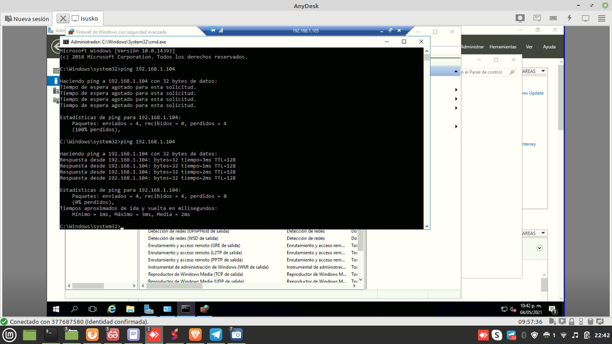

En el servidor 2016 hay que habilitar el ICMP4 en el firewall debido a que no vamos a poder realizar ping o echo 
Nos vamos a opciones avanzadas del firewall y en los puertos de entrada y salida buscamos el ICMP4 y solo le damos click en habilitar y hacemos la prueba con el ping  

Estoy tratando de hacer ping a la 192.168.1.105 pero indica que no se puede

Estoy tratando de hacer ping a la 192.168.1.104 pero indica que no se puede

Voy a realizar habilitar el ICMP4 en puertos de entrada para eso tenemos que organizar los filtros por deshabilitados y veremos ahí el ICMP4

Luego en el puerto de salida y aplicamos lo mismo

Volvemos a probar el ping al 105 y viceversa

