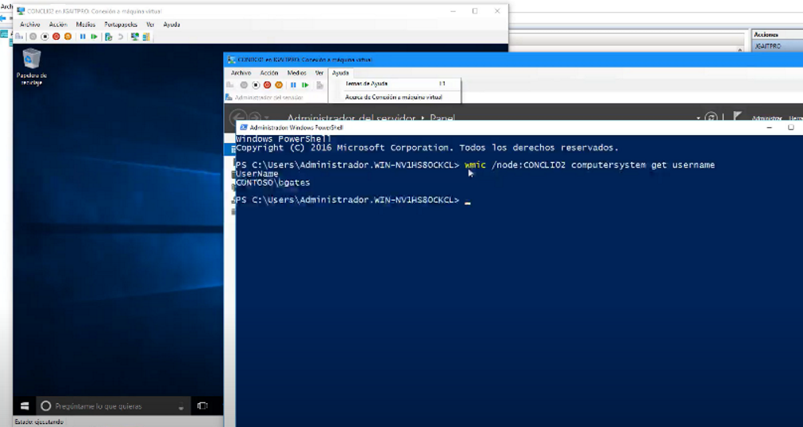

Saber que usuarios han iniciado sesión en un equipo del dominio

Vamos hacer la consulta desde el controlador de dominio a nuestro cliente en este ejemplo el cliente se llama CONCLI02

La consulta se puede realizar desde powershell o desde un cmd

Y podremos ver que el dominio es CONTOSO y el usuario es BGates