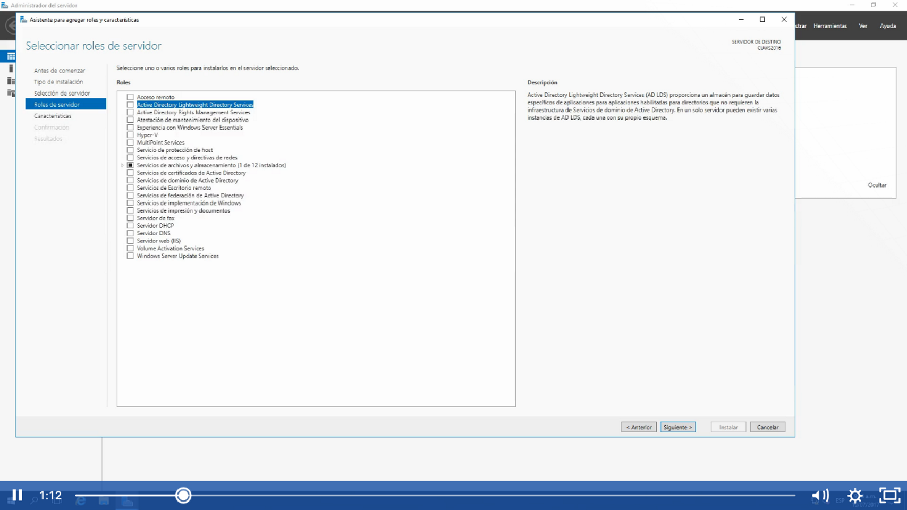
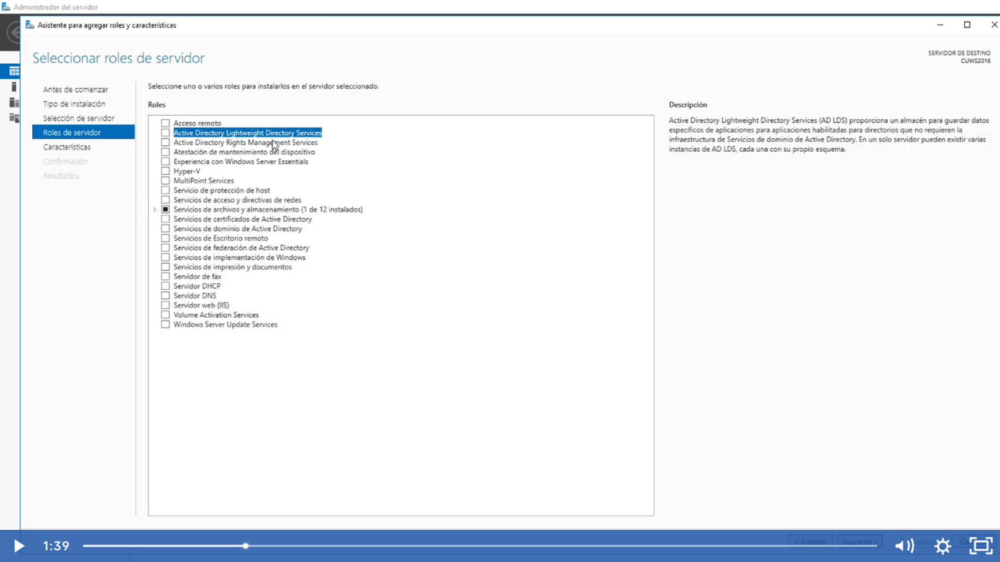
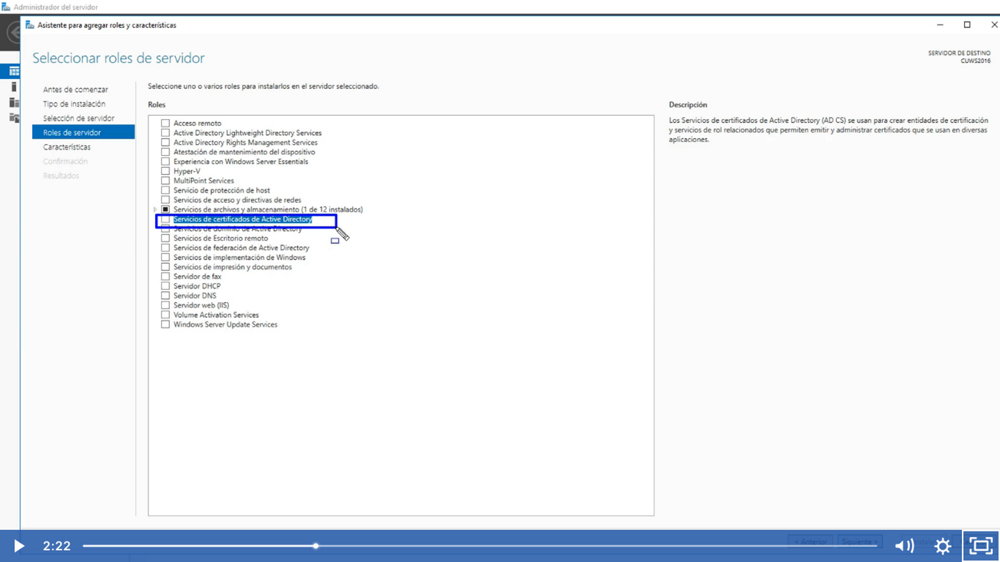
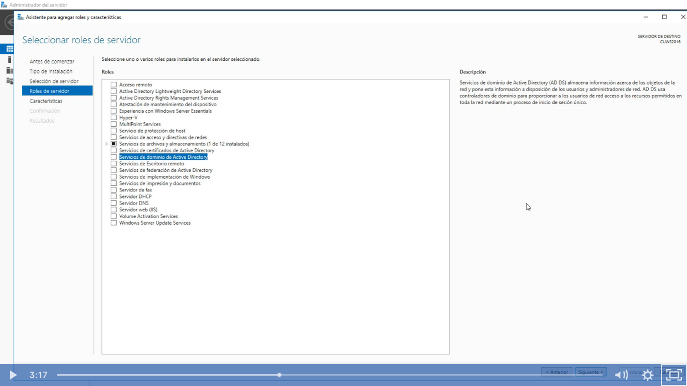
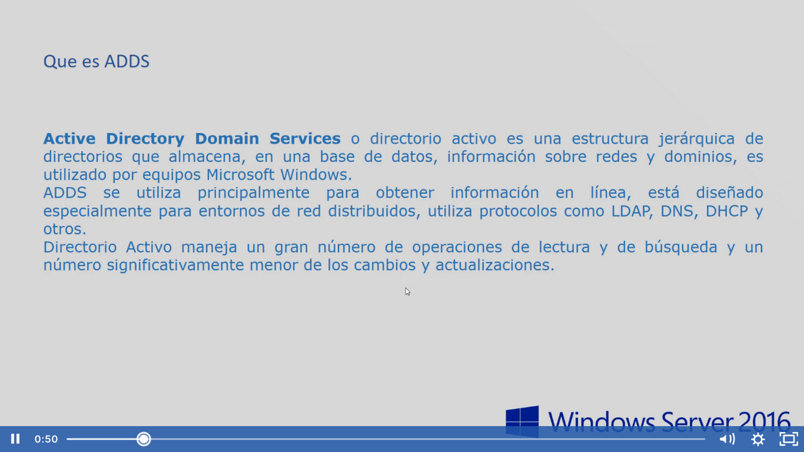
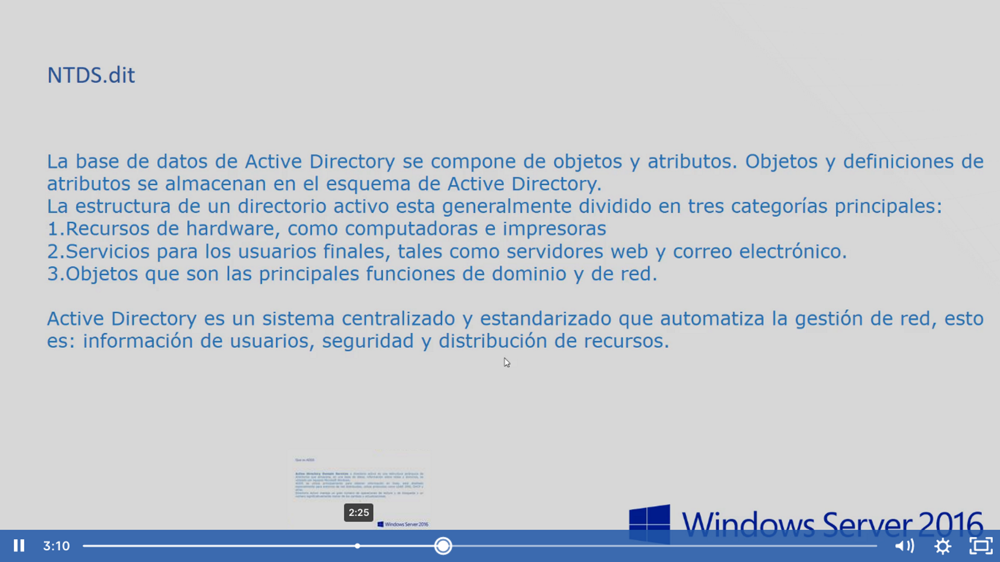
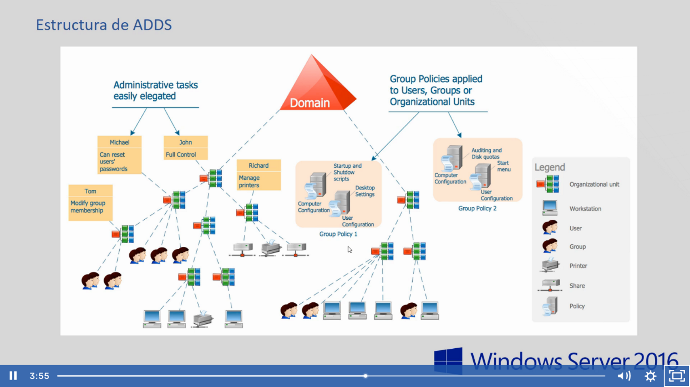

¿Que es Active Directory? 
Concepto de 5 funciones en nuestro windows server:
Nos vamos a Administrar>Roles y caracterìsticas> Roles del servidor.
1.- Active Directory Lightwave Directory Services
Nos proporciona un almacen para guardar datos especificos para aplicaciones habitadas/habilitadas para directorios que no requiere la infrestructura de servicios de dominio de active directory, en pocas palabras es un active directory suaves, que no requieran temas de autenticaciòn

2.-active directory rights management services. Ayuda a proteger la informaciòn contra el uso no autorizado, ADRMS establece la identidad de los usuarios y proporciona a los usuarios autorizados licencias para informaciòn protegida. Ejemplo:El documento A solamente lo puede ver el usuario A, si otro usuario lo encuentra no lo va poder ver.

3.- servicio de certificado de active directory.  AD CS.-  Se usan para crear entidades de certificacion y servciios de rol relaciones que permiten emitir y administrar ceritificados que se usan en diferentes aplicaciones, certificados de confianza para poder establecer en nuestros servicios

4.- Servicios de dominio de active directory. AD DS.- comunmente se conoce como active directory , nos da la seguridad y la autenticación, lo que permite que un usuario pueda ingresar con sus credenciales en un dominio por seguridad.

5.- Servcios de federación  de active directory.- AD FS.- Pro.- Incluye un servicio de federreaciòn que habilia SSO basado en explorador, se utuliza para federar intendidades, para que haya unico sesión con servicios que van vìa web, por ejemplo office 365, microsoft azure, servicios en la nube.

El punto 4 y punto 5 van muy ligados de la mano , nos dan la posibilidad de iniciar sesiòn en otros servicios vía web 

