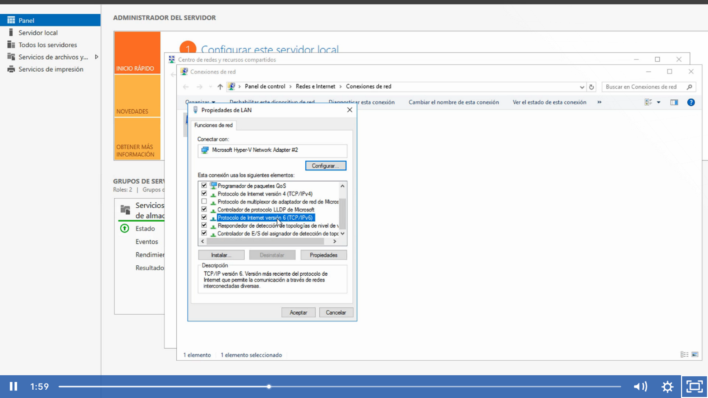
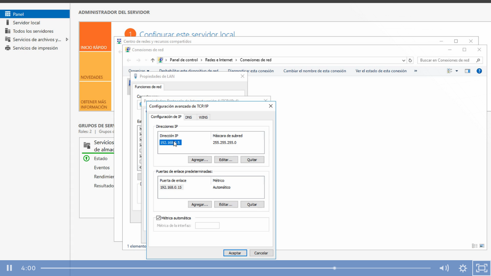

Recomendación.- en caso de no usar IPV6 lo mejor es desactivarlo

No es recomable que un controlador de dominio se conecte a internet y el DNS tiene que ser el mismo que la IP, lo recomendable es quitar la puerta de enlace.

Opciones avanzadas lo dejamos por defecto.

