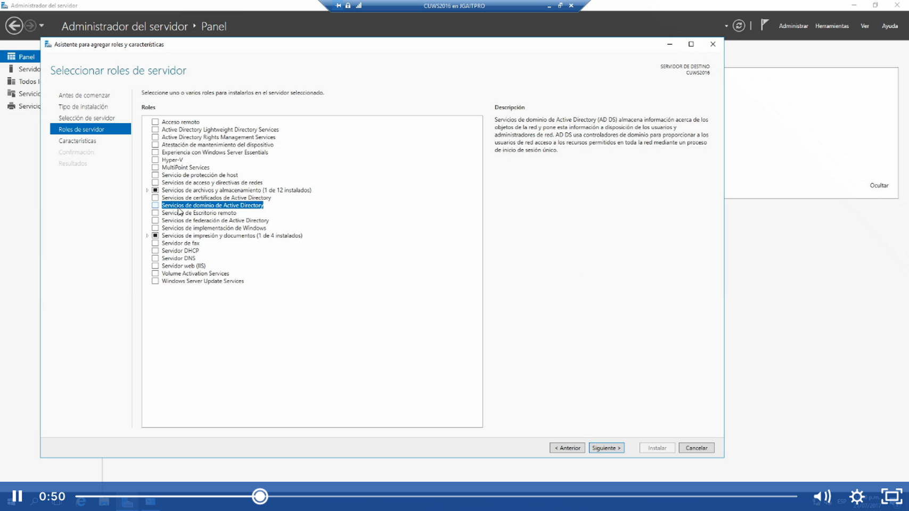

Aquí es donde vamos a instalar, click en siguiente:

Lo seleccionamos:

Click en agregar y siguiente

No se agrega ninguna caracteristica Click en siguiente:

Conexión a la nube, aquí le vamos a dar click en siguiente

Seleccionamos la opción de reiniciar, aunque no lo va reiniciar:

Va a realizar la instalación  de las administración de directivas de grupo, herramientas de … viene en la lista

Click en promover el controlador del dominio:

Antes existia el problema de que colocaban en el nombre fiscorp.mx y internamente generaba un error al contar con la pagina web y querer acceder no arrojaba un error ya que nos quería enlazar al controlador de dominio, ahora ya no existe ese problema solo hay que tomarlo en cuenta y saber decidir correctmente el nombre del controlador de dominio ya que en un furuto va a ser imposible cambiarlo por todas las aplicaciones existentes.

