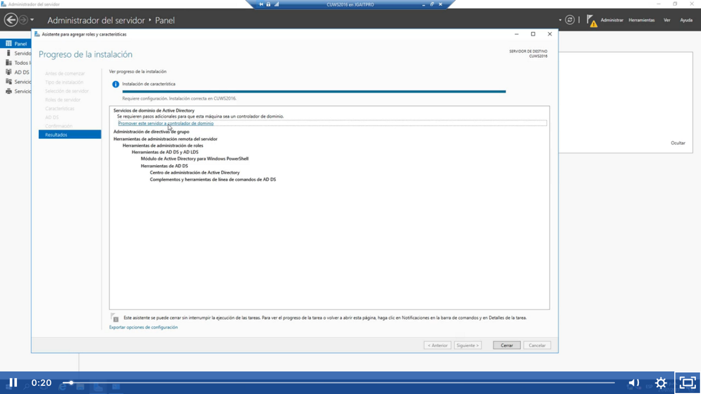

Tenemos 3 opciónes:

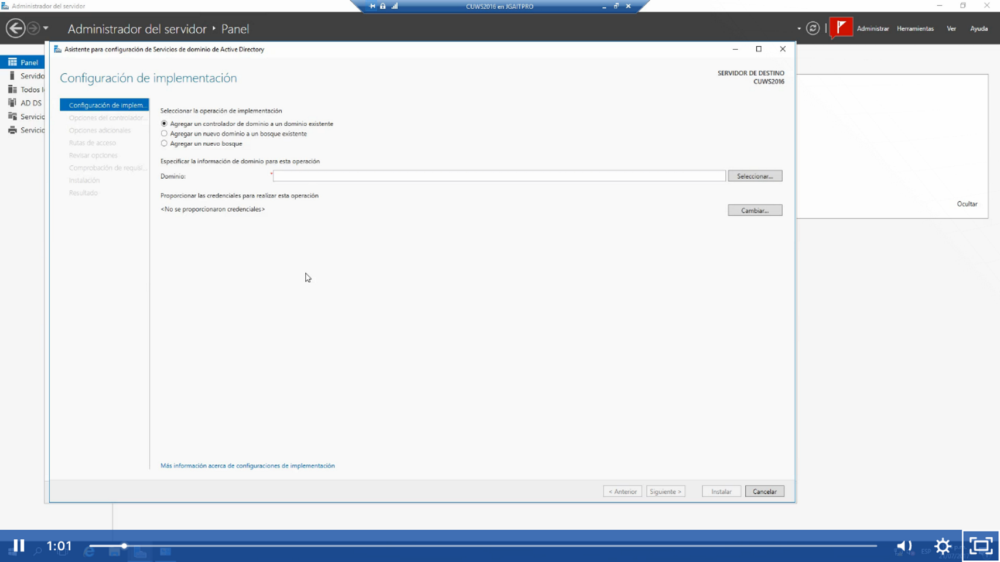

1.-Agregar un controlador de dominio a un dominio existente:
Controladores de dominio replica o copia de un controlador de dominio primario
2,. Un nuevo dominio a un bosque existente.
Cuando vamos a crear un arbol de dominio, subdominios de un dominio principal
3.-Crear un nuevo bosque
Aquí vamos a crear nuestro primer bosque nuestro primer domnio y también nuestro primer controlador de dominio..

Vamos a crear nuestro primer controlador de dominio contoso.com(para los laboratorios microsoft hace uso de este dominio) entonces seleccionamos crear mi primer bosque y escribir el nombre del dominio raíz

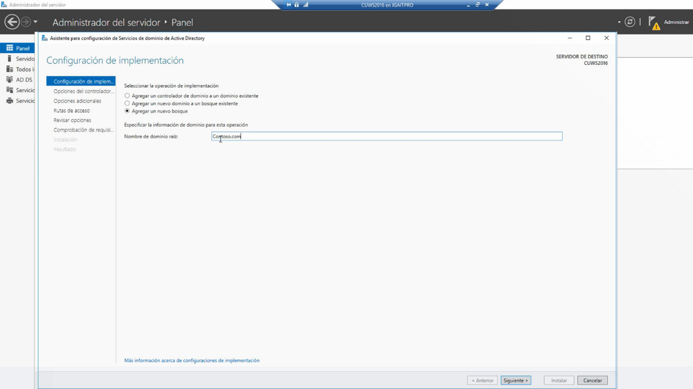

Al darle click en siguiente nos saldrá el siguiente cuadro de dialogo se va a tardar un poco porqué va a comprobar que no exista otro bosque en el dominio.
Además aquí en la parte de nivel funcional del bosque y nivel funcional de dominio debemos de ser cuidados porqué si escogemos en ambos windows server 2016 no vamos a poder agregar controladores de dominios que tengan versiones anterior como windows server 2012, 2008 o 2003, si van a existir controladores de domino con windows anteriores a 2016 se recomienda escoger windows server 2008 R sin embargo cuando se hace eso no se van a poder ocupar las funciones màs actuales de windows server 2016.

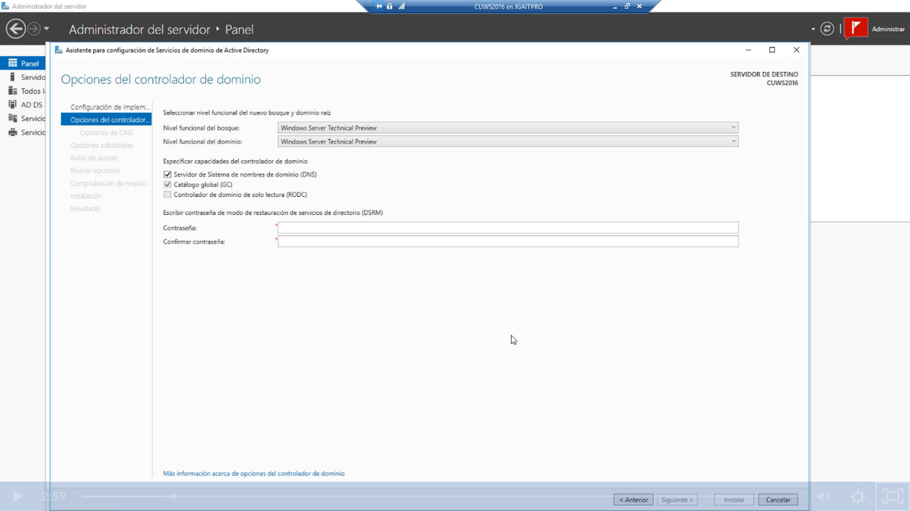

Ejemplo de lo hablado anteriormente se escoge windows 2008r en ambas opciones para que se puedan agregar controladores de dominio 2008, 2012 y 2016, para el curso seleccionaremos windows server 2016

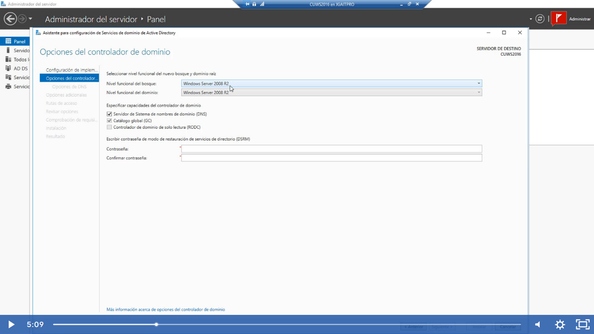

Se selecciona windows server 2016 para el curso.
Se debe de dejar por defecto la opción servidor de sistema de nombre de nominio (DNS) ya que se integra a nuestro active directory
El catalogo global (GC) es el tema de la indexación global de nombres, cuando nosotros buscamos equipos en la red por ejemplo
El controlador de dominio de solo lectura (RODC) viene desactivado porqué al instalar por primera vez como es el caso del laboratorio se instalá como parte del controlador de dominio, ahora cuando ya tenemos un dominio implementado y queremos instalar un segundo controlador de dominio tenemos que seleccionarlo y que sea solo lectura, esta opción se utiliza para sedes remotas.

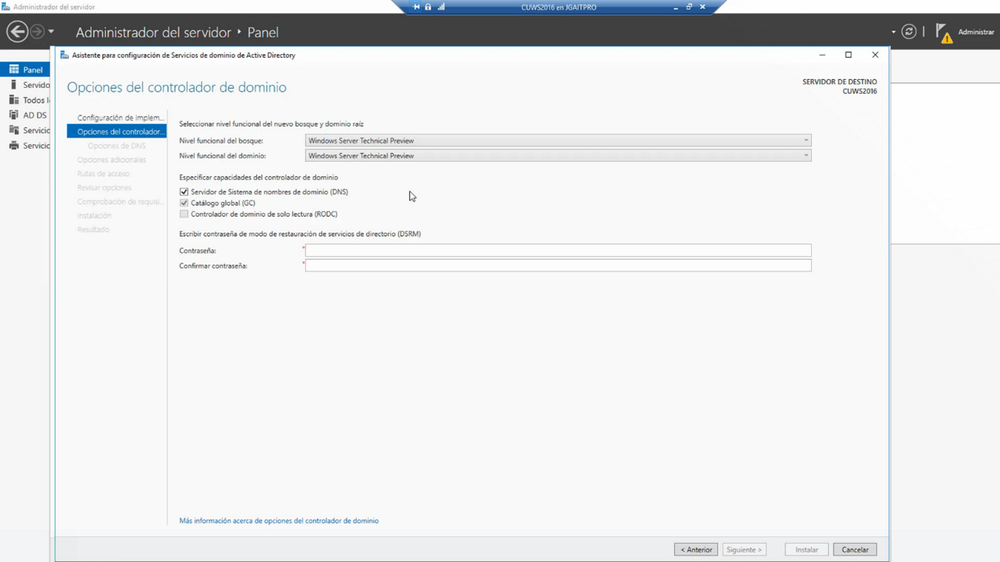

En la parte de escribir contraseña de restauración de servicios de directorio (DSRM):
Por si el active directory falla, tiene algún problema y debemos restaurarla de una copia de seguridad y es muy importante guardar la contraseña como si fuera un tesoro, porqué sino no vamos a poder restaurar el dominio. Click en siguiente

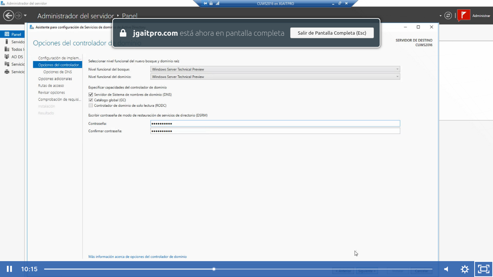

Este mensaje sale como advertencia porqué no existe en nuestra red. Lo cerramos porqué podemos continuar con 
nuestro proceso. Click en siguiente:

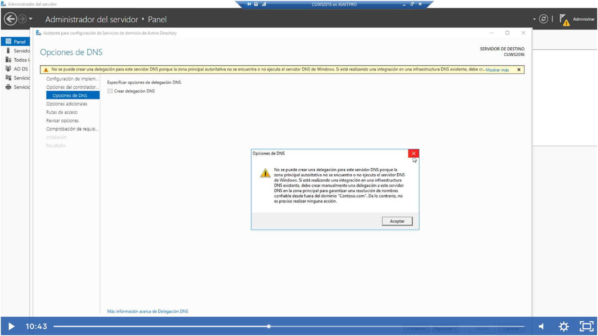

Aquí vamos a colocar el nombre netbios que vamos a mostrar a nuestros equipos en la red, el nombre de netbios puede ser diferente a la de dominio pero se recomienda que sean el mismo. Click en siguiente:

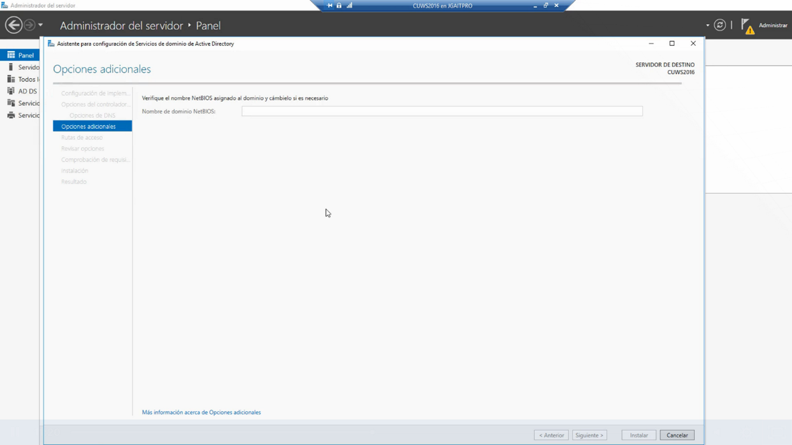

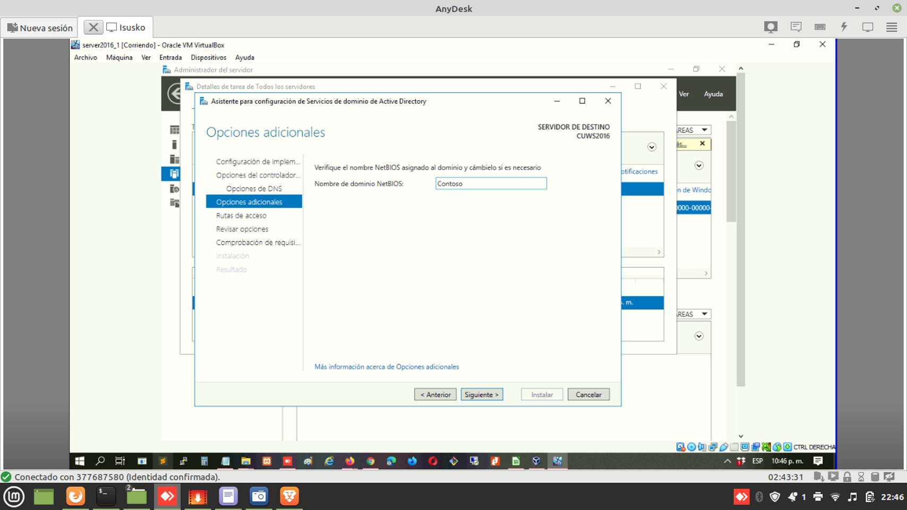

La base de datos del controlador de dominio se almacenan en NDTS, se recomienda que esté en otra unidad diferente a la unidad y volumen  C:\Windows\NTDS ( c:\winwdows\sysvol-> se recomienda que se quede en c porqué ahí es donde se agregan las políticas de grupo) tal vez en un disco D:NTDS y D:\SYSVOL click en siguiente

Nos muestra el resumen de lo que hemos configurado:

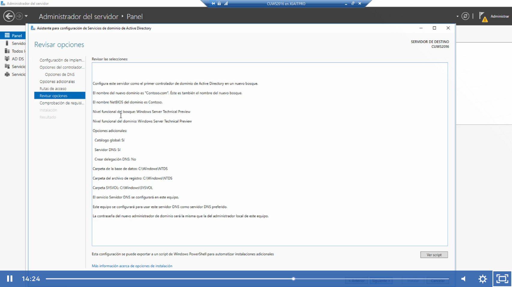

Click en siguiente y nos va a salir este cuadro de dialogo con advertencias, click en instalar:

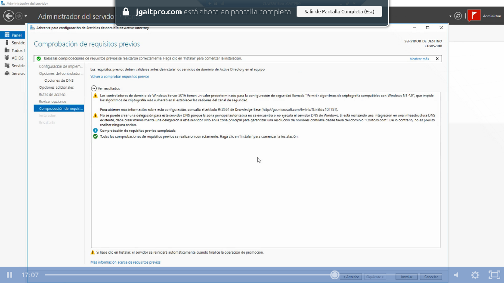

Esperamos a que reinicie solo después del mensaje:

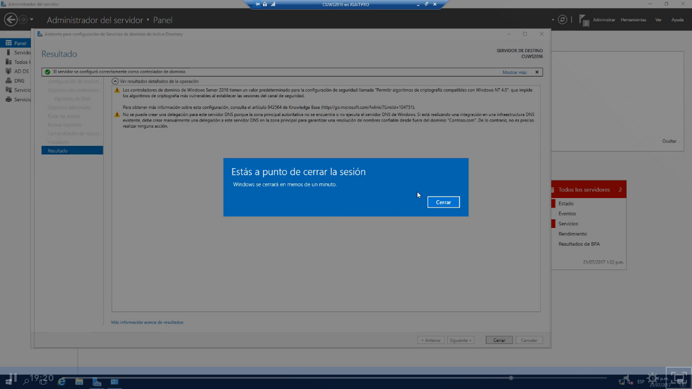

Una vez que ya termino de reiniciar nos vamos a fijar que ya se instalo el nombre del dominio + el nombre del usuario

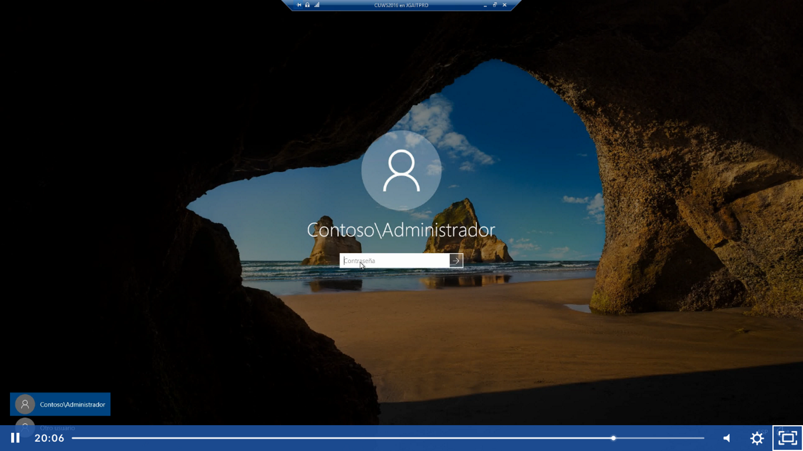

Y en el panel izquierdo nos aparecerá el controlador de dominio y el dns:

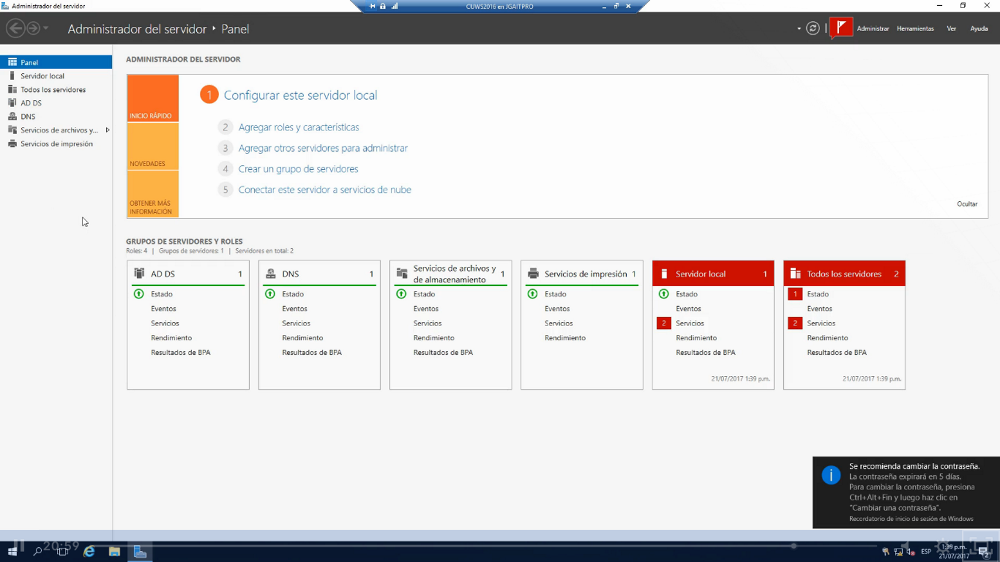

Y en propiedades nos aparecera que ya no estamos en un grupo ya pertenecesmo al dominio contoso

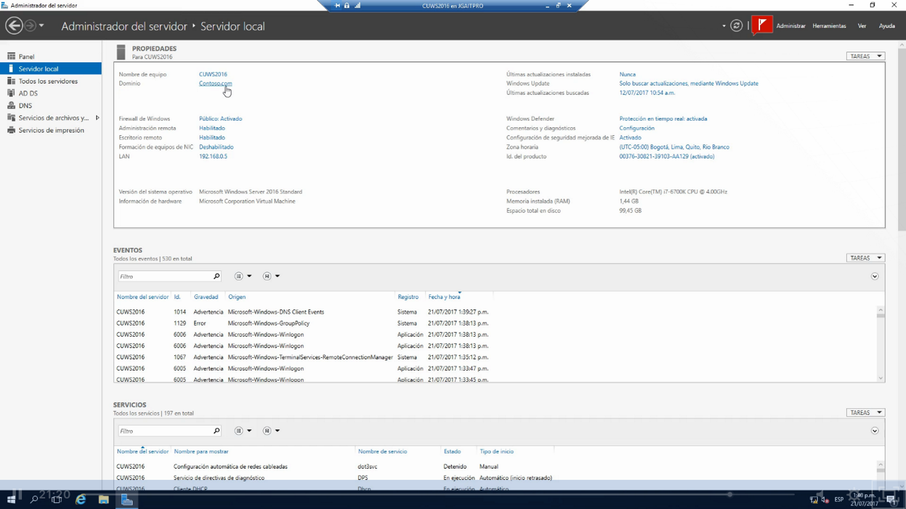

Y en herramientas también van aparcer opcioes de active directory

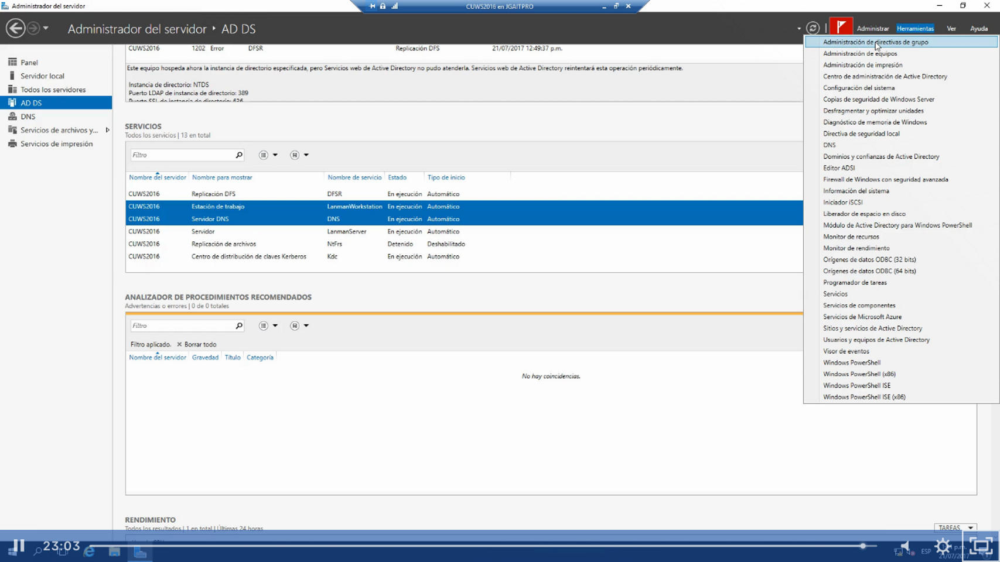