Verficaciones después de instalar un controlador de dominio.

Verficar los servicios, que las carpetas compartidas netlog y syslog esten perfectamente, que se haya creado nuestro servidor en la consola y servicios, la configuracion de dns para nuestro servidor 

1.-Lo primero que vas a verificar son los servicios active directory:
Click en herramientas, servcios:

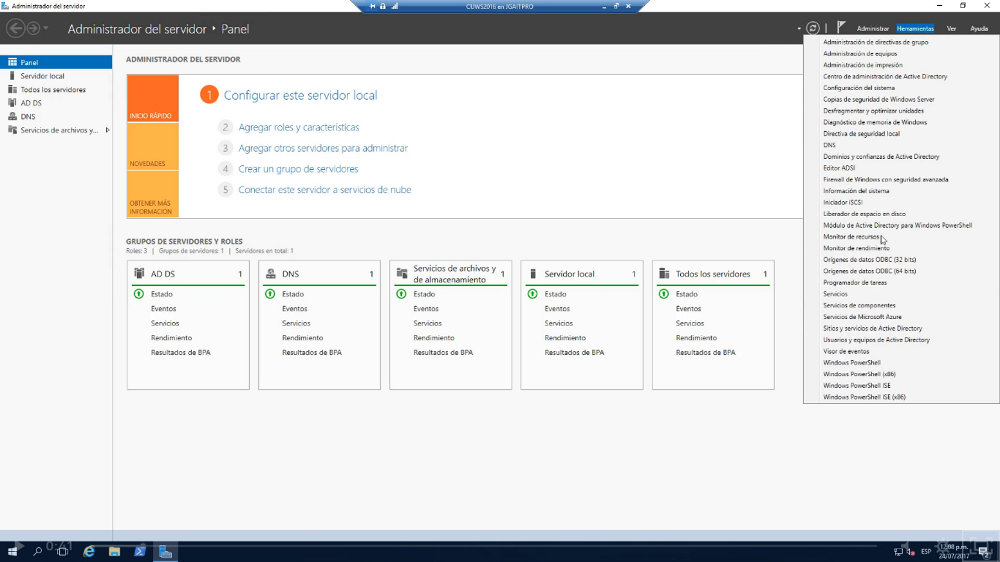

Buscamos servicios de active directory que este iniciado, en automatico y corriendo

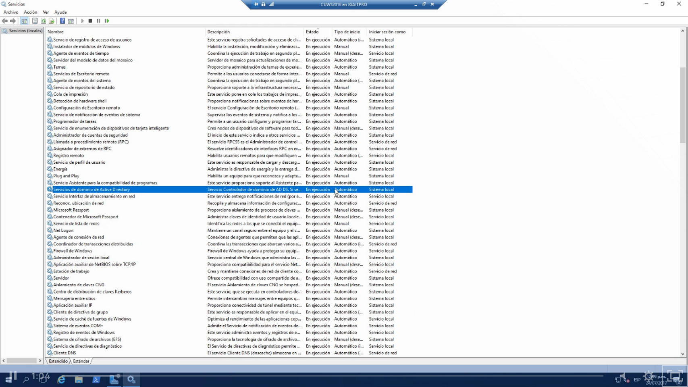

Veremos que tiene unas dependencias:

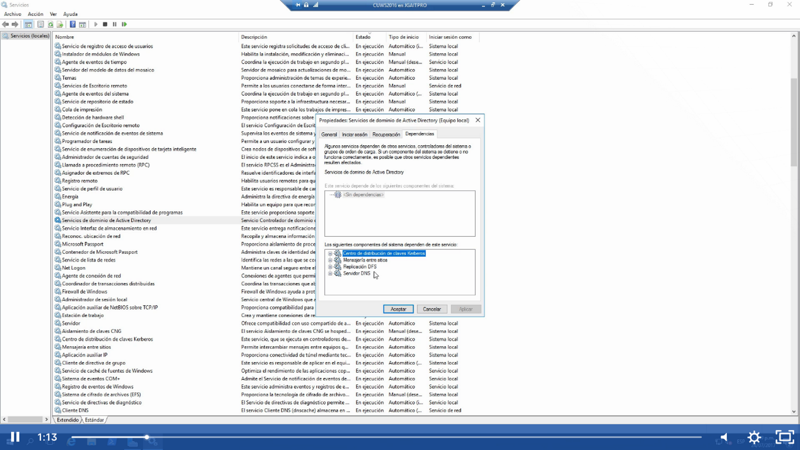

Verificar el servidor de DNS,Net Logon o inicio de sesión en Red,Hora de Windows, replicción de DFS y Servicios Web de Active Directory este iniciado, en automática y corriendo

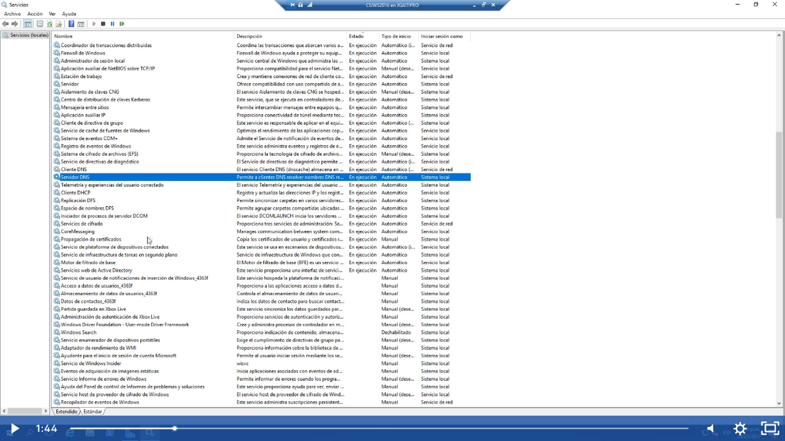

Ahora vamos a verificar que las carpetas sysvol y netlogon esten compartidas para eso abrimos el explorador y escribimos \\localhost

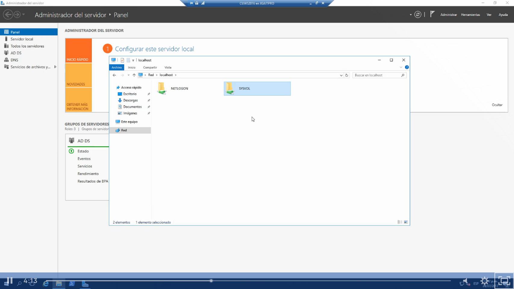

Revisar Usuarios y Equipos de Active Directory:

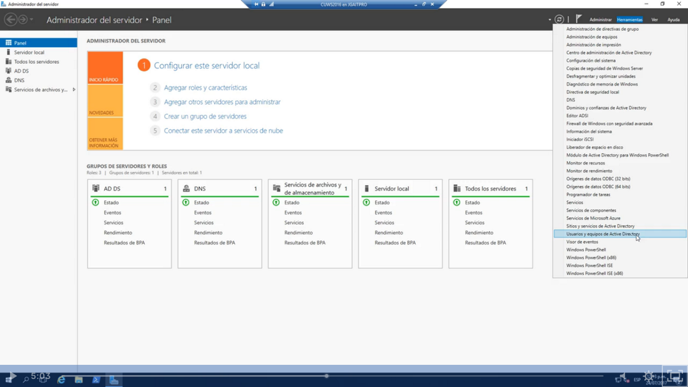

Esta va a ser la consola que màs se va a ocupar siendo el administrador de sistemas ya que aquí se va a administrar los usuario y equipos:

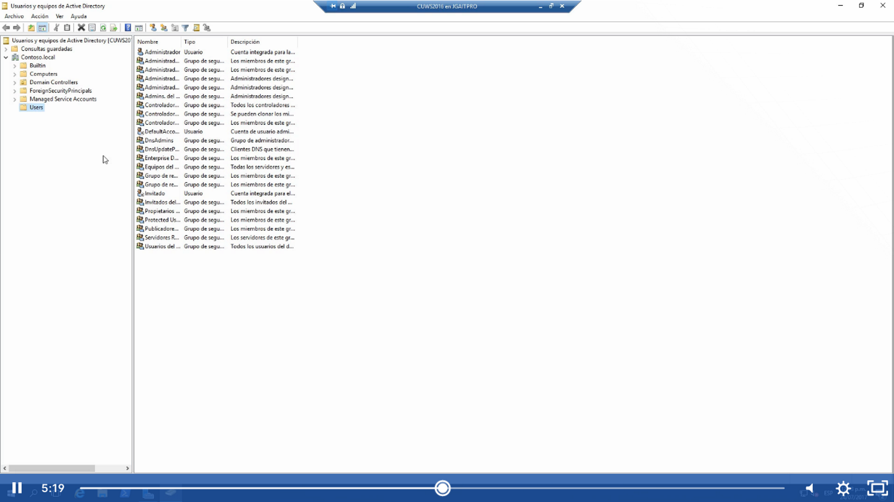

Y aquí vamos a revisar que en contoso local -> maestro de operaciones 

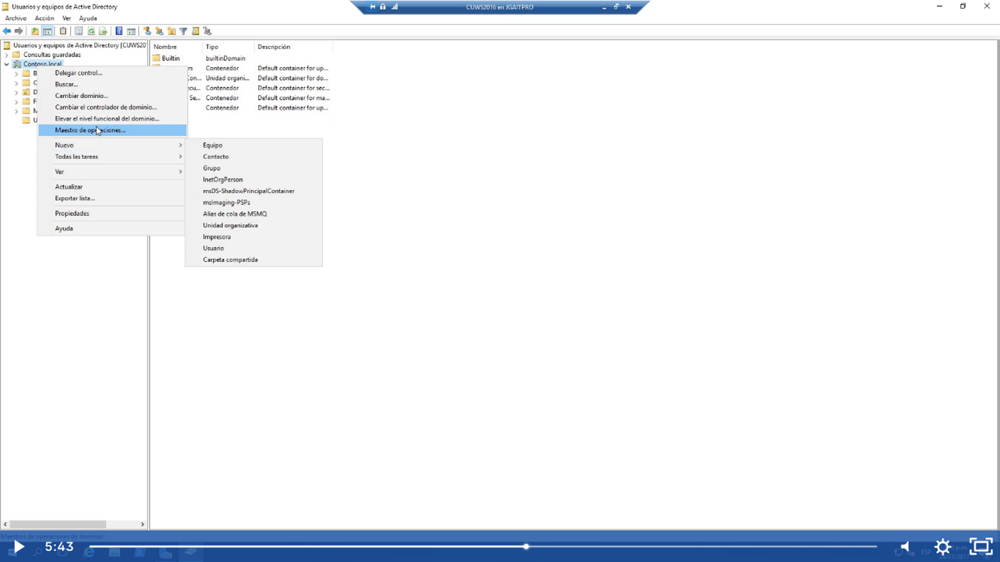

Revisar que el RID y el de infrestuctura no muestren ningún error:

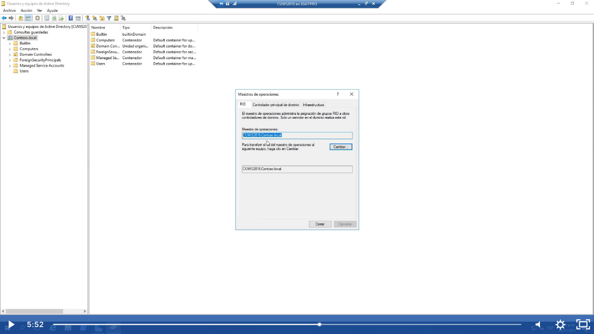

Tambien en contoso local-> elevar el nivel funcional del domonio

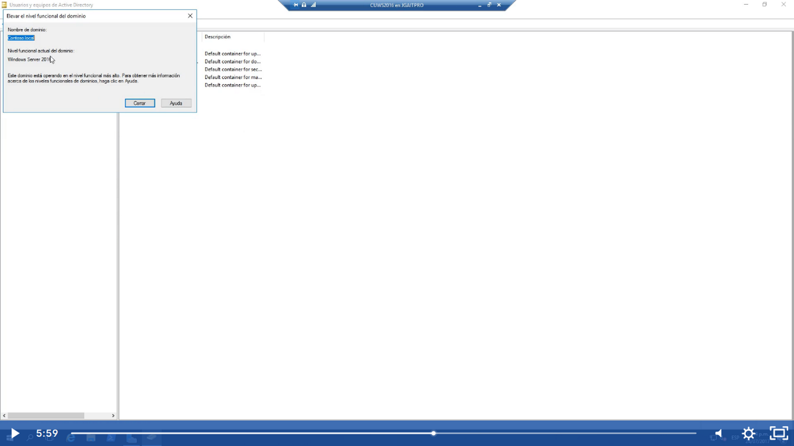

Otra cosa que debemos revisar es Sitios y servicios de active Directory

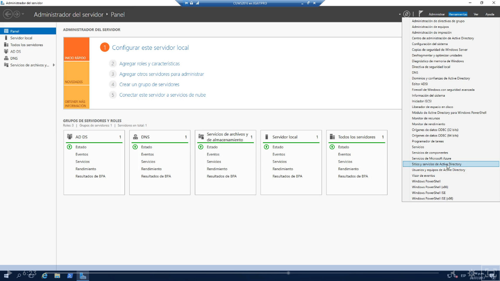

Una vez que abra debemos revisar que este creado correctamente el sitio Default

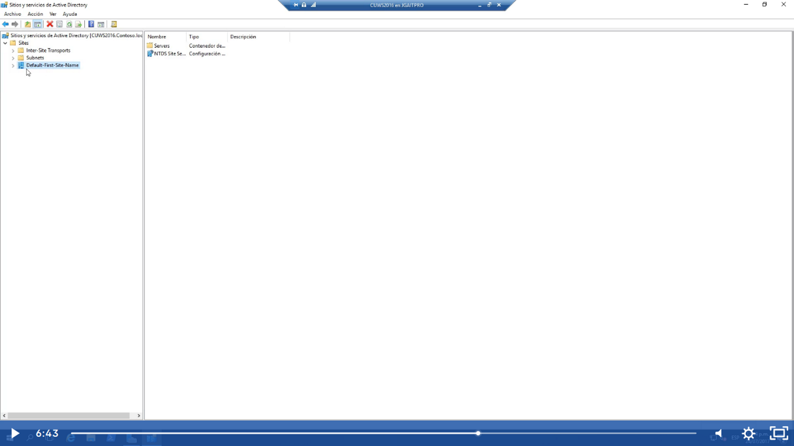

Ahora debemos verificar que en herramientas> DNS 

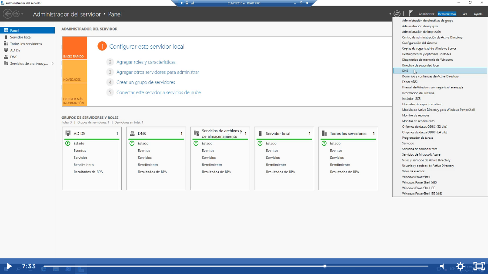

Revisamos que los archivo este creados mscdcs y contoso.local 