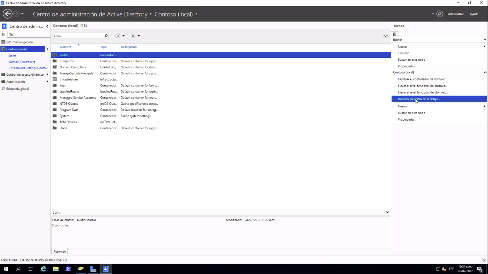
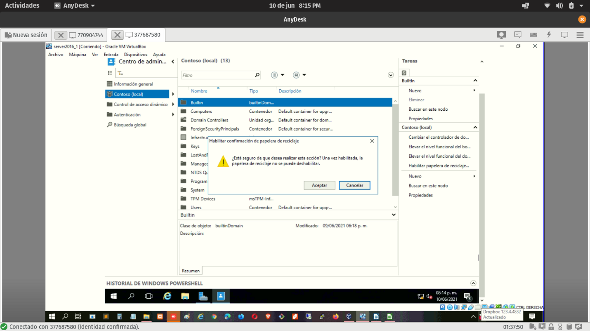
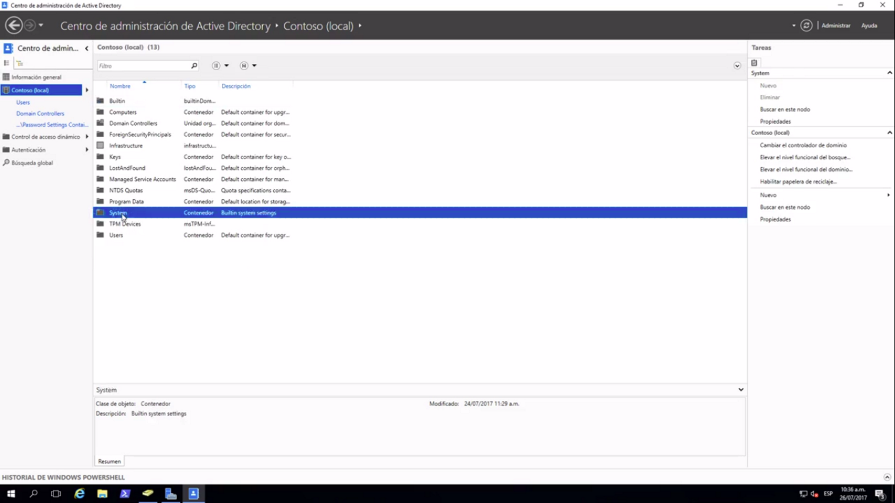
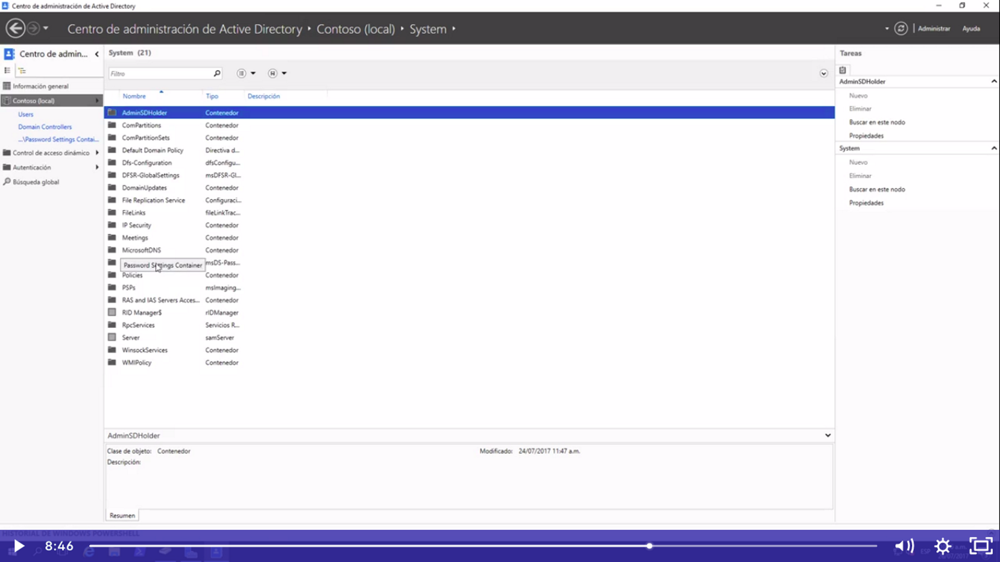
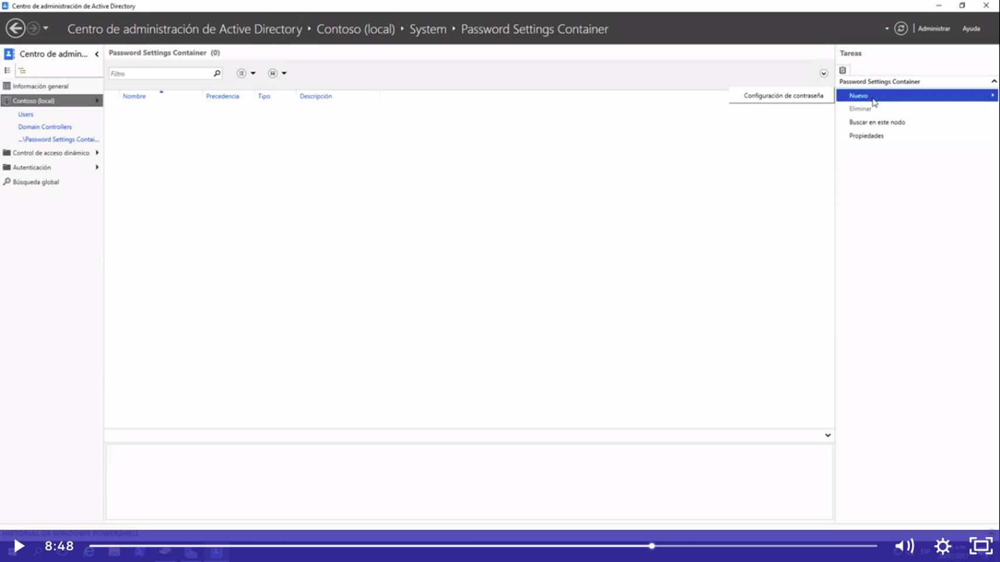
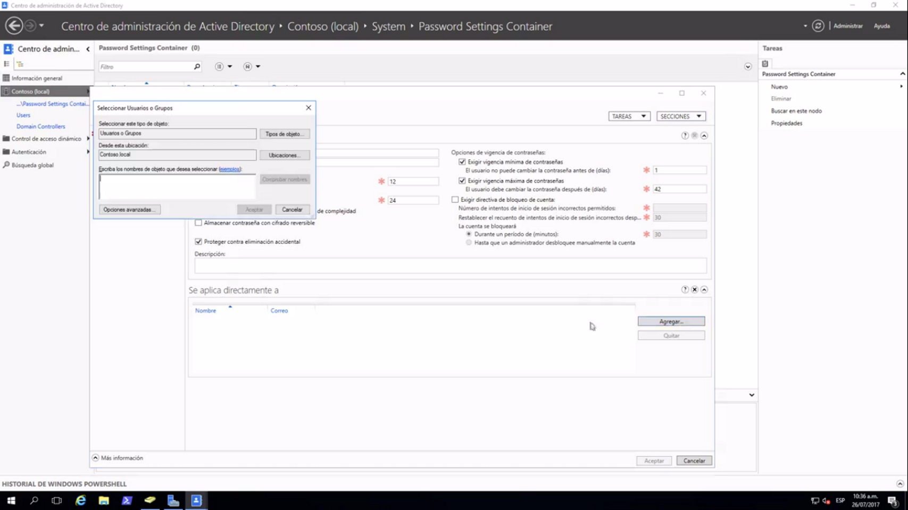
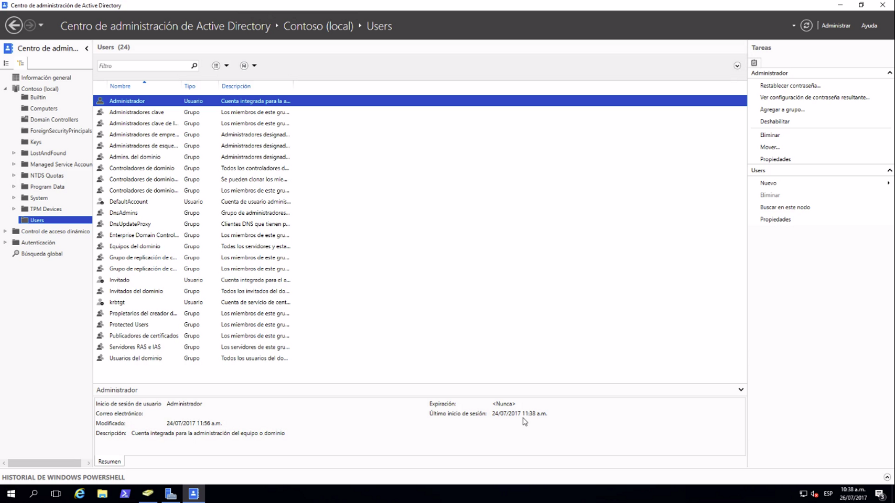
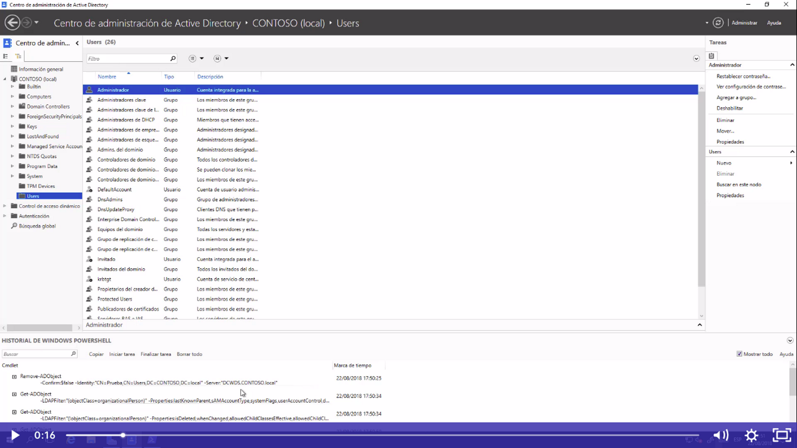

Herramientas-> Centro de administración de active directory

Aquí debemos de activar la papelera de reciclaje o a través de power shell
Esto nos permitira recuperar alguna cuenta en caso de eliminarlo por error

Al habilitar la papelera ya no se podrá desactivar

En esta parte también podemos configurar que las contraseñas sean más fuertes o debiles de acuerdo al tipo de usuario o grupo al que pertenece,por ejemplo las contraseñas para el grupo secretarias puede ser debil con 5 caracteres como mínimo:
Para eso nos vamos a local->system->password->new->confirguración de contraseña
System:

Password:

New-Configuración contraseña:

Confirgurar el grupo y el tamaño de la contraseña

Aquí también podremos ver el historial de power shell,lo que signifca que veremos todas las configuraciones realizadas tanto de power shell o a través de gráficos o ventas

