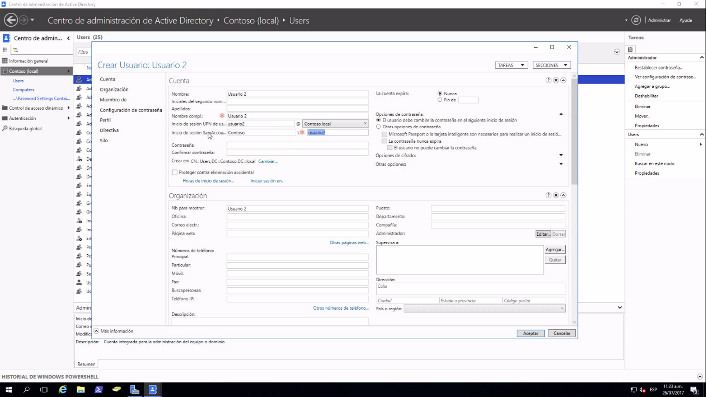
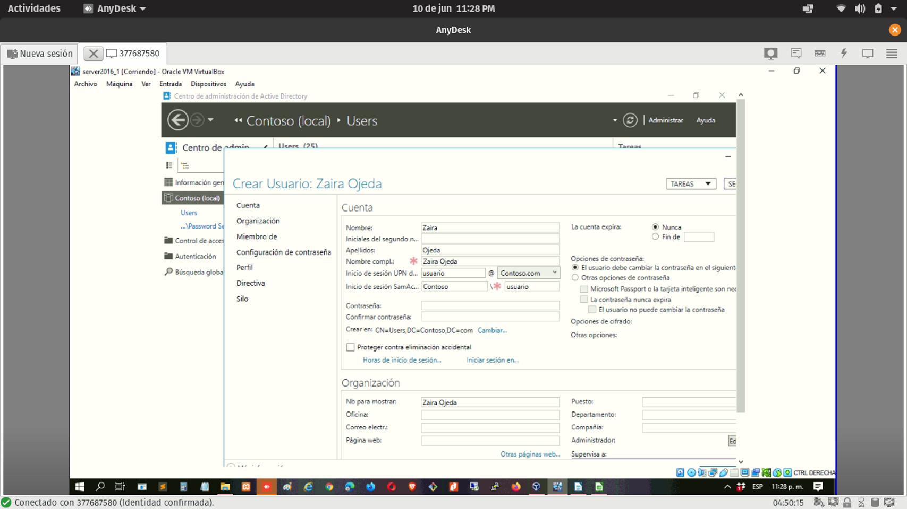

FQDN del usuario es el :
Nombre del usuario + el nombre del dominio por ejemplo:
Usuario1@contoso.local

Aquí configuramos la creación de un nuevo usuairo y la contraseña, a que grupo pertenece
Contoso.loca-> users

