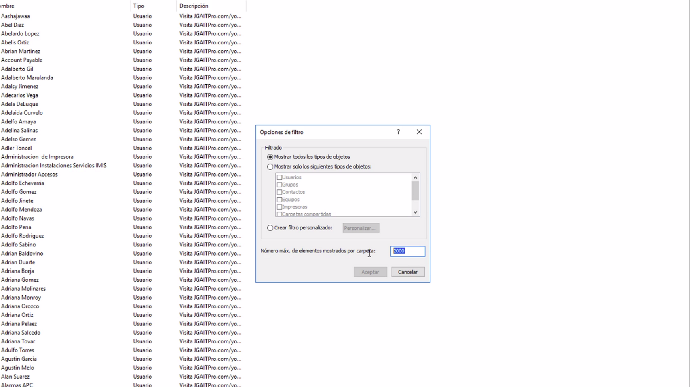

UO= Unidades Organizativas
Vamos a la consola de usuarios y equipos de active directory 
Panel->Herramientas-> Usuarios y equipos de active directory
Luego nos Vamos a l menú –> Ver-> Opciones de filtro y cambiamos el número máximo de objetivos y eso va  a depender de cuantos usuarios se creen por ejemplo en este caso fueron 2 mil entonces debemos aumentar a 3 mil porqué con 2mil no nos mostra todos los agregados y los que ya existian
