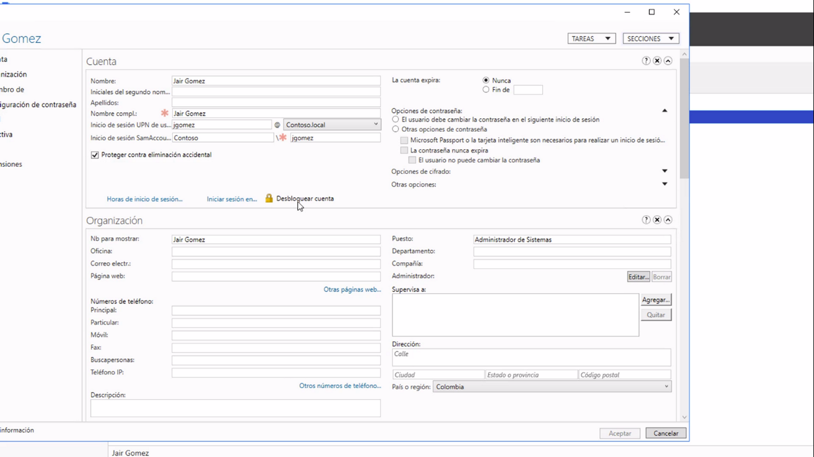
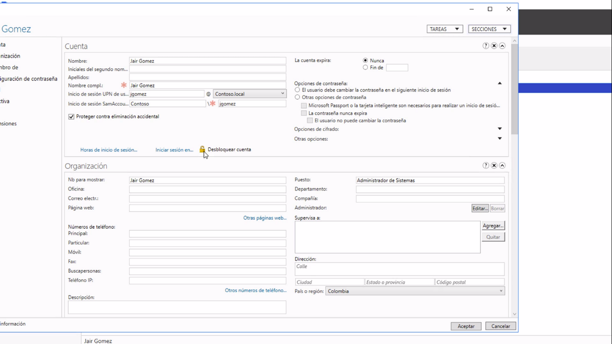

Desde el centro de Active directory buscamos el usuario, ingresamos a sus propiedades y buscamos el candadito y le damos click para desbloquear, esto pasa cuando los usuarios ingresan un password de forma erronea reiteradamente

Debloquear

