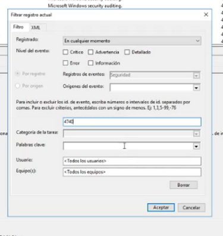

Después de intentar ingresar al equipo varias veces e introducir la contraseña equivocadamente se va a bloquear la cuenta:

Vamos a irnos a nuestro dominio:

Click en desbloquear cuenta:

Pero se sigue bloqueando la cuenta entonces queremos saber desde que equipo se está bloqueando está cuenta, para eso tenemos que ir a panel de administrador-> Herramientas->visor de eventos:

Luego aquí nos vamos a Registro de windows->seguridad->filtrar registro actual

Y en este caso el filtro será el 4740:

Y nos mostrará la información solicitada en este caso click contoso es el equipo que bloquea la cuenta:

