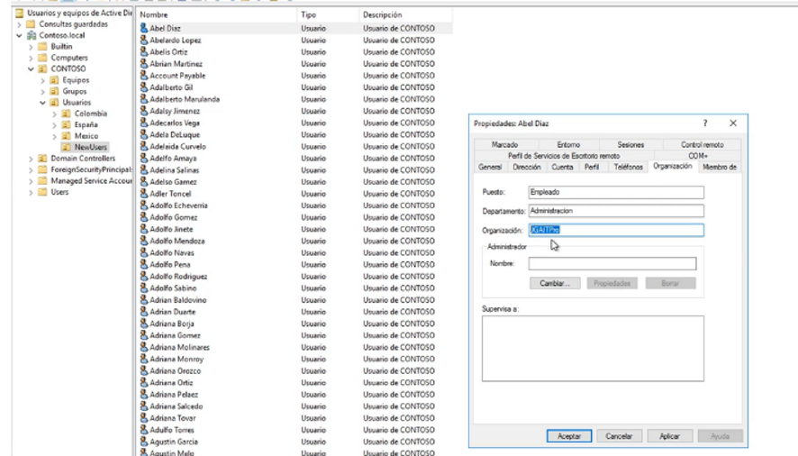
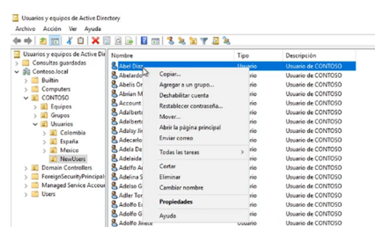
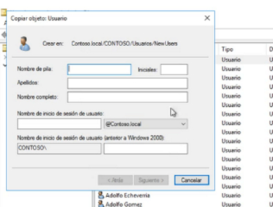
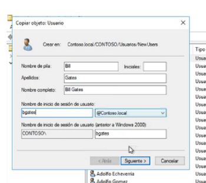
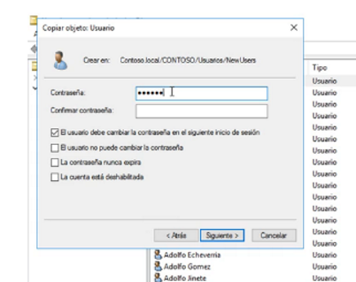

En este ejemplo ocuparemos el usuario Diaz

Solo basta con hacer click con el botón derecho encima del usuario y click en copiar

Ahora podremos crear otro usuario con la información de tipo de cuenta, grupos, información como teléfono etc, y podremos ponerle un nombre de usuario y contraseña:

Y listo, podremos revisar las pertenencias como grupo y tipo de usuario.
