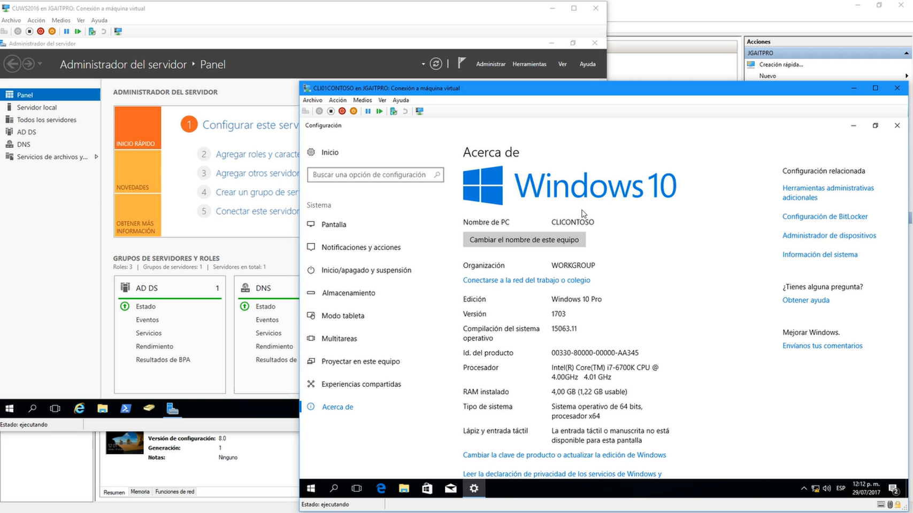
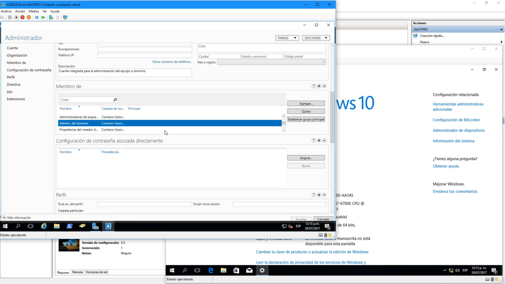

Nota: el cliente tiene que ser  del tipo profesional/enterprise como por ejemplo un windows 10 profesional
No acepta, home 
Debe de estar en la misma Red que la del dominio

Ahora del lado del servidor debe de ejecutarse de cuentas tipo administrador y la opción habilitada en active directory es en Admistrador del dominio

