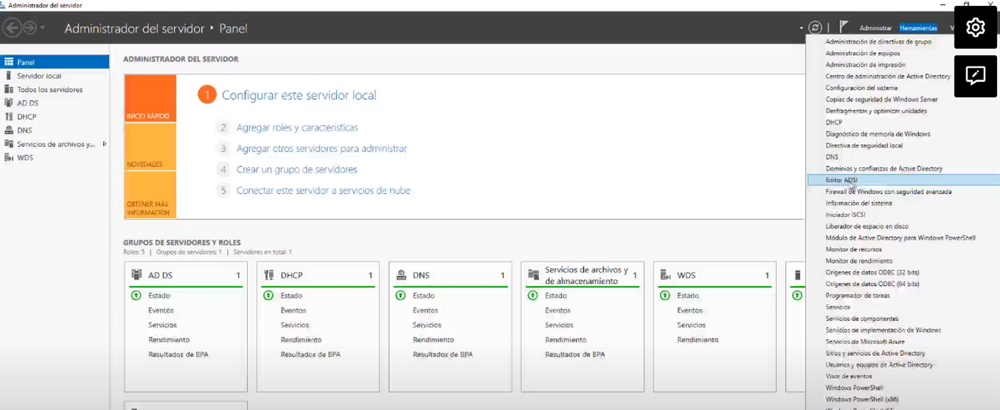
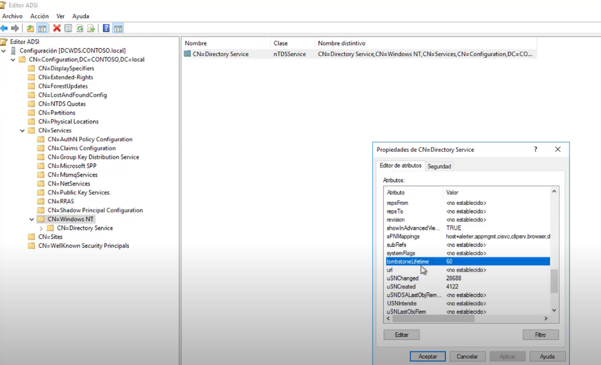

Es el tiempo que permanecera en la papelera de reciclaje un objeto. En server 2003 y 2008 por defuult son 60 días

Doble click y modificar a 730 días que son 2 años que en la industria es lo usual   
