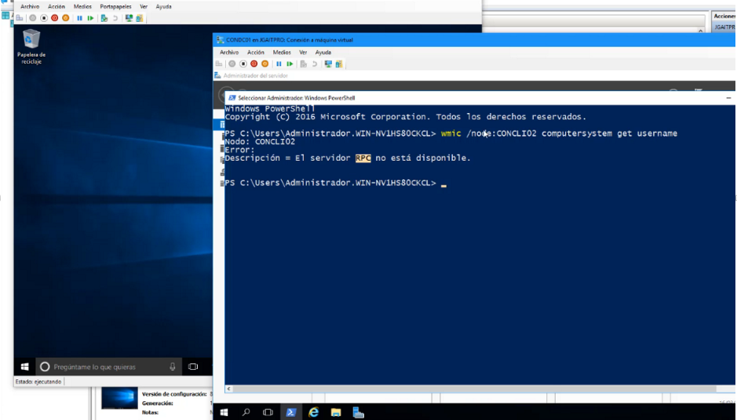
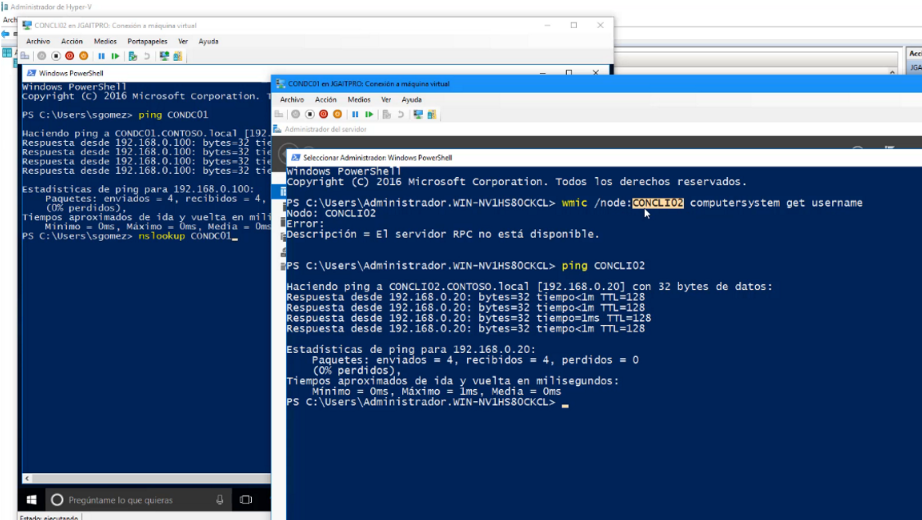
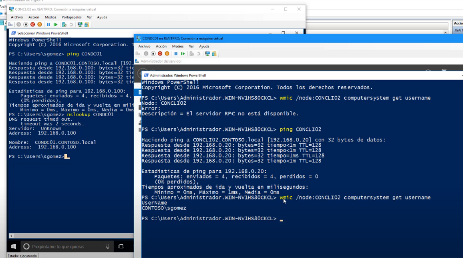

Solución El servidor RPC no esta disponible

Cuando nos presenta este error podemos verificar con un ping a la ip la ip y al controlador del dominio, también podemos hacer un nslookup 

Otra opción de verificación es desactivar el firewall y probar de nuevo

Y tendremos conexión nuevamente, entonces una de las causas es el firewall del equipo cliente
