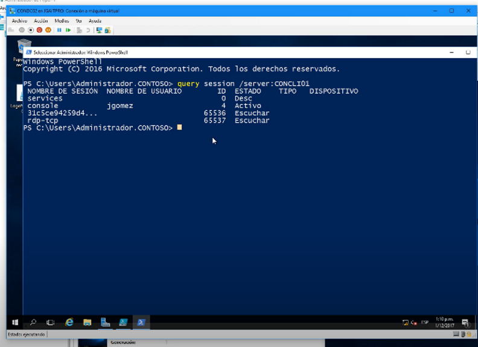
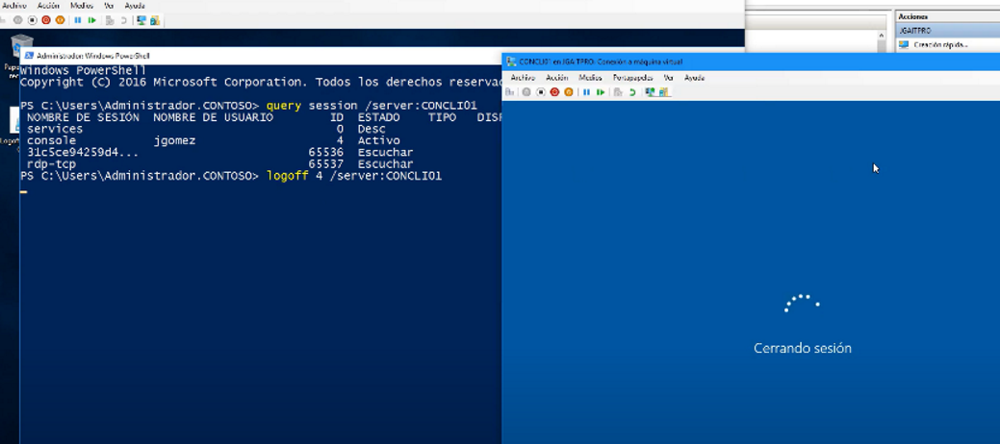

Para poder cerrar sesión cabe recalcar que la cuenta del administrador de la sesión debe de ser administrador
query session /server:IP o DNS 
}query es para listar

logoff #Sesión /server:IP o DNS
}logoff para cerrar sesión

