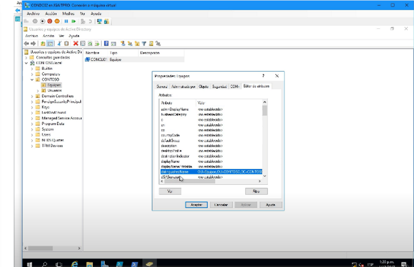
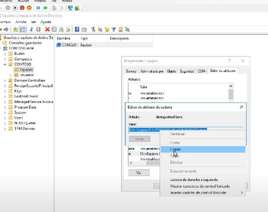
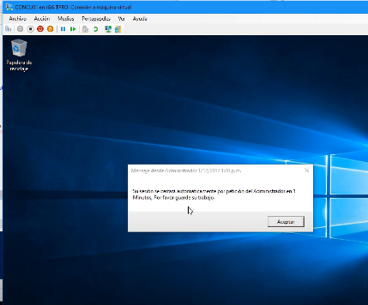

---> Para poder Cerrar remotamente sesiones de usuario en equipos de OU 

#Load Active Directory Module
Import-Module ActiveDirectory;
 
#Cambiar tiempo de cierre de sesión
 
[int]$timeleft = 1 #Tiempo de cierre de sesión en minutos
[System.Reflection.Assembly]::LoadWithPartialName("System.Diagnostics")
$countdowntimer = new-object system.diagnostics.stopwatch
 
#Establecer Nombre de equipo o todos con * y OU donde se cerrará las sesiones
[array] $prodservers= @()
Get-AdComputer -filter * -SearchBase "OU=Equipos,OU=CONTOSO,DC=CONTOSO,DC=local" -Properties "Name" | foreach-object {
$prodservers += $_.Name
}
 
while($timeleft -gt 0)
{
    $countdowntimer.start()
    foreach ($server in $prodservers) {msg * /SERVER:$server "Su sesión se cerrará automáticamente por petición del Administrador en $timeleft Minutos, Por favor guarde su trabajo."}
    while ($countdowntimer.elapsed.minutes -lt 1) {write-progress -activity "Elapsed Time" -status $countdowntimer.elapsed}
    $countdowntimer.reset()
    $timeleft--
}
 
#Forzar cierre de sesión para todos los usuarios
foreach ($server in $prodservers) 
{
    Write-Host "Logging all users off of $server"
    (gwmi win32_operatingsystem -ComputerName $server).Win32Shutdown(4)
}
Write-Host "`n`nSent Logoff command to $($prodservers.count) servers" -foregroundcolor Green;

---> Guardar archivo como Logoff All PCs OU.ps1 ->extensión .ps1
En la parte de Get-AdComputer -filter *  podemos cambiarlo por 'Name  =Like "GER*"' y quedaría algo así

Get-AdComputer -filter *

Get-AdComputer -filter  'Name  =Like "GER*"'  -< el nombre "GER" es por gerencia pero por ejemplo en la oficina fiscorp sería "FSP" y todos lo equipos que empiece con FSP se apagarán

->"OU=Equipos,OU=CONTOSO,DC=CONTOSO,DC=local"

La información de la unidad organizativa lo obtenemos así

Copiamos y remplazamos la información,
Ahora cuando lo ejecutemos se cerrará la sesión de todos los usaurios

