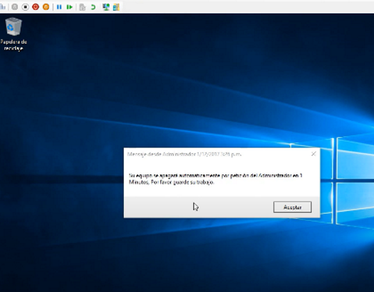

-> Para poder Apagar remotamente equipos de OU específica debemos guardar el archivo como Shutdown All PCs OU.ps1- este solo es un nombre de recomendacion
#Load Active Directory Module
Import-Module ActiveDirectory;
 
#Cambiar tiempo de Apagado
 
[int]$timeleft = 1 #Tiempo de Apagado de equipo en minutos
[System.Reflection.Assembly]::LoadWithPartialName("System.Diagnostics")
$countdowntimer = new-object system.diagnostics.stopwatch
 
#Establecer Nombre de equipo o todos con * y OU donde estan los equipos que se apagarán
[array] $prodservers= @()
Get-AdComputer -filter * -SearchBase "OU=Equipos,OU=CONTOSO,DC=CONTOSO,DC=local" -Properties "Name" | foreach-object {
$prodservers += $_.Name
}
 
while($timeleft -gt 0)
{
    $countdowntimer.start()
    foreach ($server in $prodservers) {msg * /SERVER:$server "Su equipo se apagará automáticamente por petición del Administrador en $timeleft Minutos, Por favor guarde su trabajo."}
    while ($countdowntimer.elapsed.minutes -lt 1) {write-progress -activity "Elapsed Time" -status $countdowntimer.elapsed}
    $countdowntimer.reset()
    $timeleft--
}
 
#Forzar cierre de sesión para todos los usuarios
foreach ($server in $prodservers) 
{
    Write-Host "Todos los equipos se apagaron $server"
    (gwmi win32_operatingsystem -ComputerName $server).Win32Shutdown(5)
}
Write-Host "`n`nSe envió el apagado a $($prodservers.count) servers" -foregroundcolor Green;
 
 En la opción de Win32Shutdown(5) es donde debemos especificar la acción/número :

# 0 – Log Off
  
# 4 – Forced Log Off
  
# 1 – Shutdown
  
# 5 – Forced Shutdown
  
# 2 – Reboot
  
# 6 – Forced Reboot
  
# 8 – Power Off
  
# 12 – Forced Power Off

-> una vez que se ejeucta el script procede apagar

