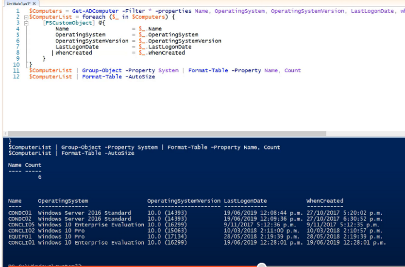

Para Obtener versión de compilación de Windows 10 desde Active Directory, guardar como Obtener versión de compilación de Windows 10 desde Active Directory.ps1-solo es un nombre sugerido para la script

$Computers = Get-ADComputer -Filter * -properties Name, OperatingSystem, OperatingSystemVersion, LastLogonDate, whenCreated
$ComputerList = foreach ($_ in $Computers) {
    [PSCustomObject] @{
        Name                   = $_.Name
        OperatingSystem        = $_.OperatingSystem
        OperatingSystemVersion = $_.OperatingSystemVersion
        LastLogonDate          = $_.LastLogonDate
        WhenCreated            = $_.WhenCreated
    }
}
$ComputerList | Group-Object -Property System | Format-Table -Property Name, Count
$ComputerList | Format-Table –AutoSize

-> y nos mostrará algo así

