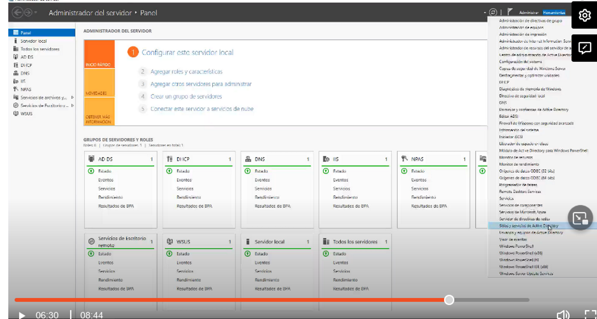
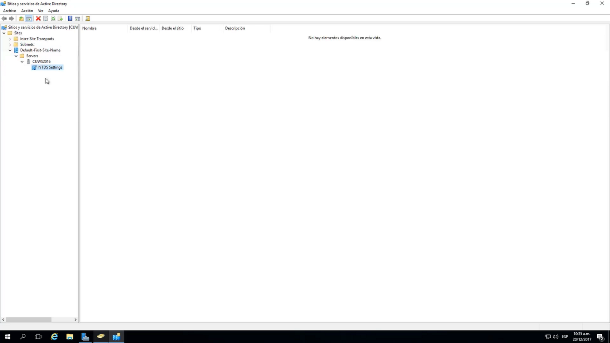
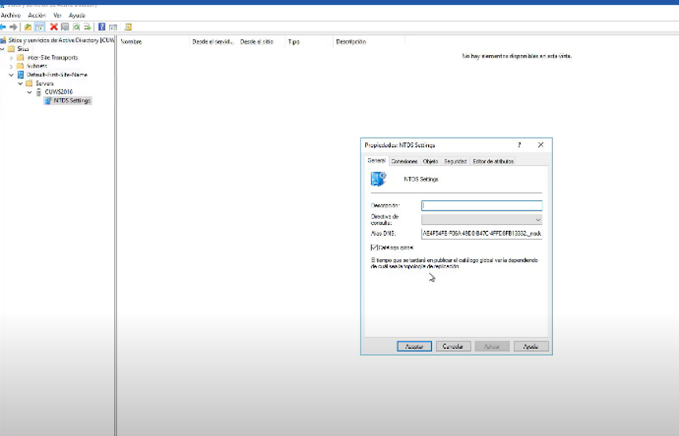

Solamente los controladores de dominio tiene la función de crear un catalogo global un servidor no tienen esa funación, la autenticación también es importante ´por ejemplo para acceder a recursos de red debe de permitir un controlador de dominio acceder a un catalogo global

Por lo menos cada bosque debe de tener 2 catalogos globales por si falla uno tenemos el otro listo

Para que sirve un catalogo global
1)Busquedas-  es como un directorio que nos va a mostrar todas las cuentas, todos los objetos de active directory y se puede buscar en todos los controladores de dominio o en todos los dominio que esten en el bosque
2)creación de cuentas de active directory- verificación de cuentas existentes
3)inicio de sesión- se debe agregar la membresia, 

Herramientas -> sitios y servicios de active directory

Damos botón derecho propiedades y debe de estar habilitado el catalogo global

