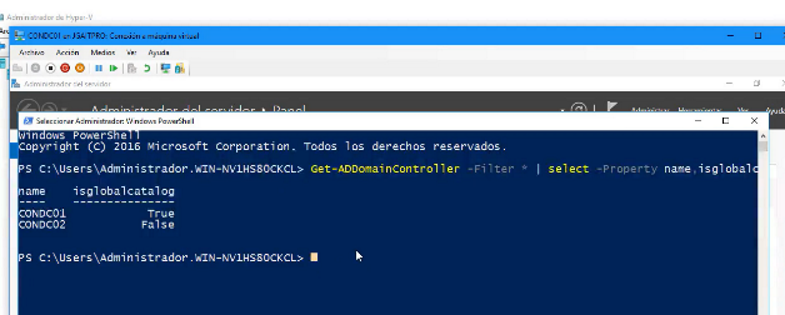
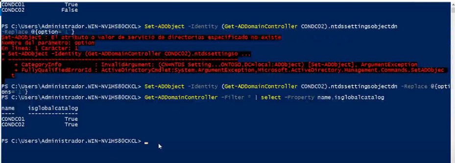

#Listar DCs Catalogo Global Get-ADDomainController -Filter * | select -Property name,isglobalcatalog #Configurar como Catalogo GlobalSet-ADObject -Identity (Get-ADDomainController CONDC02).ntdssettingsobjectdn -Replace @{options='1'}

Primero revisamos que catalgos globales están activos

Luego activamos la opción contdc02

