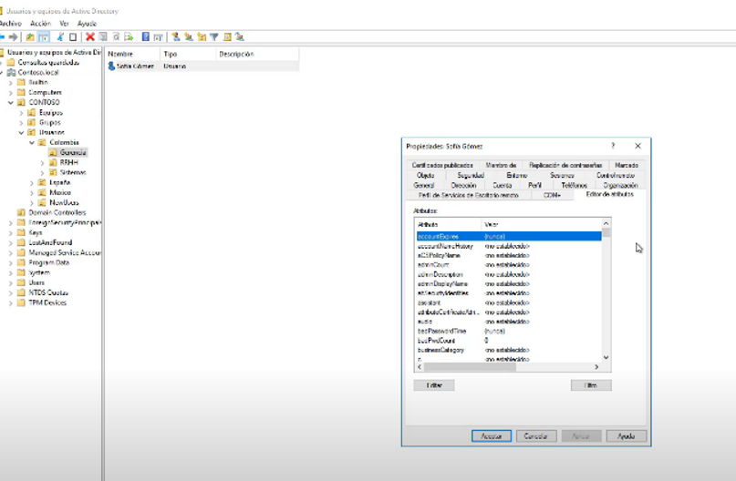
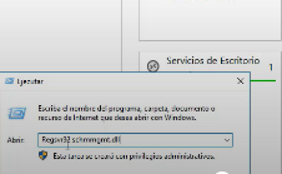
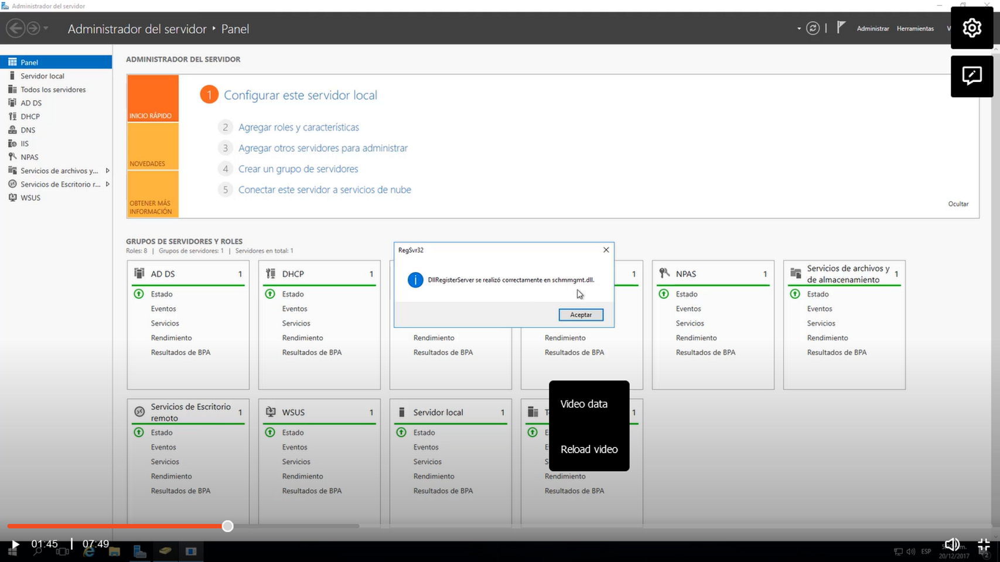
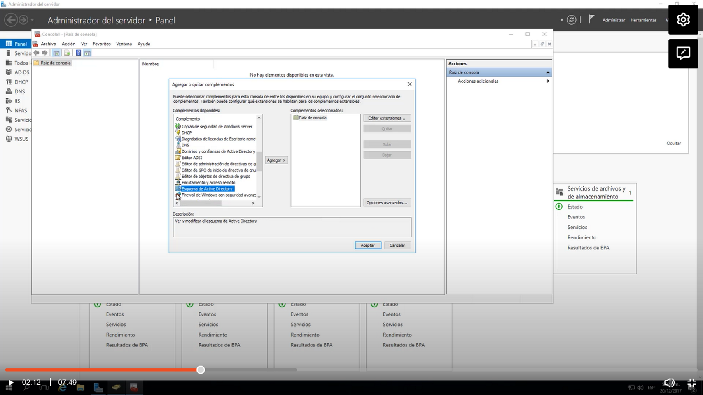
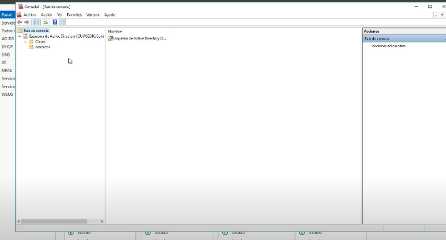
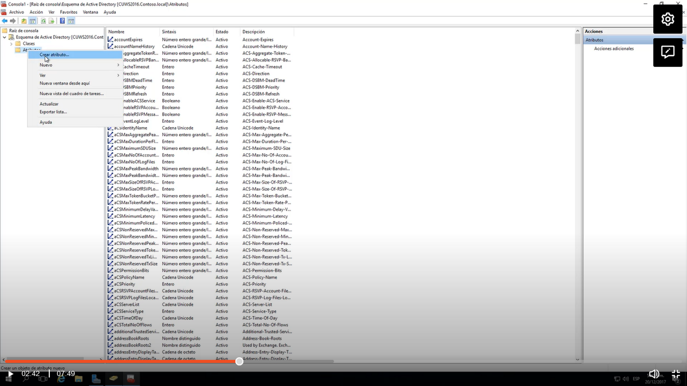
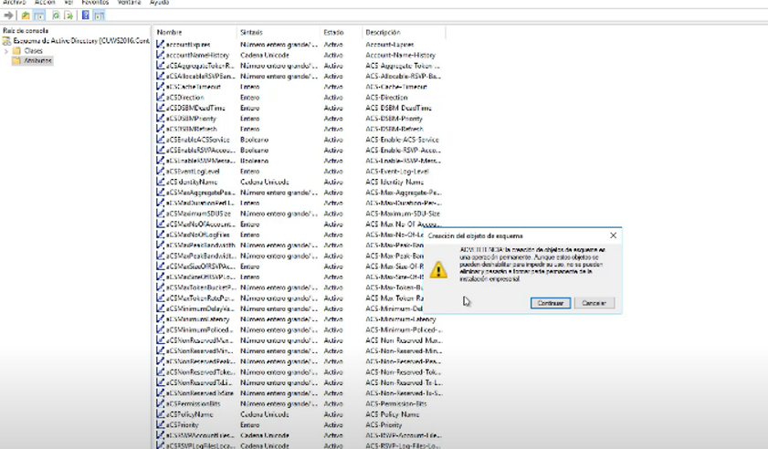
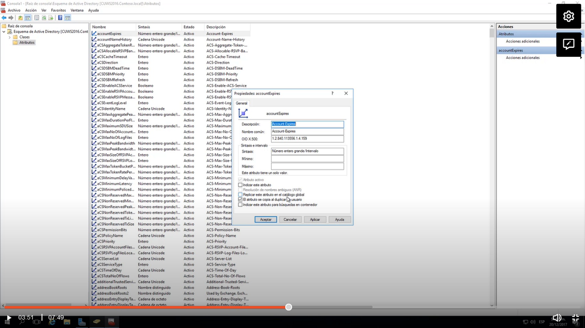
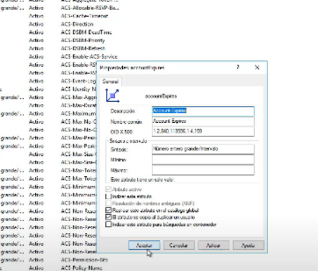

Para esto tenemos primero que agregar un DLL
Inicio-ejecutar:regsvr32 schmmgmt.dll

Luego abrimos inicio-ejecutar y escribirmos mmd

En la lista buscamos esquema de active directory click en agregar y aceptar

Nos abre el esquema:

En la opción ver seleccionamos de la lista y seleccionamos carácteristicas avanzadas

En atributos podemos crear nuevos atributos:

Nos arroja un msj de warning

Por ejemplo revisamos el primer atributo y no está habilitado el catalogo global:

Activamos el check y aplicar

