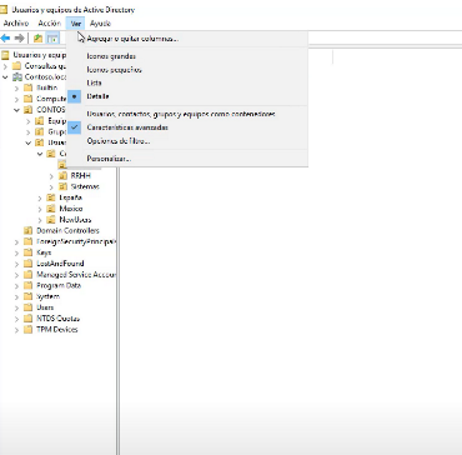
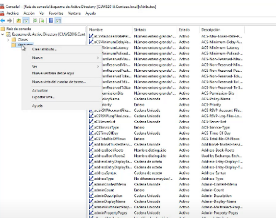
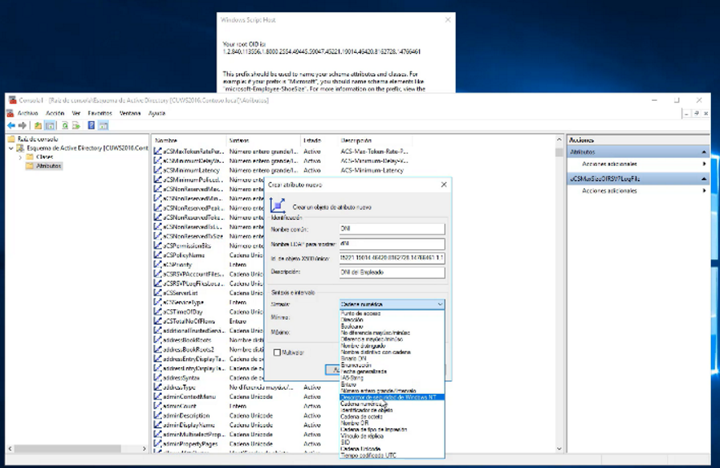
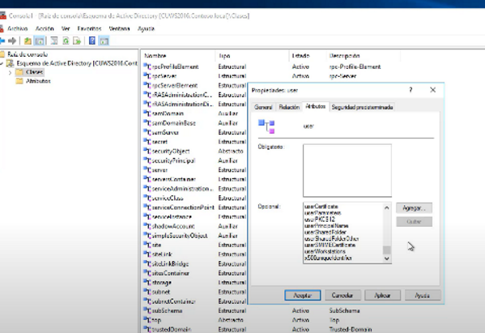
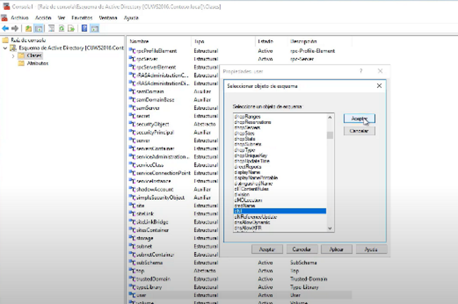
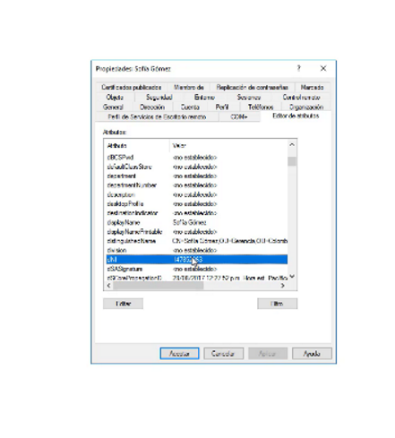

Guardas script como oidgen.vbs.txt

' oidgen.vbs 
'  
' THIS CODE AND INFORMATION IS PROVIDED "AS IS" WITHOUT WARRANTY OF ANY KIND, EITHER EXPRESSED  
' OR IMPLIED, INCLUDING BUT NOT LIMITED TO THE IMPLIED WARRANTIES OF MERCHANTABILITY AND/OR  
' FITNESS FOR A PARTICULAR PURPOSE. 
' 
' Copyright (c) Microsoft Corporation. All rights reserved 
' 
' This script is not supported under any Microsoft standard support program or service.  
' The script is provided AS IS without warranty of any kind. Microsoft further disclaims all 
' implied warranties including, without limitation, any implied warranties of merchantability 
' or of fitness for a particular purpose. The entire risk arising out of the use or performance 
' of the scripts and documentation remains with you. In no event shall Microsoft, its authors, 
' or anyone else involved in the creation, production, or delivery of the script be liable for  
' any damages whatsoever (including, without limitation, damages for loss of business profits,  
' business interruption, loss of business information, or other pecuniary loss) arising out of  
' the use of or inability to use the script or documentation, even if Microsoft has been advised  
' of the possibility of such damages. 
' ---------------------------------------------------------------------- 
Function GenerateOID() 
    'Initializing Variables 
    Dim guidString, oidPrefix 
    Dim guidPart0, guidPart1, guidPart2, guidPart3, guidPart4, guidPart5, guidPart6 
    Dim oidPart0, oidPart1, oidPart2, oidPart3, oidPart4, oidPart5, oidPart6 
    On Error Resume Next 
    'Generate GUID 
    Set TypeLib = CreateObject("Scriptlet.TypeLib") 
    guidString = TypeLib.Guid 
    'If no network card is available on the machine then generating GUID can result with an error. 
    If Err.Number <> 0 Then 
        Wscript.Echo "ERROR: Guid could not be generated, please ensure machine has a network card." 
        Err.Clear 
        WScript.Quit 
    End If 
    'Stop Error Resume Next 
    On Error GoTo 0 
    'The Microsoft OID Prefix used for the automated OID Generator 
    oidPrefix = "1.2.840.113556.1.8000.2554" 
    'Split GUID into 6 hexadecimal numbers 
    guidPart0 = Trim(Mid(guidString, 2, 4)) 
    guidPart1 = Trim(Mid(guidString, 6, 4)) 
    guidPart2 = Trim(Mid(guidString, 11, 4)) 
    guidPart3 = Trim(Mid(guidString, 16, 4)) 
    guidPart4 = Trim(Mid(guidString, 21, 4)) 
    guidPart5 = Trim(Mid(guidString, 26, 6)) 
    guidPart6 = Trim(Mid(guidString, 32, 6)) 
    'Convert the hexadecimal to decimal 
    oidPart0 = CLng("&H" & guidPart0) 
    oidPart1 = CLng("&H" & guidPart1) 
    oidPart2 = CLng("&H" & guidPart2) 
    oidPart3 = CLng("&H" & guidPart3) 
    oidPart4 = CLng("&H" & guidPart4) 
    oidPart5 = CLng("&H" & guidPart5) 
    oidPart6 = CLng("&H" & guidPart6) 
    'Concatenate all the generated OIDs together with the assigned Microsoft prefix and return 
    GenerateOID = oidPrefix & "." & oidPart0 & "." & oidPart1 & "." & oidPart2 & "." & oidPart3 & _ 
        "." & oidPart4 & "." & oidPart5 & "." & oidPart6 
End Function 
'Output the resulted OID with best practice info 
Wscript.Echo "Your root OID is: " & VBCRLF & GenerateOID & VBCRLF & VBCRLF & VBCRLF & _ 
    "This prefix should be used to name your schema attributes and classes. For example: " & _ 
    "if your prefix is ""Microsoft"", you should name schema elements like ""microsoft-Employee-ShoeSize"". " & _ 
    "For more information on the prefix, view the Schema Naming Rules in the server " & _  
    "Application Specification (http://www.microsoft.com/windowsserver2003/partners/isvs/appspec.mspx)." & _ 
    VBCRLF & VBCRLF & _ 
    "You can create subsequent OIDs for new schema classes and attributes by appending a .X to the OID where X may " & _ 
    "be any number that you choose.  A common schema extension scheme generally uses the following structure:" & VBCRLF & _ 
    "If your assigned OID was: 1.2.840.113556.1.8000.2554.999999" & VBCRLF & VBCRLF & _ 
    "then classes could be under: 1.2.840.113556.1.8000.2554.999999.1 " & VBCRLF & _  
    "which makes the first class OID: 1.2.840.113556.1.8000.2554.999999.1.1" & VBCRLF & _ 
    "the second class OID: 1.2.840.113556.1.8000.2554.999999.1.2     etc..." & VBCRLF & VBCRLF & _ 
    "Using this example attributes could be under: 1.2.840.113556.1.8000.2554.999999.2 " & VBCRLF & _ 
    "which makes the first attribute OID: 1.2.840.113556.1.8000.2554.999999.2.1 " & VBCRLF & _ 
    "the second attribute OID: 1.2.840.113556.1.8000.2554.999999.2.2     etc..." & VBCRLF & VBCRLF & _ 
     "Here are some other useful links regarding AD schema:" & VBCRLF & _ 
    "Understanding AD Schema" & VBCRLF & _ 
    "http://technet2.microsoft.com/WindowsServer/en/Library/b7b5b74f-e6df-42f6-a928-e52979a512011033.mspx " & _ 
    VBCRLF & VBCRLF & _ 
    "Developer documentation on AD Schema:" & VBCRLF & _ 
    "http://msdn2.microsoft.com/en-us/library/ms675085.aspx " & VBCRLF & VBCRLF & _ 
    "Extending the Schema" & VBCRLF & _ 
    "http://msdn2.microsoft.com/en-us/library/ms676900.aspx " & VBCRLF & VBCRLF & _ 
    "Step-by-Step Guide to Using Active Directory Schema and Display Specifiers " & VBCRLF & _ 
    "http://www.microsoft.com/technet/prodtechnol/windows2000serv/technologies/activedirectory/howto/adschema.mspx " & _ 
    VBCRLF & VBCRLF & _ 
    "Troubleshooting AD Schema " & VBCR & _ 
    "http://technet2.microsoft.com/WindowsServer/en/Library/6008f7bf-80de-4fc0-ae3e-51eda0d7ab651033.mspx  " & _ 
    VBCRLF & VBCRLF 

Para eso abrimos ejecutar->ccm->archivo->seleccionamos atributos

Abrimos cuentas de usuarios y activamos caracteristicas avanzadas

Luego ejecutamos el script arriba mencionado

Luego regresamos a la ventan del mmc y clcik en atributos y luego crear atributo

De la ventana del script ejecutada tenemos que copiar el OID y pegarlo en la ventan que nos arrojo el mmc y al final tenemos que poner .1.1

Ejemplo el odi termina en 6461.1.1

Lo que se agrega en este ejemplo el es DNI del usuario:

Ahora vamos agregar ese nuevo atributo agregado en el atributo usuario, preionamos el botón agregar y buscamos de la lista el atributo llamado dNi:

Click en aceptar:

Ahora para que se vean reflejado los cambios tenemos que reiniciar los servicios de active directory

Abrimos terminal, luego escribimos services.msc y de la lista buscamos servicios de dominio de active directory

 Click derecho y reiniciar, nos arrojará un msj y le damos aceptar.

Después de eso se mostrará el atributo DNI

