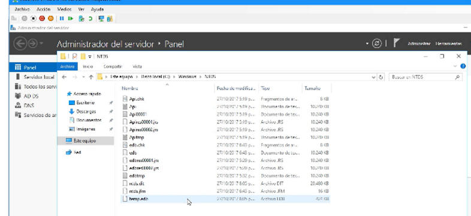

Un controlador de dominio es porque tiene la bd active directory que se llama NTDS.dit
Y un dominio adicional va a contener un respaldo de la BD del dominio principal 

Ventajas de terner uno varios controladores de dominio backup:
-va a resolver los DNS
-consulta de autenticación de usuarios y equipos  
-va a poder suplir el servidor principal 
Otro beneficio de un dominio adicional es que la carga de trabajo se reparte en caso de una alta demanada

La base de datos NTDS la podemos encontrar en la carpeta NTDS.idit(con el mismo nombre):
C:/windows/NTDS/ntds.dit

