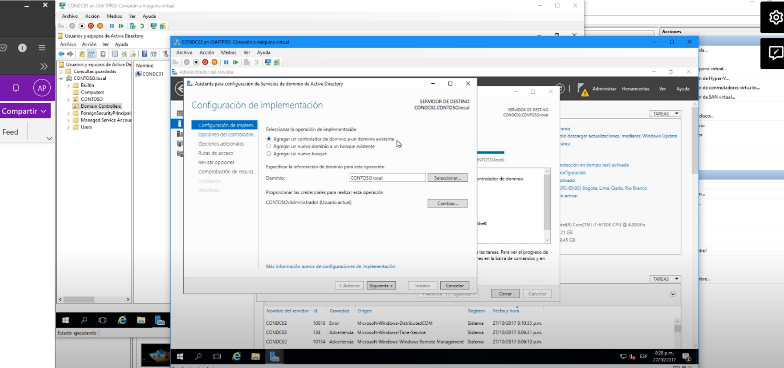

El controlador de dominio principal es CONDC01 y el que se va a agregar es CONDC02 y se verá reflejando en la carpeta Domain Controllers que por el momento solo está en la lista CONDC01

Ahora en el equipo CONTC02 vamos agregar el rol

En la lista seleccionamos Servicios de Dominio  de Active Directory

Click en agregar característicasy click en next, next 

Hasta que salga esto:

Click en promover este servidor a controlador de dominio:

Seleccionar Agregar un controlador de domino a un dominio existente:
Y como ya pertenece a un dominio existente nos muestra el nombre del dominio y as credenciales

Dejamos por defalult lo que haya estado en check y debemos de agregar una contraseña de restauración de servicios y DEBEMOS APUNTARLO MUY BIEN Y RESGUARDAR LA CONTRASEÑA 

Saltamos esta advertencia:

El siguiente paso es saber desde que Dominio se realizará la replica en este caso solo hay uno pero si hubierá más nos aparecería en la lista, uego click en siguiente

En este ejemplo lo dejamos así como están las rutas de las carpetas en donde se almacenaran, pero se pueden modificar, click en siguiente

Click en siguiente:

Nos mostrará las adevertencias y le damos click en instalar:

Ahora si volvemos al controlador de dominio principal que es CONDC01 en la parte de domain controllers, nos mostrará los dos equipos:

Ahora al iniciar el controlador de dominoii CONDC02 nos mostrará que ingresemos el password, se lo ponemos y ya podremos agregar usuarios, crear registros dns y como es replica todo lo que se haga en dominio secundario se mostrará en el primario y viceversa, ya que es una copia

Verificación de replicación de Controladores de dominios con Repadmin

La hora debe ser la misma en ambos equipos

Abrimos powershell en cualquier equipo y escribimos repadmin o administracion de aplicación

Y nos mostrará una lista de comandos y el comando que nos importa es el /showrepl

Repadmin /showrepl

En lo que tenemos que tomar en cuenta es que todas la verificaciones se hayan completado correctamente.

En caso de que nos arroje un error tenemos que corregirlo