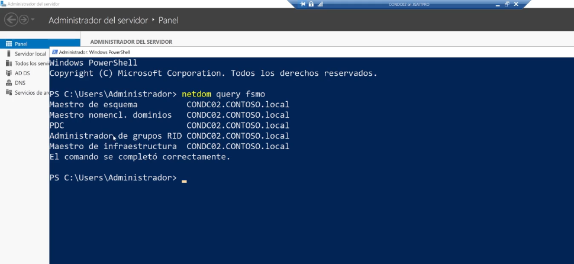

>netdom query fsmo
Para obtener una listado 

Cada rol tiene una función caracteristicas dentro de nuestro bosque de nuestro dominio:

1.- Maestro de esquema. Se utiliza para introducir actualizaciones de esquemas manuales y programatricos y estos incluyen las actualizaciones que agrega windows microsoft exchange  entre otras plataformas o aplicaciones, debe de estar en linea cuando se haga la actualización de esquema.

2.- Maestro de nomenclatura de dominio. Se utiliza para eliminar y agregar dominios 